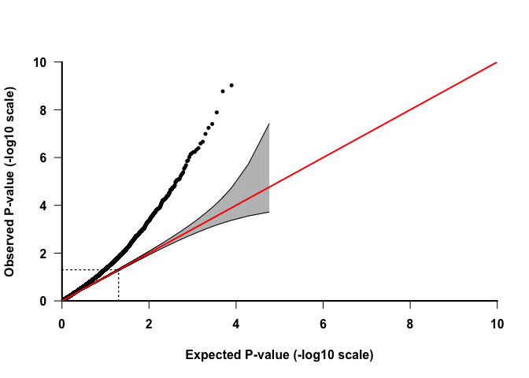

**Code Author**: Mark E. Pepin MD, PhD

**Contact**: [pepinme\@gmail.com](mailto:pepinme@gmail.com){.email}

**Institution**: Heidelberg University Hospital

**Location**: 669 Neuenheimer Feld, Institute for Experimental
Cardiology, 69120 Heidelberg, Germany

# Preliminary Setup

## Packages


``` r
if (!require("pacman")) install.packages("pacman")
pacman::p_load(dplyr, Hmisc, openxlsx, corrplot, RColorBrewer, kableExtra, ggplot2, gridExtra, ggpubr, ggsignif, DESeq2, data.table, GenomicFeatures, biomaRt, Haplin, pheatmap, calibrate, ggrepel, tidyr, gtools, rlist, limma, wesanderson,plotly)
```

## Parameters

Define the parameters used, along with the conditions required for the
current analysis. This segment must be modified for each analysis
performed.


``` r
start_t<-Sys.time()
##Set the experimental conditions [MUST DO THIS MANUALLY]
INVEST=c("Pepin")
GENOTYPE_CaMK2=c("CON")
GENOTYPE_NNT=c("N")
DIET=c("CON", "HFD.LNAME")
GROUP=c("N_CON_CON", "N_CON_HFD.LNAME") # "J_HFD.LNAME"
# OUTLIER=c("676")
STATISTIC = 0.05 #P statistic threshold used in this combination.
# Set the "variable" that determines differential expression
VARIABLE = DIET
COMPARISON= paste0(GENOTYPE_NNT[1],"_",GENOTYPE_CaMK2[1], "_",VARIABLE[2], ".vs.", VARIABLE[1])
colData_all <- openxlsx::read.xlsx("../1_Input/colData.xlsx")
colDataInvest<-colData_all
#Colors
# Candidate Gene Selection (RNA-sequencing) EDIT THIS LIST BASED ON INTERESTS.
GENES=c("Adamts3","Myo18b", "Pmch", "Cyfip2", "Stxbp4", "4833420G17Rik", "Fam160b2", "Adamts12", "Spata31")
my_comparisons <- list(c("N_CON_HFD.LNAME", "J_CON_HFD.LNAME"), c("N_CON_CON", "J_CON_CON"), c("N_CON_CON", "N_CON_HFD.LNAME"), c("J_CON_CON", "J_CON_HFD.LNAME"), c("N_DKO_CON", "N_DKO_HFD.LNAME"))
## Create color based on Genotype
ann_colors = list(Group = c(N_CON_CON="lightblue2", N_CON_HFD.LNAME = "steelblue3", J_CON_CON ="grey", J_CON_HFD.LNAME = "black", N_DKO_CON = "coral2", N_DKO_HFD.LNAME = "darkcyan"))
ann_colorTable<-as.data.frame(ann_colors)
ann_colGroup<-subset(ann_colorTable, rownames(ann_colorTable) %in% GROUP) #Creates colors just for the specific comparison (by GROUP)
ann_colListGroup<-list(ann_colGroup)
ann_colGroupVec<-ann_colGroup$Group
ann_colorInvest<-subset(ann_colorTable, rownames(ann_colorTable) %in% colDataInvest$Group) #Creates colors just for the specific comparison (by INVEST)
ann_colListInvest<-list(ann_colorInvest$Group)
ann_colorInvestVec<-ann_colorInvest$Group
names(ann_colorInvestVec)<-as.factor(rownames(ann_colorInvest))
INVEST_colors<-list(ann_colorInvestVec=ann_colorInvestVec)
names(ann_colGroupVec)<-as.factor(rownames(ann_colGroup))
GROUP_colors<-list(ann_colGroupVec=ann_colGroupVec)

# # Pathway Gene Screening
# GENE.Pathway<-scan("../1_Input/Pathways/geneset.txt", skip = 2, what = "Response")

# Create Output Folder Structure
ifelse(!dir.exists(file.path(paste0("../2_Output/"))), dir.create(file.path(paste0("../2_Output/"))), FALSE)
```

```
## [1] FALSE
```

``` r
ifelse(!dir.exists(file.path(paste0("../2_Output/", COMPARISON, "/"))), dir.create(file.path(paste0("../2_Output/", COMPARISON, "/"))), FALSE)
```

```
## [1] FALSE
```

# RNA-Sequencing Analysis

## RNA-Sequencing Alignment using STAR (STAR/2.7.1a-foss-2018b)

RNA was isolated from the left ventricle endocardial tissue using the
RNeasy Lipid Mini-Kit according to the manufacturer's instructions
(Qiagen, Valencia, CA). High-throughput RNA sequencing was performed at
BGI (Hong Kong, CN). Once sample read quality was checked (FastQC -\>
multiQC analysis), the paired-end fastq files were then aligned to the
reference genome, which was created using Gencode mouse sequence
(GRCm38.primary_assembly.genome.fa) and annotation
(gencode.vM25.primary_assembly.annotation.gtf). STAR aligner
(STAR/2.7.1a-foss-2018b) is the current gold-standard for this, which we
used for the current analysis. Before aligning each fastq file to the
genome, an annotated reference genome must first be assembled. This was
performed as follows (this was performed in Cheaha as \`bash
GenomeReference.sh':

`STAR=../../Tools/STAR-2.5.3a/bin/Linux_x86_64/STAR`

`$STAR \`

`--runThreadN 8 \`

`--runMode genomeGenerate \`

`--genomeDir ./ \`

`--genomeFastaFiles [path-to-"GRCm38.primary_assembly.genome.fa"] \`

`--sjdbOverhang 100 \`

`--sjdbGTFfile ${GTF} \`

Alignment of short reads to this annotated genome could then proceed,
using the following SLURM batch script which was submitted to the UAB
*Cheaha* compute cluster (See **Attached Shell script**). This shell
script contains the following STAR alignment run settings:

`$STAR_RUN \`

`--genomeDir $GENOME_DIR \`

`--readFilesCommand zcat \`

`--readFilesIn $INPUT_DIR/fastq/${VAR}_1.fastq.gz $INPUT_DIR/fastq/${VAR}_2.fastq.gz \`

`--sjdbGTFfile $GENOME_DIR/gencode.vM25.chr_patch_hapl_scaff.annotation.gtf  \`

`--quantMode GeneCounts \`

`--runThreadN 12 \`

`--outSAMtype BAM SortedByCoordinate \`

`--outFileNamePrefix ${RESULTS_DIR}/Alignment/${VAR}_`

## Read Count Compiling

Before the DESeq2-based differential expression can be computed, the
counts generated by STAR need to be compiled, since the .tab file
contains count information based on forward, reverse, and combined
reads. Therefore, we will take the fourth column in each table and merge
them.


``` r
Count.files <- list.files(path = "../1_Input/Counts/", pattern = "*.ReadsPerGene.out.tab", full.names = TRUE, all.files = TRUE)
Counts <- lapply(Count.files, read.table, skip = 4) #skip the first 4 rows, since these are summary data.
#Create a data.frame containing the raw counts
countData.raw <- as.data.frame(sapply(Counts, function(x) x[,4])) #selects only the 4th column raw counts.
#Generate Column names and Row names for the counts (remove the extra nonsense from the path names)
colnames <- gsub( ".ReadsPerGene[.]out[.]tab", "", Count.files)
colnames <- gsub( "[.][.]/1_Input/Counts//", "", colnames)
colnames(countData.raw) <- colnames
row.names(countData.raw) <- Counts[[1]][,1]
```

## Data Pre-Processing

After alignment of the fastq files to the annotated genome assembly
(mm10), the first step in the analysis is to consolidate the raw data
from the provided files into data matrix that can be used to generate a
normalized count matrix and differential expression dataset.


```
## [1] FALSE
```

### Count Normalization

DESeq2 (version 1.18.1) was used to perform the raw count normalization
within R (version 3.4.2) and pairwise differential expression according
to genotype.


``` r
######### RUN DESeq2
dds<-DESeqDataSetFromMatrix(countData=countData, colData = colData, design= ~Diet) #+NNT+Diet:NNT
dds
```

```
## class: DESeqDataSet 
## dim: 41096 8 
## metadata(1): version
## assays(1): counts
## rownames(41096): MGP_C57BL6NJ_G0004928 MGP_C57BL6NJ_G0016950 ...
##   MGP_C57BL6NJ_G0025049 MGP_C57BL6NJ_G0025245
## rowData names(0):
## colnames(8): 7331 7424 ... 7410 7411
## colData names(6): Sample_ID Sex ... Diet Group
```

``` r
# dds$ICM<-relevel(dds$ICM, ref = "NICM") # setting the reference to wild-type genotype. only relevant for factors.
#Determine the Dispersion Relationship (determines which distribution to use for the differential analysis) - should take about 2 minutes
dds <- estimateSizeFactors(dds)
dds <- estimateDispersions(dds)
plotDispEsts(dds)
```

<!-- -->

``` r
png(file=paste0("../2_Output/", COMPARISON, "/", COMPARISON, "_Dispersion.png"))
plotDispEsts(dds)
dev.off()
```

```
## quartz_off_screen 
##                 2
```

There appears to be a linear negative correlation between the mean and
dispersion estimates, so the parametric "Wald" model should be an
appropriate fit for differential expression analysis. Furthermore, we
could get away with the parametric fit-type owing to the apparent
negative binomial distribution. NOTE: If it were nonlinear throughout,
we would require a 'local' nonparametric fit-type.

### Differential Expression Analysis


``` r
##Pre-Filter to reduce the size of this dataset (according to the DESeq2 document reccomendations)
dds <- dds[ rowSums(counts(dds)) > 1, ]
dds
```

```
## class: DESeqDataSet 
## dim: 21752 8 
## metadata(1): version
## assays(2): counts mu
## rownames(21752): MGP_C57BL6NJ_G0017126 MGP_C57BL6NJ_G0016980 ...
##   MGP_C57BL6NJ_G0025049 MGP_C57BL6NJ_G0025245
## rowData names(10): baseMean baseVar ... dispOutlier dispMAP
## colnames(8): 7331 7424 ... 7410 7411
## colData names(7): Sample_ID Sex ... Group sizeFactor
```

``` r
################Run DESeq2 differential quantification (Likelihood ratio test (LRT) or Wald-test)
dds<-DESeq(dds, test="LRT", fitType="parametric", reduced = ~1)
#compile the results tables
resultsNames(dds)
```

```
## [1] "Intercept"             "Diet_HFD.LNAME_vs_CON"
```

``` r
resdf<-as.data.frame(results(dds,format = "DataFrame"))
resdf$ensembl_gene_id<-as.character(row.names(resdf))
```

## Annotation

Once the differential Expression analysis was performed, the following
were compiled into a results data matrix: Log2FoldChange, P-value,
Bonferroni-Adjusted P-Value (Q-value), and normalized counts for each
sample.


``` r
##Add Gene Information
gtf.file="../1_Input/c57bl_6NJ_107.gtf"
gtf.gr = rtracklayer::import(gtf.file) # creates a GRanges object
gtf.df = as.data.frame(gtf.gr)
genes = unique(gtf.df[ ,c("gene_id","gene_name")])
Test1<-dplyr::select(gtf.df, ensembl_gene_id=gene_id, gene_name) #Chr=seqnames, chromStart=start, chromEnd=end #%>% mutate(Loc=paste0(Chr,":", chromStart, "-", chromEnd))
genes = unique(Test1)
results<-merge(resdf, genes, by="ensembl_gene_id")

####Add normalized count data (for heatmap and sota)
normcount<-as.data.frame(counts(dds, normalized=TRUE))
normcount$ensembl_gene_id<-rownames(normcount)
results<-dplyr::left_join(results, normcount, by="ensembl_gene_id")
results<-results[order(results$pvalue),] # order table by pvalue
##Create a Counts table with annotated Gene name
Counts_table<-results[,9:ncol(results)]
Counts_table<-cbind(results$gene_name, Counts_table)
rownames(Counts_table)<-results$ensembl_gene_id
write.xlsx(Counts_table, paste0("../2_Output/", COMPARISON, "/", COMPARISON, "_Normalized.Counts.xlsx"), rowNames = FALSE, overwrite = T)

#Create Rlog transformed data
rld<-rlog(dds)
rld<-assay(rld) #transpose the rlog-normalized count data
rld<-as.data.frame(rld) #convert to a data frame (to merge the colData)
write.xlsx(rld, paste0("../2_Output/", COMPARISON, "/", COMPARISON, "_rlog.counts.xlsx"), rowNames = TRUE, overwrite = T)

#Create filters as tabs
results_p05<-dplyr::filter(results, pvalue<STATISTIC) 
results_q05<-dplyr::filter(results, padj<STATISTIC)
library(openxlsx)
wb_DESeq<-createWorkbook()
#Unfiltered
  addWorksheet(wb_DESeq, "Unfiltered")
  writeData(wb_DESeq, "Unfiltered", results, startCol = 1)
#P-value Significant (0.05)
  addWorksheet(wb_DESeq, "P_0.05")
  writeData(wb_DESeq, "P_0.05", results_p05, startCol = 1)
#Q-value Significant (0.05)
  addWorksheet(wb_DESeq, "Q_0.05")
  writeData(wb_DESeq, "Q_0.05", results_q05, startCol = 1)
saveWorkbook(wb_DESeq, file = paste0("../2_Output/", COMPARISON, "/", COMPARISON,"_DESeq2.xlsx"), overwrite = TRUE)
####################################################################################################
# library(biomaRt)
# hsapiens <- biomaRt::useEnsembl(biomart = "ENSEMBL_MART_ENSEMBL",
#                                      host = "www.ensembl.org",
#                                      dataset = "mmusculus_gene_ensembl",
#                                      version = 94)
# bm <- getBM(attributes=c("ensembl_gene_id_version", "external_gene_name", "chromosome_name", "start_position", "end_position", "superfamily", "gene_biotype", "description"),  mart=hsapiens)
# write.csv(bm, "../1_Input/BiomaRt_Annotation.csv")
# bm<-read.csv("../1_Input/BiomaRt_Annotation.csv", row.names = 1)
```

# Unsupervised Analysis
## MDS Plot - Transcriptomics

In contrast to our epigenomic analysis, unsupervised MDS failed to
denote any separation by race (**Supplemental Figure S5**).


``` r
library(limma)
library(openxlsx)
# Perform MDS on RNA-sequencing data
# MDS_data<-read.xlsx(paste0("../1_Input/Normalized.Counts.xlsx"), rowNames = FALSE)
MDS_data<-read.xlsx(paste0("../1_Input/DKO_Normalized.Counts.xlsx"), rowNames = FALSE)
Index_MDS<-read.xlsx("../1_Input/colData.xlsx") %>% subset(Sample_ID %in% colnames(MDS_data)) # only select samples in the counts file chosen
rownames(Index_MDS)<-Index_MDS$Sample_ID
Index_MDS$Sample_ID<-as.character(Index_MDS$Sample_ID)
options(ggrepel.max.overlaps = Inf)
#Filter normalized counts to remove outliers
vector<-Index_MDS$Sample_ID
MDS_data<-dplyr::select(MDS_data, any_of(vector), -`results$gene_name`)
# MDS in ggplot2
Ntop = 10000
library(magrittr)
library(dplyr)
library(ggpubr)
library(matrixStats)
library("ggrepel")
library(wesanderson)
MDS.set<-as.data.frame(MDS_data)
RowVar<-rowVars(data.matrix(MDS.set)) #calculate variances for each row (vector)
MDS.set<-as.data.frame(cbind(MDS.set, RowVar)) #Add to the MDS.set dataset
MDS_matrix<-MDS.set %>% arrange(desc(RowVar)) %>% top_n(Ntop,RowVar) #Select top N rows by variance
# Compute MDS
mds <- MDS_matrix %>% dplyr::select(-RowVar) %>% t(.) %>%
  dist() %>%          
  cmdscale() %>%
  as_tibble()
colnames(mds) <- c("Dim.1", "Dim.2")
rownames(mds)<-rownames(Index_MDS)
mds$Sample_ID<-rownames(mds)
mds<-dplyr::inner_join(mds, Index_MDS)

#K-means clustering
clust <- kmeans(mds[,1:2], 2)$cluster %>%
  as.factor()
mds <- mds %>%
  mutate(kmeans.2 = clust)
###
library(ggpubr)
library(cowplot) 
# Main plot
pmain <- ggplot(mds, aes(x = Dim.1, y = Dim.2, color = Group))+
  scale_color_manual(values = ann_colorInvestVec) +
  theme(panel.background = element_rect("white", colour = "black", size=2), 
      panel.grid.major = element_line(colour = "gray50", size=.75), 
      panel.grid.minor = element_line(colour = "gray50", size=0.4),
      legend.position="bottom",
      legend.key=element_blank(),
      axis.text = element_text(size = 12),
      axis.title = element_text(size = 14, face="bold")) +
  geom_hline(yintercept = 0, size = 1) + 
  geom_vline(xintercept=0, size=1) +
  geom_point()+ #Add points for each sample
  # stat_ellipse()+ # create elliptical shapes
  # geom_text_repel(data=mds, aes(label=Sample_ID), show.legend  = F) + #label the samples
  labs(x="Principal Component 1", 
       y="Principal Component 2")
# Marginal densities along x axis
xdens <- axis_canvas(pmain, axis = "x")+
  geom_density(data = mds, aes(x = Dim.1, fill = Group),
              alpha = 0.7, size = 0.2) + 
  scale_fill_manual(values = ann_colorInvestVec)
# Marginal densities along y axis
ydens <- axis_canvas(pmain, axis = "y", coord_flip = TRUE)+ #must set coord_flip = true if using coord_flip() below
  geom_density(data = mds, aes(x = Dim.2, fill = Group),
                alpha = 0.7, size = 0.2)+
  coord_flip() +
  scale_fill_manual(values = ann_colorInvestVec)
p1 <- insert_xaxis_grob(pmain, xdens, grid::unit(.2, "null"), position = "top")
p2<- insert_yaxis_grob(p1, ydens, grid::unit(.2, "null"), position = "right")
pdf(file=paste0("../2_Output/", INVEST, "_MDS.Scatterhist.pdf"), height = 5, width = 5, onefile = F)
ggdraw(p2)
dev.off()
```

```
## quartz_off_screen 
##                 2
```

``` r
ggdraw(p2)
```

<!-- -->

## QQ Plot

Before we examined the gene networks and pathways differentially
regulated by NRF2 knockout, the first task was to determine whether
transgene induction resulted in global changes. An effective way of
determining this is the QQ plot, which compares the P-value distribution
produced by the pairwise comparison to that of a random normal
distribution. Below, it is evident that differential expression
according to patient race yields a robustly divergent expression pattern
that likely reflects population differences in gene expression.


``` r
#Create Q-Q plot
test<-results
test<-test[complete.cases(test),]
pQQ(test$pvalue, lim=c(0,10))
```

<!-- -->

``` r
png(file=paste0("../2_Output/", COMPARISON,  "/", COMPARISON,"_QQ.Plot.png"))
pQQ(test$pvalue, lim=c(0,10))
dev.off()
```

```
## quartz_off_screen 
##                 2
```

## Principal Components Analysis

Once we established that the populations under consideration truly
display divergene expression patterns, we sought to determine whether
unbiased global gene expression patterns recapitulate the described
phenotypes within each heart failure group. To accomplish this, an
unsupervised Principal Components Analysis (PCA) was initially used with
normalized counts.

### PCA Features

Before running the principal components analysis, it was necessary to
first determine the number of PC's required to account for 80% of the
variance, a machine-learning algorithmm benchmark that provides
sufficient confidence in the analysis.


``` r
#Plot Features of the PCA
library(dplyr)
library(plotly)
##Import the data to be used for PCA
PCA_data<-read.xlsx(paste0("../1_Input/DKO_rlog.counts.xlsx"), rowNames = TRUE)
Index_PCA<-read.xlsx("../1_Input/colData.xlsx") %>% subset(CaMK2 %in% GENOTYPE_CaMK2)
rownames(Index_PCA)<-Index_PCA$Sample_ID
#transpose the dataset (required for PCA)
data.pca<-t(PCA_data)
data.pca<-as.data.frame(data.pca)
##merge the file
data.pca_Final<-merge(Index_PCA, data.pca, by=0)
rownames(data.pca_Final)<-data.pca_Final$Row.names
pca.comp<-prcomp(data.pca_Final[,(ncol(Index_PCA)+2):ncol(data.pca_Final)])

pcaCharts=function(x) {
    x.var <- x$sdev ^ 2
    x.pvar <- x.var/sum(x.var)
    par(mfrow=c(2,2))
    plot(x.pvar,xlab="Principal component",
         ylab="Proportion of variance", ylim=c(0,1), type='b')
    plot(cumsum(x.pvar),xlab="Principal component",
         ylab="Cumulative Proportion of variance",
         ylim=c(0,1),
         type='b')
    screeplot(x)
    screeplot(x,type="l")
    par(mfrow=c(1,1))
}
pcaCharts(pca.comp)
```

<!-- -->

``` r
png(file=paste0("../2_Output/", COMPARISON,  "/", COMPARISON, "_PCA.Charts.png"))
pcaCharts(pca.comp)
dev.off()
```

```
## quartz_off_screen 
##                 2
```

### 3-Dimensional PCA

From the previous calculations, it is seens that only 2 principal
components are necessary (accounting for \>80% cumulative variance).
Nonetheless, below is a 3-D PCA to ensure that all groups are
characterize to higher-degree of stringency. Nevertheless, a racial
difference could not be appreciated.


``` r
##Create a 3D-PCA for Inspection
library(plotly)
##Index
PCA_data<-read.xlsx(paste0("../1_Input/DKO_rlog.counts.xlsx"), rowNames = TRUE)
Index_PCA<-read.xlsx("../1_Input/colData.xlsx")
rownames(Index_PCA)<-Index_PCA$Sample_ID
Index_PCA$Group<-factor(Index_PCA$Group)
rownames(Index_PCA)<-Index_PCA$Sample_ID
PCs<-merge(pca.comp$x, Index_PCA, by=0)
rownames(PCs)<-PCs$Row.names
PCs$Group <- as.factor(PCs$Group)
fig <- plot_ly(PCs, x = ~PC1, y = ~PC2, z = ~PC3, color = ~Group, text = ~paste('Sample_ID:', Sample_ID, '<br>NNT:', NNT, '<br>Diet:', Diet, '<br>Sex:', Sex))
fig <- fig %>% add_markers()
fig <- fig %>% layout(scene = list(xaxis = list(title = 'PC1'),
                     yaxis = list(title = 'PC2'),
                     zaxis = list(title = 'PC3')))
fig
```

```{=html}
<div class="plotly html-widget html-fill-item" id="htmlwidget-d6cc341e211a90e5122d" style="width:672px;height:480px;"></div>
<script type="application/json" data-for="htmlwidget-d6cc341e211a90e5122d">{"x":{"visdat":{"6472f8cbf19":["function () ","plotlyVisDat"]},"cur_data":"6472f8cbf19","attrs":{"6472f8cbf19":{"x":{},"y":{},"z":{},"text":{},"color":{},"alpha_stroke":1,"sizes":[10,100],"spans":[1,20],"type":"scatter3d","mode":"markers","inherit":true}},"layout":{"margin":{"b":40,"l":60,"t":25,"r":10},"scene":{"xaxis":{"title":"PC1"},"yaxis":{"title":"PC2"},"zaxis":{"title":"PC3"}},"hovermode":"closest","showlegend":true},"source":"A","config":{"modeBarButtonsToAdd":["hoverclosest","hovercompare"],"showSendToCloud":false},"data":[{"x":[-6.0701488937454178,7.628510436900056,-4.4879895214513876,10.000209719259896],"y":[-7.8973106806680358,-4.5810744492762066,-3.7940927640360278,-7.8369458206886877],"z":[-9.9261166085106733,3.6408314386508831,-2.4020062792073862,3.0439621412253093],"text":["Sample_ID: 7331 <br>NNT: N <br>Diet: CON <br>Sex: M","Sample_ID: 7424 <br>NNT: N <br>Diet: CON <br>Sex: M","Sample_ID: 7426 <br>NNT: N <br>Diet: CON <br>Sex: M","Sample_ID: 7445 <br>NNT: N <br>Diet: CON <br>Sex: M"],"type":"scatter3d","mode":"markers","name":"N_CON_CON","marker":{"color":"rgba(141,160,203,1)","line":{"color":"rgba(141,160,203,1)"}},"textfont":{"color":"rgba(141,160,203,1)"},"error_y":{"color":"rgba(141,160,203,1)"},"error_x":{"color":"rgba(141,160,203,1)"},"line":{"color":"rgba(141,160,203,1)"},"frame":null},{"x":[10.849196638351254,-7.3770929261813718,-9.5303623000080702,-1.0123231531247581],"y":[12.87240112959284,7.3366990892722121,3.9012660077666381,-0.00094251196266203813],"z":[-5.4052717283344087,-1.0403920670335995,7.753170597006581,4.3358225062032094],"text":["Sample_ID: 7336 <br>NNT: N <br>Diet: HFD.LNAME <br>Sex: M","Sample_ID: 7370 <br>NNT: N <br>Diet: HFD.LNAME <br>Sex: M","Sample_ID: 7410 <br>NNT: N <br>Diet: HFD.LNAME <br>Sex: M","Sample_ID: 7411 <br>NNT: N <br>Diet: HFD.LNAME <br>Sex: M"],"type":"scatter3d","mode":"markers","name":"N_CON_HFD.LNAME","marker":{"color":"rgba(231,138,195,1)","line":{"color":"rgba(231,138,195,1)"}},"textfont":{"color":"rgba(231,138,195,1)"},"error_y":{"color":"rgba(231,138,195,1)"},"error_x":{"color":"rgba(231,138,195,1)"},"line":{"color":"rgba(231,138,195,1)"},"frame":null}],"highlight":{"on":"plotly_click","persistent":false,"dynamic":false,"selectize":false,"opacityDim":0.20000000000000001,"selected":{"opacity":1},"debounce":0},"shinyEvents":["plotly_hover","plotly_click","plotly_selected","plotly_relayout","plotly_brushed","plotly_brushing","plotly_clickannotation","plotly_doubleclick","plotly_deselect","plotly_afterplot","plotly_sunburstclick"],"base_url":"https://plot.ly"},"evals":[],"jsHooks":[]}</script>
```

## Volcano Plot


``` r
# Load packages
# Load packages
library(dplyr)
library(ggplot2)
library(ggrepel)
library(openxlsx)
# Read data from the web
options(ggrepel.max.overlaps = Inf)
results<-read.xlsx(paste0("../2_Output/", COMPARISON, "/", COMPARISON, "_DESeq2.xlsx"), sheet = "Unfiltered") %>% dplyr::filter(pvalue!="NA")
results = mutate(results, minuslogpvalue = -log(pvalue), log2FC=log2FoldChange)

results <- results %>% 
  mutate(., sig=ifelse(pvalue<0.05 & log2FoldChange>1, 
                       "P < 0.05 and Fold-Change > 2", 
                       ifelse(pvalue<0.05 & log2FoldChange< -1,
                              "P < 0.05 and Fold-Change < 2", 
                              "Not Sig")
                       )
         )
results$sig<-factor(results$sig, 
levels = c("P < 0.05 and Fold-Change < 2",
  "Not Sig",
  "P < 0.05 and Fold-Change > 2")
  )
max(results$minuslogpvalue, na.rm = TRUE)
```

```
## [1] 28.06675
```

``` r
max(results$log2FoldChange, na.rm = TRUE)
```

```
## [1] 9.158752
```

``` r
min(results$log2FoldChange, na.rm = TRUE)
```

```
## [1] -5.623393
```

``` r
p = ggplot(results, aes(log2FoldChange, minuslogpvalue)) + 
  theme_classic() +
  theme(axis.line = element_blank(),
        axis.ticks = element_blank()
  ) +
  geom_point(aes(fill=sig, size = minuslogpvalue),
             colour="black",
             shape=21,
             stroke = 0,
             alpha = 7/10) +
  geom_vline(xintercept=1, size=.5, linetype="dashed") +
  geom_vline(xintercept=-1, size=0.5, linetype="dashed") +
  geom_hline(yintercept=0-log(0.05), size=.5, linetype="dashed") +
  labs(x=expression(Log[2](Fold-Change)), y=expression(-Log[10](P-value))) + 
  xlim(min(results$log2FoldChange, na.rm = TRUE),max(results$log2FoldChange, na.rm = TRUE)) + 
  ylim(-0, max(results$minuslogpvalue, na.rm = TRUE)) + geom_hline(yintercept = 0, size = 1) + 
  geom_vline(xintercept=0, size=1) +
  scale_fill_manual(values=c("dodgerblue4", "darkgray", "goldenrod2")) +
  scale_size_continuous(range = c(.1, 3))

  p+
  geom_text_repel(data=top_n(filter(results, log2FoldChange< -2), 10, minuslogpvalue), aes(label=gene_name)) +
  geom_text_repel(data=top_n(filter(results, log2FoldChange>2), 10, minuslogpvalue), aes(label=gene_name))
```

<!-- -->

``` r
tiff(file = paste0("../2_Output/", COMPARISON, "/", COMPARISON, "_VolcanoPlot.tiff"), units="in", width = 6, height = 6,res=300)
  p+
  geom_text_repel(data=top_n(filter(results, log2FoldChange< -1), 10, minuslogpvalue), aes(label=gene_name)) +
  geom_text_repel(data=top_n(filter(results, log2FoldChange > 1), 10, minuslogpvalue), aes(label=gene_name))
dev.off()
```

```
## quartz_off_screen 
##                 2
```

# Comparison-Specific Analysis
## Heatmap and Clustering of DEGs

In order to visualize the distribution of differentially-expressed
genes, as well as determine the effect various heart failure etiologies
on transcription, hierarchical clustering and heatmap visualization were
performed at the Q \< 0.05 statistical level. This analysis reveals that
P \< 0.05 is sufficient to delineate hierarchical clustering according
to patient race.


``` r
library(dplyr)
library(pheatmap)
library(ComplexHeatmap)
##
##Index file for annotating samples
rownames(colData_all)<-colData_all$Sample_ID
Index<-colData_all %>% dplyr::select(NNT, CaMK2,Diet) %>% select_if(~ !any(is.na(.)))
Index<-as.data.frame(Index)
vector<-rownames(Index)
# Format heatmap counts Data
results_p05<-results %>% filter(pvalue<STATISTIC) %>% select(gene_name, pvalue, padj, log2FoldChange) %>% filter(gene_name != "NA")
normCount_all<-read.xlsx(paste0("../1_Input/Normalized.Counts.xlsx"), rowNames = F) %>% rename(gene_name=`results$gene_name`)
## Create heatmap matrix
Combined_data<-inner_join(results_p05, normCount_all)
rownames(Combined_data)<-make.unique(Combined_data$gene_name, sep = ".")
hm_data<-Combined_data %>% dplyr::select(any_of(vector)) %>% data.matrix()
# Ensure Index has the same number of columns
Index<-Index %>% subset(rownames(Index) %in% colnames(hm_data)) # needed for ComplexHeatmap
#Create heatmaps on summary data
ann_colors = list(NNT = c(N="darkgray", J = "goldenrod2"), Diet = c(CON = "darkgray", HFD.LNAME = "darkcyan"), CaMK2 = c(CON = "white", DKO = "coral2"))
paletteLength <- 100
myColor <- colorRampPalette(c("dodgerblue4", "white", "gold2"))(paletteLength)
###########################################################################
hm_pheatmap<-pheatmap::pheatmap(hm_data, scale="row",
                    name = COMPARISON,
                    cluster_cols = F,
                    cluster_rows = T,
                    cutree_rows = 5,
                    # cutree_cols = 2,
                     fontsize_col = 8,
                     color = myColor,
                    annotation_names_col = FALSE,
                    show_colnames = F,
                     show_rownames = F,
                     border_color = NA,
                    annotation_colors = GROUP_colors,
                    annotation_col = Index,
                    border = TRUE)
```

<!-- -->

``` r
## Cluster Analysis
hc <-hm_pheatmap$tree_row
lbl <- cutree(hc, 5)
cluster1<-which(lbl==1)
cluster2<-which(lbl==2)
cluster3<-which(lbl==3)
cluster4<-which(lbl==4) 
cluster5<-which(lbl==5) 
#
Cluster1_data<-Combined_data[cluster1,]
Cluster2_data<-Combined_data[cluster2,]
Cluster3_data<-Combined_data[cluster3,]
Cluster4_data<-Combined_data[cluster4,]
Cluster5_data<-Combined_data[cluster5,]
# Cluster6_data<-Combined_data[cluster6,]
Name_1<-Cluster1_data %>% top_n(10, -pvalue)
Name_1<-Name_1$gene_name
Name_2<-Cluster2_data %>% top_n(10, -pvalue)
Name_2<-Name_2$gene_name
Name_3<-Cluster3_data %>% top_n(10, -pvalue)
Name_3<-Name_3$gene_name
Name_4<-Cluster4_data %>% top_n(10, -pvalue)
Name_4<-Name_4$gene_name
Name_5<-Cluster5_data %>% top_n(10, -pvalue)
Name_5<-Name_5$gene_name
# Name_6<-Cluster6_data %>% top_n(5, -pvalue)
# Name_6<-Name_6$gene_name
write.csv(Cluster1_data, paste0("../2_Output/", COMPARISON, "/", COMPARISON, "_Cluster1_data.csv"))
write.csv(Cluster2_data, paste0("../2_Output/", COMPARISON, "/", COMPARISON, "_Cluster2_data.csv"))
write.csv(Cluster3_data, paste0("../2_Output/", COMPARISON, "/", COMPARISON, "_Cluster3_data.csv"))
write.csv(Cluster4_data, paste0("../2_Output/", COMPARISON, "/", COMPARISON, "_Cluster4_data.csv"))
write.csv(Cluster5_data, paste0("../2_Output/", COMPARISON, "/", COMPARISON, "_Cluster5_data.csv"))
# write.csv(Cluster6_data, "Cluster6_data.csv")
############################################################################
GENES_HM<-stringr::str_to_title(c(Name_1, Name_2,Name_3,Name_4,Name_5, "Sirt3"))
# Genes that containing the strings:
# ha = rowAnnotation(link = anno_mark(at = grep(paste(GENES_HM, collapse="|"),
#                                               Combined_data$gene_name),
#                    labels = Combined_data[grep(paste(GENES_HM, collapse="|"),
#                                               Combined_data$gene_name), "gene_name"],
#                    labels_gp = gpar(fontsize = 7), 
#                    padding = unit(1, "mm"))
#                    )
ha = rowAnnotation(link = anno_mark(at = which(Combined_data$gene_name %in% GENES_HM),
                   labels = Combined_data[which(Combined_data$gene_name %in% GENES_HM), "gene_name"],
                   labels_gp = gpar(fontsize = 7),
                   padding = unit(1, "mm"))
                   )
heatmap_combination<-ComplexHeatmap::pheatmap(hm_data, scale="row",
                    name = COMPARISON,
                    cluster_cols = T,
                    cluster_rows = T,
                    cutree_rows = 5,
                    cutree_cols = 2,
                     fontsize_col = 8,
                     color = myColor,
                    annotation_names_col = FALSE,
                    show_colnames = F,
                     show_rownames = F,
                     border_color = NA,
                    annotation_colors = ann_colors,
                    right_annotation = ha, 
                    annotation_col = Index,
                    border = TRUE)
heatmap_combination
```

<!-- -->

``` r
###############################
RNAColor <- colorRampPalette(c("dodgerblue4", "white", "gold2"))(paletteLength)
Expression_HM<-Heatmap(Combined_data$log2FoldChange, 
                  name = "DEG",
                  na_col = "white", 
                  col = RNAColor,
                  show_column_names = T, 
                  right_annotation = ha, 
                  width = unit(5, "mm"))
############################
pdf(file=paste0("../2_Output/", COMPARISON, "/", COMPARISON, "Master_Heatmap.pdf"), height = 7, width = 8, onefile = F)
heatmap_combination
dev.off()
```

```
## quartz_off_screen 
##                 2
```

``` r
heatmap_combination
```

<!-- -->

``` r
while (!is.null(dev.list()))  dev.off()
```

# Candidate Gene Expression


``` r
GENES=c("Myo18b", "Cyfip2", "Stxbp4", "Fam160b2", "Adamts12")
library(ggplot2)
library(gridExtra)
library(ggpubr)
library(dplyr)
library(gtools)
library(openxlsx)
ifelse(!dir.exists(file.path(paste0("../2_Output/Candidates"))), dir.create(file.path(paste0("../2_Output/Candidates"))), FALSE)
```

```
## [1] FALSE
```

``` r
#Import Index file
colData<-openxlsx::read.xlsx("../1_Input/colData.xlsx",  startRow = 1)
colData$Sample_ID<-as.character(colData$Sample_ID)
# colData<-colData %>% filter(Sex=="F") # Select sex (if applicable)
##Import normalized counts
Counts<-read.xlsx(paste0("../1_Input/Normalized.Counts.xlsx"), rowNames = F)
#Remove outliers
vector<-colData$Sample_ID
Counts$gene_name<-Counts$`results$gene_name`
Counts<-dplyr::select(Counts, any_of(vector), gene_name)

#Filter results by the gene vector
DEGs<-subset(Counts, gene_name %in% GENES)
rownames(DEGs)<-make.unique(as.character(DEGs$gene_name, sep = "."))
tDEGs<-as.data.frame(t(DEGs))
## convert all genes to numeric (from factors)
asNumeric=function(x){as.numeric(as.character(x))}
factorsNumeric=function(d){modifyList(d, lapply(d[, sapply(d, is.character)], asNumeric))}
##
tDEGs<-factorsNumeric(tDEGs)
tDEGs$Sample_ID<-rownames(tDEGs)
colData.ex<-dplyr::inner_join(tDEGs, colData)
colData.ex$Group<-factor(colData.ex$Group, levels = c("N_CON_CON", "N_CON_HFD.LNAME", "N_DKO_CON", "N_DKO_HFD.LNAME", "J_CON_CON", "J_CON_HFD.LNAME"))
colData.ex<-dplyr::group_by_(colData.ex, "Group") #define groups for statistics
write.xlsx(colData.ex, paste0("../2_Output/Candidates/Candidate_genes.xlsx"), overwrite = T)
## For loop creating a graph for each gene
plotlist = list()
p<-1
for (i in GENES){
g_plot<-ggboxplot(colData.ex, x = "Group", 
          y = i, 
          fill = "Group",
          add = "jitter"
          ) + 
  scale_fill_manual(values = ann_colorInvestVec) +
  stat_compare_means(aes(group = Group),
                    comparisons = my_comparisons,
                    label = "p.signif",
                    bracket.nudge.y = 5
                    ) +
  theme(axis.text.x=element_text(size=rel(0.75), angle = 45, hjust = 1), axis.text.y=element_text(size=rel(0.75)), axis.title.x = element_blank(), axis.title.y = element_text(face = "bold"), legend.position="none") + # resize labels, remove legend
  scale_y_continuous(expand = expansion(mult = c(0, 0.2)))  # expand = expansion(mult = c(0, 0.1)) ### Y scale (to see the statistics)
pdf(file=paste0("../2_Output/Candidates/", GENOTYPE_NNT[1],"_",i, "_Expression.pdf"), width = 6, height = 6)
print(g_plot)
dev.off()
plotlist[[i]] = g_plot
}
t<-marrangeGrob(grobs = plotlist, legend, nrow=2, ncol=2)
ggsave(paste0("../2_Output/Candidates/DEGs.", GENOTYPE_NNT[1], ".pdf"), t, width = 6, height = 7)
t
```

<!-- --><!-- -->

## Differential Expression bar graphs


``` r
#Plot as single bar graph
library(ggplot2)
library(gridExtra)
library(ggpubr)
library(dplyr)
library(tidyr)
library(openxlsx)
library(tibble)
#Import dataset
Counts<-read.xlsx(paste0("../1_Input/Normalized.Counts.xlsx"),rowNames = F)
colData<-openxlsx::read.xlsx("../1_Input/colData.xlsx", startRow = 1)
colData$Sample_ID<-as.character(colData$Sample_ID)
#Filter results by the gene vector
DEGs<-dplyr::mutate(Counts, gene_name=`results$gene_name`) %>% filter(gene_name %in% GENES) %>% select(-`results$gene_name`)
rownames(DEGs)<-DEGs$gene_name
DEGs<-DEGs %>% select(-gene_name)
tDEGs<-as.data.frame(t(DEGs))
## convert all genes to numeric (from factors)
asNumeric=function(x){as.numeric(as.character(x))}
factorsNumeric=function(d){modifyList(d, lapply(d[, sapply(d, is.character)], asNumeric))}
##
tDEGs<-factorsNumeric(tDEGs)
tDEGs<-as.data.frame(tDEGs) %>% mutate(Sample_ID=rownames(.))
colData.ex<-dplyr::inner_join(tDEGs, colData)
colData.exg<-tidyr::gather(colData.ex, "Gene.Symbol", "Gene.Expression", c(rownames(DEGs)))
colData.exg$Gene.Symbol<-factor(colData.exg$Gene.Symbol, levels = GENES)
colData.exg$Group<-factor(colData.exg$Group, levels = c("N_CON_CON", "N_CON_HFD.LNAME", "J_CON_CON", "J_CON_HFD.LNAME"))
stat.test<-compare_means(
  Gene.Expression~Group,
  data = colData.exg,
  group.by = "Gene.Symbol",
  method = "t.test",
  ref.group = "N_CON_CON"
)

bp<-ggbarplot(
  colData.exg, x = "Gene.Symbol", y = "Gene.Expression", fill = "Group", palette = "jco",
  add = "mean_sd", add.params = list(group = "Group"),
  position = position_dodge(.9) 
) +
  stat_pvalue_manual(stat.test, x = "Gene.Symbol", y.position = max(colData.exg$Gene.Expression), position = position_dodge(.9), label = "p.signif")
pdf(file=paste0("../2_Output/Candidates/DEGs.singlebar.pdf"), width = 6.5, height = 4)
print(bp)
dev.off()
```

```
## quartz_off_screen 
##                 2
```

``` r
bp
```

<!-- -->

``` r
#######################
```

# Promoter-based Motif Enrichment in HOMER

## Motif Pre-processing

In order to determine the relative enrichment of response elements in
the proximal promoters of differentially-expressed genes, the first step
is to define the lists of up-regulated and down-regulated genes.
Furthermore, because motif-enrichment requires the use of system
commands (i.e. HOMER), R variables should be exported as system
variables to preserve the analysis pipeline.


``` r
homer_tS<-Sys.time()
library(dplyr)
GeneList.up<-dplyr::filter(results_p05, log2FoldChange>.454) %>% .$gene_name
GeneList.down<-dplyr::filter(results_p05, log2FoldChange< -.454) %>% .$gene_name
#Create the gene list for motif Enrichment (UP)
fileConn<-file(paste0("../2_Output/", COMPARISON, "/", "DEGS_UP.txt")) 
writeLines(GeneList.up, fileConn)
close(fileConn)
#Create the gene list for motif Enrichment (DOWN)
fileConn<-file(paste0("../2_Output/", COMPARISON, "/", "DEGS_DOWN.txt")) 
writeLines(GeneList.down, fileConn)
close(fileConn)

## THIS IS SO COOL - Exporting system variables based on this analysis
Sys.setenv(motifLoc_WD = paste0("../2_Output/", COMPARISON))
Sys.setenv(motifLoc_UP = paste0("../2_Output/", COMPARISON, "/", "motifsUP"))
Sys.setenv(motifLoc_DOWN = paste0("../2_Output/", COMPARISON, "/", "motifsDOWN"))
```

# Venn Diagram


``` r
library(dplyr)
library(pathview)
library(biomaRt)
library(openxlsx)
N_DEGs<-read.xlsx("../2_Output/N_CON_HFD.LNAME.vs.CON/N_CON_HFD.LNAME.vs.CON_DESeq2.xlsx", sheet = "P_0.05")
J_DEGs<-read.xlsx("../2_Output/J_CON_HFD.LNAME.vs.CON/J_CON_HFD.LNAME.vs.CON_DESeq2.xlsx", sheet = "P_0.05")
# N-Only DEGs
N_UP<-filter(N_DEGs, log2FoldChange>0)
N_DOWN<-filter(N_DEGs, log2FoldChange<0)
N_ONLY<-anti_join(N_DEGs, J_DEGs, by = "gene_name")
N_ONLY.UP<-N_ONLY %>% filter(log2FoldChange>0)
N_ONLY.DOWN<-N_ONLY %>% filter(log2FoldChange<0)
write.xlsx(N_ONLY, "../2_Output/N.ONLY_HFD.LNAME.vs.CON.xlsx", overwrite = TRUE)
# J-Only DEGs
J_UP<-filter(J_DEGs, log2FoldChange>0)
J_DOWN<-filter(J_DEGs, log2FoldChange<0)
J_ONLY<-anti_join(J_DEGs, N_DEGs, by = "gene_name")
J_ONLY.UP<-J_ONLY %>% filter(log2FoldChange>0)
J_ONLY.DOWN<-J_ONLY %>% filter(log2FoldChange<0)
write.xlsx(J_ONLY, "../2_Output/J.ONLY_HFD.LNAME.vs.CON.xlsx", overwrite = TRUE)
# Overlapping DEGs
Conserved_DEGs<-inner_join(N_DEGs, J_DEGs, by = "ensembl_gene_id") %>% rename(GeneName = gene_name.x) %>% rename_all(~stringr::str_replace_all(.,c(".y"="_J", ".x"="_N"))) %>% filter(GeneName != "NA")
rownames(Conserved_DEGs)<-make.unique(Conserved_DEGs$GeneName, sep = ".")
Conserved_Both.UP<-Conserved_DEGs %>% filter(log2FoldChange_N > 0, log2FoldChange_J > 0)
Conserved_Both.DOWN<-Conserved_DEGs %>% filter(log2FoldChange_N < 0, log2FoldChange_J < 0)
Conserved_Inverse<-Conserved_DEGs %>% filter((log2FoldChange_N>0 & log2FoldChange_J<0) | (log2FoldChange_N<0 & log2FoldChange_J>0))
write.xlsx(Conserved_DEGs, "../2_Output/Conserved_HFD.LNAME.vs.CON.xlsx", overwrite = TRUE)
#Merge dataframe for IPA
Merged<-full_join(N_DEGs, J_DEGs, by = "ensembl_gene_id") %>% full_join(., Conserved_DEGs, by = "ensembl_gene_id")
write.xlsx(Merged,"Merged.xlsx", overwrite = TRUE)
########### VENN DIAGRAM
x<-list(N = N_DEGs$gene_name, J = J_DEGs$gene_name)
library(VennDiagram)
venn.diagram(x,fill = c("red", "grey"), alpha = c(0.75, 0.75), lty = 'blank', filename = "../2_Output/DEGs.Overlap.png", na = "remove")
```

```
## [1] 1
```

``` r
#Write excel worksheet
wb_DESeq<-createWorkbook()
  addWorksheet(wb_DESeq, "N.ONLY_HFD.vs.CON_p05")
  writeData(wb_DESeq, "N.ONLY_HFD.vs.CON_p05", N_ONLY, startCol = 1)
  addWorksheet(wb_DESeq, "J.ONLY_HFD.vs.CON_p05")
  writeData(wb_DESeq, "J.ONLY_HFD.vs.CON_p05", J_ONLY, startCol = 1)
  addWorksheet(wb_DESeq, "Overlap_J.N")
  writeData(wb_DESeq, "Overlap_J.N", Conserved_DEGs, startCol = 1)
saveWorkbook(wb_DESeq, file = "../2_Output/Venn.Diagram_HFD.vs.CON.xlsx", overwrite = TRUE)
```

## Volcano Plot (N-only)


``` r
# Load packages
library(dplyr)
library(ggplot2)
library(ggrepel)
library(openxlsx)
options(ggrepel.max.overlaps = Inf)
N_only<-read.xlsx("../2_Output/Venn.Diagram_HFD.vs.CON.xlsx", sheet = "N.ONLY_HFD.vs.CON_p05")
results_N <- N_only %>% 
  mutate(., minuslogpvalue=0-log(pvalue, 10), sig=ifelse(pvalue<0.05 & log2FoldChange>1, 
                       "P < 0.05 and Fold-Change > 2", 
                       ifelse(pvalue<0.05 & log2FoldChange< -1,
                              "P < 0.05 and Fold-Change < 2", 
                              "Not Sig")
                       )
         )
max(results_N$minuslogpvalue, na.rm = TRUE)
```

```
## [1] 12.18924
```

``` r
max(results_N$log2FoldChange, na.rm = TRUE)
```

```
## [1] 9.158752
```

``` r
min(results_N$log2FoldChange, na.rm = TRUE)
```

```
## [1] -5.323685
```

``` r
p = ggplot(results_N, aes(log2FoldChange, minuslogpvalue)) + 
  theme_classic() +
  theme(axis.line = element_blank(),
        axis.ticks = element_blank()
  ) +
  geom_point(aes(fill=sig, size = minuslogpvalue),
             colour="black",
             shape=21,
             stroke = 0,
             alpha = 7/10) +
  geom_vline(xintercept=1, size=.5, linetype="dashed") +
  geom_vline(xintercept=-1, size=0.5, linetype="dashed") +
  geom_hline(yintercept=0-log(0.05,10), size=.5, linetype="dashed") +
  labs(x=expression(Log[2](Fold-Change)), y=expression(-Log[10](P-value))) + 
  xlim(min(results_N$log2FoldChange, na.rm = TRUE),max(results_N$log2FoldChange, na.rm = TRUE)) + 
  ylim(-0, max(results_N$minuslogpvalue, na.rm = TRUE)) + geom_hline(yintercept = 0, size = 1) + 
  geom_vline(xintercept=0, size=1) +
  scale_fill_manual(values=c("darkgray", "dodgerblue4", "goldenrod2")) +
  scale_size_continuous(range = c(.1, 3))

  p+
  geom_text_repel(data=top_n(filter(results_N, log2FoldChange< -2), 10, minuslogpvalue), aes(label=gene_name)) +
  geom_text_repel(data=top_n(filter(results_N, log2FoldChange>2), 10, minuslogpvalue), aes(label=gene_name))
```

<!-- -->

``` r
pdf(file = paste0("../2_Output/N.ONLY_HFD.LNAME.vs.CON_VolcanoPlot.pdf"))
  p+
  geom_text_repel(data=top_n(filter(results_N, log2FoldChange< -2), 10, minuslogpvalue), aes(label=gene_name)) +
  geom_text_repel(data=top_n(filter(results_N, log2FoldChange > 2), 10, minuslogpvalue), aes(label=gene_name))
dev.off()
```

```
## quartz_off_screen 
##                 2
```

# Pathway Enrichment Analysis


``` r
##Enrichr
library(enrichR)
dbs <- c("Reactome_2016")
enriched_N_UP <- enrichr(N_UP$gene_name, dbs)
```

```
## Uploading data to Enrichr... Done.
##   Querying Reactome_2016... Done.
## Parsing results... Done.
```

``` r
enrich.N_UP<-enriched_N_UP[[dbs]]
enriched_N_DOWN <- enrichr(N_DOWN$gene_name, dbs)
```

```
## Uploading data to Enrichr... Done.
##   Querying Reactome_2016... Done.
## Parsing results... Done.
```

``` r
enrich.N_DOWN<-enriched_N_DOWN[[dbs]]
Test<-enrich.N_DOWN %>% separate_rows(Genes, sep = ";") %>% filter(Term=="Tricarboxylic acid (TCA) cycle and respiratory electron transport")
# N Only
enriched_N_ONLY.UP <- enrichr(N_ONLY.UP$gene_name, dbs)
```

```
## Uploading data to Enrichr... Done.
##   Querying Reactome_2016... Done.
## Parsing results... Done.
```

``` r
enrich.N_ONLY.UP<-enriched_N_ONLY.UP[[dbs]]
enriched_N_ONLY.DOWN <- enrichr(N_ONLY.DOWN$gene_name, dbs)
```

```
## Uploading data to Enrichr... Done.
##   Querying Reactome_2016... Done.
## Parsing results... Done.
```

``` r
enrich.N_ONLY.DOWN<-enriched_N_ONLY.DOWN[[dbs]]
#J
enriched_J_UP <- enrichr(J_UP$gene_name, dbs)
```

```
## Uploading data to Enrichr... Done.
##   Querying Reactome_2016... Done.
## Parsing results... Done.
```

``` r
enrich.J_UP<-enriched_J_UP[[dbs]]
enriched_J_DOWN <- enrichr(J_DOWN$gene_name, dbs)
```

```
## Uploading data to Enrichr... Done.
##   Querying Reactome_2016... Done.
## Parsing results... Done.
```

``` r
enrich.J_DOWN<-enriched_J_DOWN[[dbs]]
enriched_J_ONLY.UP <- enrichr(J_ONLY.UP$gene_name, dbs)
```

```
## Uploading data to Enrichr... Done.
##   Querying Reactome_2016... Done.
## Parsing results... Done.
```

``` r
enrich.J_ONLY.UP<-enriched_J_ONLY.UP[[dbs]]
enriched_J_ONLY.DOWN <- enrichr(J_ONLY.DOWN$gene_name, dbs)
```

```
## Uploading data to Enrichr... Done.
##   Querying Reactome_2016... Done.
## Parsing results... Done.
```

``` r
enrich.J_ONLY.DOWN<-enriched_J_ONLY.DOWN[[dbs]]
#Overlap
enriched_Conserved_Both.UP <- enrichr(Conserved_Both.UP$GeneName, dbs)
```

```
## Uploading data to Enrichr... Done.
##   Querying Reactome_2016... Done.
## Parsing results... Done.
```

``` r
enrich.Conserved_Both.UP<-enriched_Conserved_Both.UP[[dbs]]
enriched_Conserved_Both.DOWN <- enrichr(Conserved_Both.DOWN$GeneName, dbs)
```

```
## Uploading data to Enrichr... Done.
##   Querying Reactome_2016... Done.
## Parsing results... Done.
```

``` r
enrich.Conserved_Both.DOWN<-enriched_Conserved_Both.DOWN[[dbs]]

TCA_N<-enrich.N_ONLY.DOWN %>% filter(grepl("mito", Term))
TCA_N<-unlist(strsplit(TCA_N$Genes, ";"))
TCA_N.Genes<-stringr::str_to_title(TCA_N)
TCA_J<-enrich.J_DOWN %>% filter(grepl("mito", Term))
TCA_J<-unlist(strsplit(TCA_J$Genes, ";"))
TCA_list<-list(N=TCA_N, J=TCA_J)
venn.diagram(TCA_list, fill = c("red", "grey"), alpha = c(0.75, 0.75), lty = 'blank', filename = "../2_Output/TCA_DOWN.Overlap.png", na = "remove")
```

```
## [1] 1
```

``` r
TGFB_N<-enrich.N_UP %>% filter(grepl("Signaling by TGF-beta Receptor Complex", Term))
TGFB_N<-strsplit(TGFB_N$Genes, ";")[[1]]
TGFB_J<-enrich.J_UP %>% filter(grepl("Signaling by TGF-beta Receptor Complex", Term))
TGFB_J<-strsplit(TGFB_J$Genes, ";")[[1]]
TGFB_list<-list(N=TGFB_N, J=TGFB_J)
venn.diagram(TGFB_list, fill = c("red", "grey"), alpha = c(0.75, 0.75), lty = 'blank', filename = "../2_Output/TGFB_UP.Overlap.png", na = "remove")
```

```
## [1] 1
```

# Candidate Gene Expression for TCA Cycle Intermediates


``` r
library(ggplot2)
library(gridExtra)
library(ggpubr)
library(dplyr)
library(gtools)
library(openxlsx)
ifelse(!dir.exists(file.path(paste0("../2_Output/Candidates/Pathway"))), dir.create(file.path(paste0("../2_Output/Candidates/Pathway"))), FALSE)
```

```
## [1] FALSE
```

``` r
#Import Index file
colData<-openxlsx::read.xlsx("../1_Input/colData.xlsx",  startRow = 1)
colData$Sample_ID<-as.character(colData$Sample_ID)
# colData<-colData %>% filter(Sex=="F") # Select sex (if applicable)
##Import normalized counts
Counts<-read.xlsx(paste0("../1_Input/Normalized.Counts.xlsx"), rowNames = F)
#Remove outliers
vector<-colData$Sample_ID
Counts<-dplyr::select(Counts, any_of(vector), `results$gene_name`) %>% rename(gene_name=`results$gene_name`)

#Filter results by the gene vector
DEGs<-subset(Counts, gene_name %in% TCA_N.Genes)
rownames(DEGs)<-make.unique(as.character(DEGs$gene_name, sep = "."))
tDEGs<-as.data.frame(t(DEGs))
## convert all genes to numeric (from factors)
asNumeric=function(x){as.numeric(as.character(x))}
factorsNumeric=function(d){modifyList(d, lapply(d[, sapply(d, is.character)], asNumeric))}
##
tDEGs<-factorsNumeric(tDEGs)
tDEGs$Sample_ID<-rownames(tDEGs)
colData.ex<-dplyr::inner_join(tDEGs, colData)
colData.ex$Group<-factor(colData.ex$Group, levels = c("J_CON_CON", "J_CON_HFD.LNAME", "N_CON_CON", "N_CON_HFD.LNAME"))
colData.ex<-dplyr::group_by_(colData.ex, "Group") #define groups for statistics
write.xlsx(colData.ex, paste0("../2_Output/Candidates/Candidate_genes.xlsx"), overwrite = T)
## For loop creating a graph for each gene
plotlist = list()
p<-1
for (i in TCA_N.Genes){
g_plot<-ggboxplot(colData.ex, x = "Group", 
          y = i, 
          fill = "Group",
          add = "jitter"
          ) + 
  scale_fill_manual(values = ann_colorInvestVec) +
  # stat_compare_means(aes(group = Group),
  #                   comparisons = my_comparisons,
  #                   label = "p.signif",
  #                   bracket.nudge.y = 5
  #                   ) +
  theme(axis.text.x=element_text(size=rel(0.75), 
                                 angle = 45, hjust = 1), 
        axis.text.y=element_text(size=rel(0.75)), 
        axis.title.x = element_blank(), 
        axis.title.y = element_text(face = "bold"), 
        legend.position="none") + # resize labels, remove legend
  scale_y_continuous(expand = expansion(mult = c(0, 0.2)))  # expand = expansion(mult = c(0, 0.1)) ### Y scale (to see the statistics)
pdf(file=paste0("../2_Output/Candidates/TCA_Expression.pdf"), width = 6, height = 6)
print(g_plot)
dev.off()
plotlist[[i]] = g_plot
}
t<-marrangeGrob(grobs = plotlist, legend, nrow=2, ncol=2)
ggsave(paste0("../2_Output/Candidates/DEGs.TCA_Pathway.pdf"), t, width = 6, height = 7)
t
```

<!-- --><!-- --><!-- -->

``` r
#Heatmap
rownames(colData.ex)<-colData.ex$Sample_ID
colnames(colData.ex)<-as.character(colnames(colData.ex))
hm_data.candidate<-colData.ex %>% dplyr::select(-Sample_ID, -CaMK2, -NNT, -Diet, -Sex, -Group)
hm_data.t<-t(hm_data.candidate[,-1])
colnames(hm_data.t)<-colData.ex$Sample_ID
hm_data.t<-data.matrix(hm_data.t)
paletteLength <- 100
myColor <- colorRampPalette(c("dodgerblue4", "white", "gold2"))(paletteLength)
pheatmap::pheatmap(hm_data.t, scale="row",
         cluster_cols = F,
         cluster_rows = TRUE,
         #breaks = myBreaks,
        cutree_cols = 2,
         # cutree_rows = 4,
         angle_col = 45,
         fontsize_col = 8,
         color = myColor,
         show_rownames = T,
         border_color = NA,
         annotation_colors = GROUP_colors,
         annotation_col = Index, 
        filename = "../2_Output/TCA_Candidates.pdf")

pheatmap::pheatmap(hm_data.t, scale="row",
         cluster_cols = F,
         cluster_rows = TRUE,
         #breaks = myBreaks,
        cutree_cols = 2,
         # cutree_rows = 4,
         angle_col = 45,
         fontsize_col = 8,
         color = myColor,
         show_rownames = T,
         border_color = NA,
         annotation_colors = GROUP_colors,
         annotation_col = Index)
```

## Extract DEGs associated with a pathway


``` r
library("KEGGREST")
#Get the list of numbers, gene symbols and gene description
names <- keggGet("mmu00010")[[1]]$GENE
#Delete the gene number by deleting every other line
namesodd <-  names[seq(0,length(names),2)]
#Create a substring deleting everything after the ; on each line (this deletes the gene description).
namestrue <- gsub("\\;.*","",namesodd)
#export the vector as a csv
write.csv(namestrue, file = "mmu01212",quote = F, row.names = F)
Pathway_DEGs<-subset(results, gene_name %in% namestrue)
```

# Differential Exon Usage
To validate the NNT genotypes identified via PCR, transcriptomic data were used to understand exon-level expression.


``` r
library(dplyr)
library(tidyr)
library("DEXSeq")
options(MulticoreParam=quote(MulticoreParam(workers=8)))
mcparams <- BiocParallel::MulticoreParam(8L) # parallelization (10-core)

#Generate the Count Data matrix
Count.files <- list.files(path = "../../Alignment/Results", pattern = "*_Aligned.sortedByCoord.out.txt", full.names = TRUE, all.files = TRUE)
Counts <- lapply(Count.files, read.table) #skip the first 4 rows, since these are summary data.
#Create a data.frame containing the raw counts
countData.raw <- as.data.frame(sapply(Counts, function(x) x[,2])) #selects only the 4th column raw counts.
#Generate Column names and Row names for the counts (remove the extra nonsense from the path names)
colnames <- gsub( "_Aligned[.]sortedByCoord[.]out[.]txt", "", Count.files)
colnames <- gsub( "[.][.]/[.][.]/Alignment/Results/", "", colnames) # removes everything before the hyphen
colnames(countData.raw) <- colnames
row.names(countData.raw) <- Counts[[1]][,1]

#Import the Sample Information
colData_all <- openxlsx::read.xlsx("../1_Input/colData.xlsx")
colData_all$NNT<-factor(colData_all$NNT, levels = c("N", "J"))
colData_all$Diet<-factor(colData_all$Diet, levels = c("CON", "HFD.LNAME"))
colData<-dplyr::filter(colData_all, Diet %in% c("CON", "HFD.LNAME"), NNT %in% c("N"), CaMK2 %in% "CON") %>% dplyr::rename(condition=Group)
rownames(colData)<-colData$Sample_ID

##Select samples for counts
countData<-dplyr::select(countData.raw, all_of(rownames(colData)))

Features<-as.data.frame(rownames(countData)) %>% dplyr::select(Feature=`rownames(countData)`) %>% separate(., Feature, c("groupID", "featureID"), sep = ":") %>% mutate(groupID=gsub("\\+.*","",.$groupID))

dxd = DEXSeqDataSet(
   countData = countData,
   sampleData=colData,
   design= ~ sample + exon + condition:exon,
   featureID = Features$featureID,
   groupID = Features$groupID)
registered()

dxd = estimateSizeFactors(dxd)
dxd = estimateDispersions(dxd)
plotDispEsts(dxd)
dxd = testForDEU(dxd)
# dxd = estimateExonFoldChanges(dxd, fitExpToVar="Group")
dxr1 = DEXSeqResults(dxd)
table ( dxr1$padj < 0.1 ) # How many exons have padj < 0.1?

# plotMA(dxr1, cex=0.8)
DEXs<-as.data.frame(dxr1)

library(rtracklayer)
####Add Annotation to the results file (this will take some time, about 5 minutes...)
gtf.file="../../Alignment/Input/Genome_C57BL.6NJ/c57bl_6NJ_107.gtf"
gtf.gr = import(gtf.file) # creates a GRanges object
gtf.df = as.data.frame(gtf.gr)
genes = unique(gtf.df[ ,c("gene_id","gene_name")])
Annot<-gtf.df %>% filter(type=="gene") %>% dplyr::select(ensembl_gene_id=gene_id, gene_name, seqnames:strand)
# genes = unique(Test1[ ,c("ensembl_gene_id","gene_name")])
DEXs_Annot<-merge(Annot, DEXs, by.x = "ensembl_gene_id", by.y="groupID")

#create excel sheet of differential exon expression
#Create filters as tabs
library(openxlsx)
results_DEXSeq<-as.data.frame(DEXs_Annot)
write.csv(results_DEXSeq, paste0("../2_Output/", COMPARISON, "/", COMPARISON,"_DEXSeq.csv"))
results_DEXSeq_p05<-results_DEXSeq %>% filter(pvalue<0.05)
results_DEXSeq_q05<-results_DEXSeq %>% filter(padj<0.05)

# wh = (dxr1$groupID=="MGP_C57BL6NJ_G0003354")
# plotDEXSeq(dxr1, "MGP_C57BL6NJ_G0003354", fitExpToVar="NNT", legend=TRUE, FDR = 0.2, na.rm = TRUE, norCounts = TRUE,  cex=1.3, lwd=2, plot.window(xlim = c(0, 1), ylim = c(0, 10)))
```

# ScheirerRayHare Testing

## Biometric SRH Analysis (N vs. J)


``` r
library(openxlsx)
Table_Master <- read.xlsx("Table_Master.xlsx")
Table_Master$Genotype <- factor(Table_Master$Genotype)
Table_Master$Diet <- factor(Table_Master$Diet)

library(rcompanion)
library(dplyr)

# Remove variables with NA names or names that cannot be parsed as valid variable names
valid_vars <- setdiff(names(Table_Master), c("Group", "Genotype", "Diet"))
testable_vars <- valid_vars[make.names(valid_vars) == valid_vars]

# Initialize lists for each effect
diet_list <- list()
geno_list <- list()
interaction_list <- list()

# Loop through the testable variables
for (var in testable_vars) {
  subset_data <- Table_Master[, c("Genotype", "Diet", var)]
  
  # Debug: print progress
  cat("\nRunning test for", var, "with", nrow(subset_data), "observations\n")
  cat("Unique values in", var, ":", length(unique(subset_data[[var]])), "\n")
  
  # Skip if constant or empty after NA removal
  if (nrow(subset_data) < 2 || length(unique(subset_data[[var]])) < 2) {
    cat("Skipping", var, ": insufficient variability or data\n")
    next
  }
  
  formula <- as.formula(paste(var, "~ Genotype + Diet"))
  
  result <- tryCatch(
    scheirerRayHare(formula, data = subset_data),
    error = function(e) { 
      message("Skipping ", var, ": ", e$message)
      return(NULL) 
    }
  )
  
  if (!is.null(result)) {
    # Extract row names directly and store results with proper suffixes
    if ("Diet" %in% rownames(result)) {
      diet_list[[var]] <- data.frame(
        Variable = var,
        H_Diet = result["Diet", "H"],
        p_value_Diet = result["Diet", "p.value"]
      )
    }
    
    if ("Genotype" %in% rownames(result)) {
      geno_list[[var]] <- data.frame(
        Variable = var,
        H_Genotype = result["Genotype", "H"],
        p_value_Genotype = result["Genotype", "p.value"]
      )
    }

    if ("Genotype:Diet" %in% rownames(result)) {
      interaction_list[[var]] <- data.frame(
        Variable = var,
        H_Interaction = result["Genotype:Diet", "H"],
        p_value_Interaction = result["Genotype:Diet", "p.value"]
      )
    }
  }
}
```

```
## 
## Running test for Ee with 24 observations
## Unique values in Ee : 21 
## 
## DV:  Ee 
## Observations:  20 
## D:  1 
## MS total:  35 
## 
## 
## Running test for BP with 24 observations
## Unique values in BP : 20 
## 
## DV:  BP 
## Observations:  20 
## D:  0.9992481 
## MS total:  35 
## 
## 
## Running test for Running with 24 observations
## Unique values in Running : 18 
## 
## DV:  Running 
## Observations:  20 
## D:  0.9977444 
## MS total:  35 
## 
## 
## Running test for EA with 24 observations
## Unique values in EA : 21 
## 
## DV:  EA 
## Observations:  20 
## D:  1 
## MS total:  35 
## 
## 
## Running test for EDPVR with 24 observations
## Unique values in EDPVR : 20 
## 
## DV:  EDPVR 
## Observations:  20 
## D:  0.9992481 
## MS total:  35 
## 
## 
## Running test for EF with 24 observations
## Unique values in EF : 21 
## 
## DV:  EF 
## Observations:  20 
## D:  1 
## MS total:  35 
## 
## 
## Running test for Ee_1wk with 24 observations
## Unique values in Ee_1wk : 21 
## 
## DV:  Ee_1wk 
## Observations:  20 
## D:  1 
## MS total:  35 
## 
## 
## Running test for Ee_5wk with 24 observations
## Unique values in Ee_5wk : 21 
## 
## DV:  Ee_5wk 
## Observations:  20 
## D:  1 
## MS total:  35 
## 
## 
## Running test for GSH with 24 observations
## Unique values in GSH : 21 
## 
## DV:  GSH 
## Observations:  20 
## D:  1 
## MS total:  35 
## 
## 
## Running test for GSSG with 24 observations
## Unique values in GSSG : 21 
## 
## DV:  GSSG 
## Observations:  20 
## D:  1 
## MS total:  35 
## 
## 
## Running test for GSH_GSSG with 24 observations
## Unique values in GSH_GSSG : 21 
## 
## DV:  GSH_GSSG 
## Observations:  20 
## D:  1 
## MS total:  35 
## 
## 
## Running test for MYO18D with 24 observations
## Unique values in MYO18D : 17 
## 
## DV:  MYO18D 
## Observations:  16 
## D:  1 
## MS total:  22.66667 
## 
## 
## Running test for Cfip2 with 24 observations
## Unique values in Cfip2 : 17 
## 
## DV:  Cfip2 
## Observations:  16 
## D:  1 
## MS total:  22.66667 
## 
## 
## Running test for Fam160b2 with 24 observations
## Unique values in Fam160b2 : 17 
## 
## DV:  Fam160b2 
## Observations:  16 
## D:  1 
## MS total:  22.66667 
## 
## 
## Running test for Nnt with 24 observations
## Unique values in Nnt : 17 
## 
## DV:  Nnt 
## Observations:  16 
## D:  1 
## MS total:  22.66667 
## 
## 
## Running test for BW_9wks with 24 observations
## Unique values in BW_9wks : 20 
## 
## DV:  BW_9wks 
## Observations:  20 
## D:  0.9992481 
## MS total:  35 
## 
## 
## Running test for BG_baseline with 24 observations
## Unique values in BG_baseline : 18 
## 
## DV:  BG_baseline 
## Observations:  20 
## D:  0.9977444 
## MS total:  35 
## 
## 
## Running test for BG_15min with 24 observations
## Unique values in BG_15min : 21 
## 
## DV:  BG_15min 
## Observations:  20 
## D:  1 
## MS total:  35 
## 
## 
## Running test for BG_30min with 24 observations
## Unique values in BG_30min : 21 
## 
## DV:  BG_30min 
## Observations:  20 
## D:  1 
## MS total:  35 
## 
## 
## Running test for BG_60min with 24 observations
## Unique values in BG_60min : 20 
## 
## DV:  BG_60min 
## Observations:  20 
## D:  0.9992481 
## MS total:  35 
## 
## 
## Running test for BG_120min with 24 observations
## Unique values in BG_120min : 20 
## 
## DV:  BG_120min 
## Observations:  20 
## D:  0.9992481 
## MS total:  35 
## 
## 
## Running test for Abat with 24 observations
## Unique values in Abat : 17 
## 
## DV:  Abat 
## Observations:  16 
## D:  1 
## MS total:  22.66667 
## 
## 
## Running test for Gadd45g with 24 observations
## Unique values in Gadd45g : 17 
## 
## DV:  Gadd45g 
## Observations:  16 
## D:  1 
## MS total:  22.66667 
## 
## 
## Running test for Fgf1 with 24 observations
## Unique values in Fgf1 : 17 
## 
## DV:  Fgf1 
## Observations:  16 
## D:  1 
## MS total:  22.66667 
## 
## 
## Running test for NAD with 24 observations
## Unique values in NAD : 23 
## 
## DV:  NAD 
## Observations:  24 
## D:  0.9995652 
## MS total:  50
```

``` r
# Combine result tables into a single table
diet_table <- bind_rows(diet_list)
genotype_table <- bind_rows(geno_list)
interaction_table <- bind_rows(interaction_list)
# Combine all result tables into one final table
combined_table <- dplyr::inner_join(diet_table, genotype_table) %>% inner_join(., interaction_table)
# Check result dimensions
cat(" Combined table rows:", nrow(combined_table), "\n")
```

```
##  Combined table rows: 25
```

``` r
# Optional: print example
print(head(combined_table))
```

```
##   Variable     H_Diet p_value_Diet  H_Genotype p_value_Genotype H_Interaction
## 1       Ee 14.2857143 0.0001570523 0.280000000        0.5967012     1.8514286
## 2       BP 12.9025583 0.0003281333 0.413167795        0.5203660     0.2802107
## 3  Running 14.3180106 0.0001543807 0.005727204        0.9396750     0.3665411
## 4       EA  0.4628571 0.4962917022 0.965714286        0.3257514     6.2228571
## 5    EDPVR  3.8657637 0.0492807602 1.957185854        0.1618146     4.0158766
## 6       EF  0.5714286 0.4496917980 1.462857143        0.2264761     0.2800000
##   p_value_Interaction
## 1          0.17361733
## 2          0.59656316
## 3          0.54489574
## 4          0.01261114
## 5          0.04507379
## 6          0.59670122
```

``` r
library(openxlsx)
openxlsx::write.xlsx(combined_table, "Scheirer_Ray_Hare_Results.xlsx", rowNames = FALSE)
```

## Biometric SRH Analysis (Females NNT knockout)


``` r
Table_Female <- read.xlsx("Table_Master.xlsx", sheet = "Female")
Table_Female$Genotype <- factor(Table_Female$Genotype)
Table_Female$Diet <- factor(Table_Female$Diet)

library(rcompanion)
library(dplyr)

# Remove variables with NA names or names that cannot be parsed as valid variable names
valid_vars <- setdiff(names(Table_Female), c("Genotype", "Diet"))
testable_vars <- valid_vars[make.names(valid_vars) == valid_vars]

# Initialize lists for each effect
diet_list <- list()
geno_list <- list()
interaction_list <- list()

# Loop through the testable variables
for (var in testable_vars) {
  subset_data <- Table_Female[, c("Genotype", "Diet", var)]
  
  # Debug: print progress
  cat("\nRunning test for", var, "with", nrow(subset_data), "observations\n")
  cat("Unique values in", var, ":", length(unique(subset_data[[var]])), "\n")
  
  # Skip if constant or empty after NA removal
  if (nrow(subset_data) < 2 || length(unique(subset_data[[var]])) < 2) {
    cat("Skipping", var, ": insufficient variability or data\n")
    next
  }
  
  formula <- as.formula(paste(var, "~ Genotype + Diet"))
  
  result <- tryCatch(
    scheirerRayHare(formula, data = subset_data),
    error = function(e) { 
      message("Skipping ", var, ": ", e$message)
      return(NULL) 
    }
  )
  
  if (!is.null(result)) {
    # Extract row names directly and store results with proper suffixes
    if ("Diet" %in% rownames(result)) {
      diet_list[[var]] <- data.frame(
        Variable = var,
        H_Diet = result["Diet", "H"],
        p_value_Diet = result["Diet", "p.value"]
      )
    }
    
    if ("Genotype" %in% rownames(result)) {
      geno_list[[var]] <- data.frame(
        Variable = var,
        H_Genotype = result["Genotype", "H"],
        p_value_Genotype = result["Genotype", "p.value"]
      )
    }

    if ("Genotype:Diet" %in% rownames(result)) {
      interaction_list[[var]] <- data.frame(
        Variable = var,
        H_Interaction = result["Genotype:Diet", "H"],
        p_value_Interaction = result["Genotype:Diet", "p.value"]
      )
    }
  }
}
```

```
## 
## Running test for BW_9wks with 23 observations
## Unique values in BW_9wks : 18 
## 
## DV:  BW_9wks 
## Observations:  20 
## D:  0.9977444 
## MS total:  35 
## 
## 
## Running test for Running with 23 observations
## Unique values in Running : 20 
## 
## DV:  Running 
## Observations:  19 
## D:  1 
## MS total:  31.66667 
## 
## 
## Running test for BV.Tibial with 23 observations
## Unique values in BV.Tibial : 20 
## 
## DV:  BV.Tibial 
## Observations:  20 
## D:  0.9992481 
## MS total:  35 
## 
## 
## Running test for BP with 23 observations
## Unique values in BP : 19 
## 
## DV:  BP 
## Observations:  19 
## D:  0.9991228 
## MS total:  31.66667 
## 
## 
## Running test for EDPVR with 23 observations
## Unique values in EDPVR : 19 
## 
## DV:  EDPVR 
## Observations:  18 
## D:  1 
## MS total:  28.5 
## 
## 
## Running test for Ee with 23 observations
## Unique values in Ee : 20 
## 
## DV:  Ee 
## Observations:  19 
## D:  1 
## MS total:  31.66667 
## 
## 
## Running test for EA with 23 observations
## Unique values in EA : 19 
## 
## DV:  EA 
## Observations:  18 
## D:  1 
## MS total:  28.5 
## 
## 
## Running test for FS with 23 observations
## Unique values in FS : 20 
## 
## DV:  FS 
## Observations:  19 
## D:  1 
## MS total:  31.66667 
## 
## 
## Running test for LVPWd with 23 observations
## Unique values in LVPWd : 20 
## 
## DV:  LVPWd 
## Observations:  19 
## D:  1 
## MS total:  31.66667
```

``` r
# Combine result tables into a single table
diet_table <- bind_rows(diet_list)
genotype_table <- bind_rows(geno_list)
interaction_table <- bind_rows(interaction_list)
# Combine all result tables into one final table
combined_table <- dplyr::inner_join(diet_table, genotype_table) %>% inner_join(., interaction_table)
# Check result dimensions
cat(" Combined table rows:", nrow(combined_table), "\n")
```

```
##  Combined table rows: 9
```

``` r
# Optional: print example
print(head(combined_table))
```

```
##    Variable       H_Diet p_value_Diet  H_Genotype p_value_Genotype
## 1   BW_9wks 5.441762e-01  0.460707115 10.45560205      0.001222781
## 2   Running 9.082222e-01  0.340586570  2.61991048      0.105530394
## 3 BV.Tibial 1.431937e-02  0.904749645  0.06418551      0.799998846
## 4        BP 1.372404e+00  0.241399344  0.20607746      0.649859382
## 5     EDPVR 1.152148e-33  1.000000000  4.92631579      0.026450652
## 6        Ee 6.783882e+00  0.009198463  0.61130604      0.434296485
##   H_Interaction p_value_Interaction
## 1   0.004442255          0.94686015
## 2   5.217792869          0.02235691
## 3   0.182197430          0.66949157
## 4   0.001912009          0.96512240
## 5   0.950292398          0.32964488
## 6   3.324132554          0.06827002
```

``` r
library(openxlsx)
openxlsx::write.xlsx(combined_table, "Scheirer_Ray_Hare_Female.xlsx", rowNames = FALSE)
```

## GTT Area-under-the-Curve (AUC) Calculation

``` r
Table_GTT <- read.xlsx("Table_Master.xlsx", sheet = "GTT")

# Define AUC function using trapezoidal rule
auc_trapz <- function(x, y) {
  sum(diff(x) * (head(y, -1) + tail(y, -1)) / 2)
}

# Calculate AUC for each response column
auc_vector <- sapply(Table_GTT[-1], function(y) auc_trapz(Table_GTT$Time, y))

# Convert to a data frame
auc_table <- data.frame(
  Sample = names(auc_vector),
  AUC = as.numeric(auc_vector)
)

write.xlsx(auc_table, "GTT_AUC.xlsx", rowNames = FALSE)
```

Packages and settings used in the current analysis:


``` r
# unloading system variables after session
homer_tE<-Sys.time()
homer_t<-homer_tE - homer_tS
homer_t
```

```
## Time difference of 55.28393 secs
```

``` r
end_t<-Sys.time()
Total_time<-end_t - start_t
Total_time
```

```
## Time difference of 1.746109 mins
```

``` r
Sys.unsetenv("motifLoc_UP")
Sys.unsetenv("motifLoc_DOWN")
Sys.unsetenv("motifLoc_WD")
# Write 
options(kableExtra.latex.load_packages = FALSE)
library(kableExtra)
sinfo<-devtools::session_info()
sinfo$platform
```

```
##  setting  value
##  version  R version 4.4.2 (2024-10-31)
##  os       macOS Sequoia 15.4
##  system   aarch64, darwin20
##  ui       X11
##  language (EN)
##  collate  en_US.UTF-8
##  ctype    en_US.UTF-8
##  tz       America/Los_Angeles
##  date     2025-04-14
##  pandoc   3.4 @ /opt/anaconda3/bin/ (via rmarkdown)
##  quarto   1.5.57 @ /Applications/RStudio.app/Contents/Resources/app/quarto/bin/quarto
```

``` r
sinfo$packages %>% kable(
                         align="c",
                         longtable=T,
                         booktabs=T,
                         caption="Packages and Required Dependencies") %>%
    kable_styling(latex_options=c("striped", "repeat_header", "condensed"))
```

<table class="table" style="color: black; margin-left: auto; margin-right: auto;">
<caption>Packages and Required Dependencies</caption>
 <thead>
  <tr>
   <th style="text-align:left;">  </th>
   <th style="text-align:center;"> package </th>
   <th style="text-align:center;"> ondiskversion </th>
   <th style="text-align:center;"> loadedversion </th>
   <th style="text-align:center;"> path </th>
   <th style="text-align:center;"> loadedpath </th>
   <th style="text-align:center;"> attached </th>
   <th style="text-align:center;"> is_base </th>
   <th style="text-align:center;"> date </th>
   <th style="text-align:center;"> source </th>
   <th style="text-align:center;"> md5ok </th>
   <th style="text-align:center;"> library </th>
  </tr>
 </thead>
<tbody>
  <tr>
   <td style="text-align:left;"> abind </td>
   <td style="text-align:center;"> abind </td>
   <td style="text-align:center;"> 1.4.8 </td>
   <td style="text-align:center;"> 1.4-8 </td>
   <td style="text-align:center;"> /Library/Frameworks/R.framework/Versions/4.4-arm64/Resources/library/abind </td>
   <td style="text-align:center;"> /Library/Frameworks/R.framework/Versions/4.4-arm64/Resources/library/abind </td>
   <td style="text-align:center;"> FALSE </td>
   <td style="text-align:center;"> FALSE </td>
   <td style="text-align:center;"> 2024-09-12 </td>
   <td style="text-align:center;"> CRAN (R 4.4.1) </td>
   <td style="text-align:center;">  </td>
   <td style="text-align:center;"> /Library/Frameworks/R.framework/Versions/4.4-arm64/Resources/library </td>
  </tr>
  <tr>
   <td style="text-align:left;"> AnnotationDbi </td>
   <td style="text-align:center;"> AnnotationDbi </td>
   <td style="text-align:center;"> 1.68.0 </td>
   <td style="text-align:center;"> 1.68.0 </td>
   <td style="text-align:center;"> /Library/Frameworks/R.framework/Versions/4.4-arm64/Resources/library/AnnotationDbi </td>
   <td style="text-align:center;"> /Library/Frameworks/R.framework/Versions/4.4-arm64/Resources/library/AnnotationDbi </td>
   <td style="text-align:center;"> TRUE </td>
   <td style="text-align:center;"> FALSE </td>
   <td style="text-align:center;"> 2024-11-08 </td>
   <td style="text-align:center;"> Bioconductor 3.20 (R 4.4.1) </td>
   <td style="text-align:center;">  </td>
   <td style="text-align:center;"> /Library/Frameworks/R.framework/Versions/4.4-arm64/Resources/library </td>
  </tr>
  <tr>
   <td style="text-align:left;"> backports </td>
   <td style="text-align:center;"> backports </td>
   <td style="text-align:center;"> 1.5.0 </td>
   <td style="text-align:center;"> 1.5.0 </td>
   <td style="text-align:center;"> /Library/Frameworks/R.framework/Versions/4.4-arm64/Resources/library/backports </td>
   <td style="text-align:center;"> /Library/Frameworks/R.framework/Versions/4.4-arm64/Resources/library/backports </td>
   <td style="text-align:center;"> FALSE </td>
   <td style="text-align:center;"> FALSE </td>
   <td style="text-align:center;"> 2024-05-23 </td>
   <td style="text-align:center;"> CRAN (R 4.4.0) </td>
   <td style="text-align:center;">  </td>
   <td style="text-align:center;"> /Library/Frameworks/R.framework/Versions/4.4-arm64/Resources/library </td>
  </tr>
  <tr>
   <td style="text-align:left;"> base64enc </td>
   <td style="text-align:center;"> base64enc </td>
   <td style="text-align:center;"> 0.1.3 </td>
   <td style="text-align:center;"> 0.1-3 </td>
   <td style="text-align:center;"> /Library/Frameworks/R.framework/Versions/4.4-arm64/Resources/library/base64enc </td>
   <td style="text-align:center;"> /Library/Frameworks/R.framework/Versions/4.4-arm64/Resources/library/base64enc </td>
   <td style="text-align:center;"> FALSE </td>
   <td style="text-align:center;"> FALSE </td>
   <td style="text-align:center;"> 2015-07-28 </td>
   <td style="text-align:center;"> CRAN (R 4.4.0) </td>
   <td style="text-align:center;">  </td>
   <td style="text-align:center;"> /Library/Frameworks/R.framework/Versions/4.4-arm64/Resources/library </td>
  </tr>
  <tr>
   <td style="text-align:left;"> Biobase </td>
   <td style="text-align:center;"> Biobase </td>
   <td style="text-align:center;"> 2.66.0 </td>
   <td style="text-align:center;"> 2.66.0 </td>
   <td style="text-align:center;"> /Library/Frameworks/R.framework/Versions/4.4-arm64/Resources/library/Biobase </td>
   <td style="text-align:center;"> /Library/Frameworks/R.framework/Versions/4.4-arm64/Resources/library/Biobase </td>
   <td style="text-align:center;"> TRUE </td>
   <td style="text-align:center;"> FALSE </td>
   <td style="text-align:center;"> 2024-11-08 </td>
   <td style="text-align:center;"> Bioconductor 3.20 (R 4.4.1) </td>
   <td style="text-align:center;">  </td>
   <td style="text-align:center;"> /Library/Frameworks/R.framework/Versions/4.4-arm64/Resources/library </td>
  </tr>
  <tr>
   <td style="text-align:left;"> BiocFileCache </td>
   <td style="text-align:center;"> BiocFileCache </td>
   <td style="text-align:center;"> 2.14.0 </td>
   <td style="text-align:center;"> 2.14.0 </td>
   <td style="text-align:center;"> /Library/Frameworks/R.framework/Versions/4.4-arm64/Resources/library/BiocFileCache </td>
   <td style="text-align:center;"> /Library/Frameworks/R.framework/Versions/4.4-arm64/Resources/library/BiocFileCache </td>
   <td style="text-align:center;"> FALSE </td>
   <td style="text-align:center;"> FALSE </td>
   <td style="text-align:center;"> 2024-11-08 </td>
   <td style="text-align:center;"> Bioconductor 3.20 (R 4.4.1) </td>
   <td style="text-align:center;">  </td>
   <td style="text-align:center;"> /Library/Frameworks/R.framework/Versions/4.4-arm64/Resources/library </td>
  </tr>
  <tr>
   <td style="text-align:left;"> BiocGenerics </td>
   <td style="text-align:center;"> BiocGenerics </td>
   <td style="text-align:center;"> 0.52.0 </td>
   <td style="text-align:center;"> 0.52.0 </td>
   <td style="text-align:center;"> /Library/Frameworks/R.framework/Versions/4.4-arm64/Resources/library/BiocGenerics </td>
   <td style="text-align:center;"> /Library/Frameworks/R.framework/Versions/4.4-arm64/Resources/library/BiocGenerics </td>
   <td style="text-align:center;"> TRUE </td>
   <td style="text-align:center;"> FALSE </td>
   <td style="text-align:center;"> 2024-11-08 </td>
   <td style="text-align:center;"> Bioconductor 3.20 (R 4.4.1) </td>
   <td style="text-align:center;">  </td>
   <td style="text-align:center;"> /Library/Frameworks/R.framework/Versions/4.4-arm64/Resources/library </td>
  </tr>
  <tr>
   <td style="text-align:left;"> BiocIO </td>
   <td style="text-align:center;"> BiocIO </td>
   <td style="text-align:center;"> 1.16.0 </td>
   <td style="text-align:center;"> 1.16.0 </td>
   <td style="text-align:center;"> /Library/Frameworks/R.framework/Versions/4.4-arm64/Resources/library/BiocIO </td>
   <td style="text-align:center;"> /Library/Frameworks/R.framework/Versions/4.4-arm64/Resources/library/BiocIO </td>
   <td style="text-align:center;"> FALSE </td>
   <td style="text-align:center;"> FALSE </td>
   <td style="text-align:center;"> 2024-11-08 </td>
   <td style="text-align:center;"> Bioconductor 3.20 (R 4.4.1) </td>
   <td style="text-align:center;">  </td>
   <td style="text-align:center;"> /Library/Frameworks/R.framework/Versions/4.4-arm64/Resources/library </td>
  </tr>
  <tr>
   <td style="text-align:left;"> BiocParallel </td>
   <td style="text-align:center;"> BiocParallel </td>
   <td style="text-align:center;"> 1.40.0 </td>
   <td style="text-align:center;"> 1.40.0 </td>
   <td style="text-align:center;"> /Library/Frameworks/R.framework/Versions/4.4-arm64/Resources/library/BiocParallel </td>
   <td style="text-align:center;"> /Library/Frameworks/R.framework/Versions/4.4-arm64/Resources/library/BiocParallel </td>
   <td style="text-align:center;"> FALSE </td>
   <td style="text-align:center;"> FALSE </td>
   <td style="text-align:center;"> 2024-11-23 </td>
   <td style="text-align:center;"> Bioconductor 3.20 (R 4.4.2) </td>
   <td style="text-align:center;">  </td>
   <td style="text-align:center;"> /Library/Frameworks/R.framework/Versions/4.4-arm64/Resources/library </td>
  </tr>
  <tr>
   <td style="text-align:left;"> biomaRt </td>
   <td style="text-align:center;"> biomaRt </td>
   <td style="text-align:center;"> 2.62.1 </td>
   <td style="text-align:center;"> 2.62.1 </td>
   <td style="text-align:center;"> /Library/Frameworks/R.framework/Versions/4.4-arm64/Resources/library/biomaRt </td>
   <td style="text-align:center;"> /Library/Frameworks/R.framework/Versions/4.4-arm64/Resources/library/biomaRt </td>
   <td style="text-align:center;"> TRUE </td>
   <td style="text-align:center;"> FALSE </td>
   <td style="text-align:center;"> 2025-01-30 </td>
   <td style="text-align:center;"> Bioconductor 3.20 (R 4.4.2) </td>
   <td style="text-align:center;">  </td>
   <td style="text-align:center;"> /Library/Frameworks/R.framework/Versions/4.4-arm64/Resources/library </td>
  </tr>
  <tr>
   <td style="text-align:left;"> Biostrings </td>
   <td style="text-align:center;"> Biostrings </td>
   <td style="text-align:center;"> 2.74.1 </td>
   <td style="text-align:center;"> 2.74.1 </td>
   <td style="text-align:center;"> /Library/Frameworks/R.framework/Versions/4.4-arm64/Resources/library/Biostrings </td>
   <td style="text-align:center;"> /Library/Frameworks/R.framework/Versions/4.4-arm64/Resources/library/Biostrings </td>
   <td style="text-align:center;"> FALSE </td>
   <td style="text-align:center;"> FALSE </td>
   <td style="text-align:center;"> 2024-12-16 </td>
   <td style="text-align:center;"> Bioconductor 3.20 (R 4.4.2) </td>
   <td style="text-align:center;">  </td>
   <td style="text-align:center;"> /Library/Frameworks/R.framework/Versions/4.4-arm64/Resources/library </td>
  </tr>
  <tr>
   <td style="text-align:left;"> bit </td>
   <td style="text-align:center;"> bit </td>
   <td style="text-align:center;"> 4.5.0.1 </td>
   <td style="text-align:center;"> 4.5.0.1 </td>
   <td style="text-align:center;"> /Library/Frameworks/R.framework/Versions/4.4-arm64/Resources/library/bit </td>
   <td style="text-align:center;"> /Library/Frameworks/R.framework/Versions/4.4-arm64/Resources/library/bit </td>
   <td style="text-align:center;"> FALSE </td>
   <td style="text-align:center;"> FALSE </td>
   <td style="text-align:center;"> 2024-12-03 </td>
   <td style="text-align:center;"> CRAN (R 4.4.1) </td>
   <td style="text-align:center;">  </td>
   <td style="text-align:center;"> /Library/Frameworks/R.framework/Versions/4.4-arm64/Resources/library </td>
  </tr>
  <tr>
   <td style="text-align:left;"> bit64 </td>
   <td style="text-align:center;"> bit64 </td>
   <td style="text-align:center;"> 4.6.0.1 </td>
   <td style="text-align:center;"> 4.6.0-1 </td>
   <td style="text-align:center;"> /Library/Frameworks/R.framework/Versions/4.4-arm64/Resources/library/bit64 </td>
   <td style="text-align:center;"> /Library/Frameworks/R.framework/Versions/4.4-arm64/Resources/library/bit64 </td>
   <td style="text-align:center;"> FALSE </td>
   <td style="text-align:center;"> FALSE </td>
   <td style="text-align:center;"> 2025-01-16 </td>
   <td style="text-align:center;"> CRAN (R 4.4.1) </td>
   <td style="text-align:center;">  </td>
   <td style="text-align:center;"> /Library/Frameworks/R.framework/Versions/4.4-arm64/Resources/library </td>
  </tr>
  <tr>
   <td style="text-align:left;"> bitops </td>
   <td style="text-align:center;"> bitops </td>
   <td style="text-align:center;"> 1.0.9 </td>
   <td style="text-align:center;"> 1.0-9 </td>
   <td style="text-align:center;"> /Library/Frameworks/R.framework/Versions/4.4-arm64/Resources/library/bitops </td>
   <td style="text-align:center;"> /Library/Frameworks/R.framework/Versions/4.4-arm64/Resources/library/bitops </td>
   <td style="text-align:center;"> FALSE </td>
   <td style="text-align:center;"> FALSE </td>
   <td style="text-align:center;"> 2024-10-03 </td>
   <td style="text-align:center;"> CRAN (R 4.4.1) </td>
   <td style="text-align:center;">  </td>
   <td style="text-align:center;"> /Library/Frameworks/R.framework/Versions/4.4-arm64/Resources/library </td>
  </tr>
  <tr>
   <td style="text-align:left;"> blob </td>
   <td style="text-align:center;"> blob </td>
   <td style="text-align:center;"> 1.2.4 </td>
   <td style="text-align:center;"> 1.2.4 </td>
   <td style="text-align:center;"> /Library/Frameworks/R.framework/Versions/4.4-arm64/Resources/library/blob </td>
   <td style="text-align:center;"> /Library/Frameworks/R.framework/Versions/4.4-arm64/Resources/library/blob </td>
   <td style="text-align:center;"> FALSE </td>
   <td style="text-align:center;"> FALSE </td>
   <td style="text-align:center;"> 2023-03-17 </td>
   <td style="text-align:center;"> CRAN (R 4.4.0) </td>
   <td style="text-align:center;">  </td>
   <td style="text-align:center;"> /Library/Frameworks/R.framework/Versions/4.4-arm64/Resources/library </td>
  </tr>
  <tr>
   <td style="text-align:left;"> boot </td>
   <td style="text-align:center;"> boot </td>
   <td style="text-align:center;"> 1.3.31 </td>
   <td style="text-align:center;"> 1.3-31 </td>
   <td style="text-align:center;"> /Library/Frameworks/R.framework/Versions/4.4-arm64/Resources/library/boot </td>
   <td style="text-align:center;"> /Library/Frameworks/R.framework/Versions/4.4-arm64/Resources/library/boot </td>
   <td style="text-align:center;"> FALSE </td>
   <td style="text-align:center;"> FALSE </td>
   <td style="text-align:center;"> 2024-08-28 </td>
   <td style="text-align:center;"> CRAN (R 4.4.2) </td>
   <td style="text-align:center;">  </td>
   <td style="text-align:center;"> /Library/Frameworks/R.framework/Versions/4.4-arm64/Resources/library </td>
  </tr>
  <tr>
   <td style="text-align:left;"> broom </td>
   <td style="text-align:center;"> broom </td>
   <td style="text-align:center;"> 1.0.7 </td>
   <td style="text-align:center;"> 1.0.7 </td>
   <td style="text-align:center;"> /Library/Frameworks/R.framework/Versions/4.4-arm64/Resources/library/broom </td>
   <td style="text-align:center;"> /Library/Frameworks/R.framework/Versions/4.4-arm64/Resources/library/broom </td>
   <td style="text-align:center;"> FALSE </td>
   <td style="text-align:center;"> FALSE </td>
   <td style="text-align:center;"> 2024-09-26 </td>
   <td style="text-align:center;"> CRAN (R 4.4.1) </td>
   <td style="text-align:center;">  </td>
   <td style="text-align:center;"> /Library/Frameworks/R.framework/Versions/4.4-arm64/Resources/library </td>
  </tr>
  <tr>
   <td style="text-align:left;"> bslib </td>
   <td style="text-align:center;"> bslib </td>
   <td style="text-align:center;"> 0.9.0 </td>
   <td style="text-align:center;"> 0.9.0 </td>
   <td style="text-align:center;"> /Library/Frameworks/R.framework/Versions/4.4-arm64/Resources/library/bslib </td>
   <td style="text-align:center;"> /Library/Frameworks/R.framework/Versions/4.4-arm64/Resources/library/bslib </td>
   <td style="text-align:center;"> FALSE </td>
   <td style="text-align:center;"> FALSE </td>
   <td style="text-align:center;"> 2025-01-30 </td>
   <td style="text-align:center;"> CRAN (R 4.4.1) </td>
   <td style="text-align:center;">  </td>
   <td style="text-align:center;"> /Library/Frameworks/R.framework/Versions/4.4-arm64/Resources/library </td>
  </tr>
  <tr>
   <td style="text-align:left;"> cachem </td>
   <td style="text-align:center;"> cachem </td>
   <td style="text-align:center;"> 1.1.0 </td>
   <td style="text-align:center;"> 1.1.0 </td>
   <td style="text-align:center;"> /Library/Frameworks/R.framework/Versions/4.4-arm64/Resources/library/cachem </td>
   <td style="text-align:center;"> /Library/Frameworks/R.framework/Versions/4.4-arm64/Resources/library/cachem </td>
   <td style="text-align:center;"> FALSE </td>
   <td style="text-align:center;"> FALSE </td>
   <td style="text-align:center;"> 2024-05-16 </td>
   <td style="text-align:center;"> CRAN (R 4.4.0) </td>
   <td style="text-align:center;">  </td>
   <td style="text-align:center;"> /Library/Frameworks/R.framework/Versions/4.4-arm64/Resources/library </td>
  </tr>
  <tr>
   <td style="text-align:left;"> Cairo </td>
   <td style="text-align:center;"> Cairo </td>
   <td style="text-align:center;"> 1.6.2 </td>
   <td style="text-align:center;"> 1.6-2 </td>
   <td style="text-align:center;"> /Library/Frameworks/R.framework/Versions/4.4-arm64/Resources/library/Cairo </td>
   <td style="text-align:center;"> /Library/Frameworks/R.framework/Versions/4.4-arm64/Resources/library/Cairo </td>
   <td style="text-align:center;"> FALSE </td>
   <td style="text-align:center;"> FALSE </td>
   <td style="text-align:center;"> 2023-11-28 </td>
   <td style="text-align:center;"> CRAN (R 4.4.0) </td>
   <td style="text-align:center;">  </td>
   <td style="text-align:center;"> /Library/Frameworks/R.framework/Versions/4.4-arm64/Resources/library </td>
  </tr>
  <tr>
   <td style="text-align:left;"> calibrate </td>
   <td style="text-align:center;"> calibrate </td>
   <td style="text-align:center;"> 1.7.7 </td>
   <td style="text-align:center;"> 1.7.7 </td>
   <td style="text-align:center;"> /Library/Frameworks/R.framework/Versions/4.4-arm64/Resources/library/calibrate </td>
   <td style="text-align:center;"> /Library/Frameworks/R.framework/Versions/4.4-arm64/Resources/library/calibrate </td>
   <td style="text-align:center;"> TRUE </td>
   <td style="text-align:center;"> FALSE </td>
   <td style="text-align:center;"> 2020-06-19 </td>
   <td style="text-align:center;"> CRAN (R 4.4.0) </td>
   <td style="text-align:center;">  </td>
   <td style="text-align:center;"> /Library/Frameworks/R.framework/Versions/4.4-arm64/Resources/library </td>
  </tr>
  <tr>
   <td style="text-align:left;"> car </td>
   <td style="text-align:center;"> car </td>
   <td style="text-align:center;"> 3.1.3 </td>
   <td style="text-align:center;"> 3.1-3 </td>
   <td style="text-align:center;"> /Library/Frameworks/R.framework/Versions/4.4-arm64/Resources/library/car </td>
   <td style="text-align:center;"> /Library/Frameworks/R.framework/Versions/4.4-arm64/Resources/library/car </td>
   <td style="text-align:center;"> FALSE </td>
   <td style="text-align:center;"> FALSE </td>
   <td style="text-align:center;"> 2024-09-27 </td>
   <td style="text-align:center;"> CRAN (R 4.4.1) </td>
   <td style="text-align:center;">  </td>
   <td style="text-align:center;"> /Library/Frameworks/R.framework/Versions/4.4-arm64/Resources/library </td>
  </tr>
  <tr>
   <td style="text-align:left;"> carData </td>
   <td style="text-align:center;"> carData </td>
   <td style="text-align:center;"> 3.0.5 </td>
   <td style="text-align:center;"> 3.0-5 </td>
   <td style="text-align:center;"> /Library/Frameworks/R.framework/Versions/4.4-arm64/Resources/library/carData </td>
   <td style="text-align:center;"> /Library/Frameworks/R.framework/Versions/4.4-arm64/Resources/library/carData </td>
   <td style="text-align:center;"> FALSE </td>
   <td style="text-align:center;"> FALSE </td>
   <td style="text-align:center;"> 2022-01-06 </td>
   <td style="text-align:center;"> CRAN (R 4.4.0) </td>
   <td style="text-align:center;">  </td>
   <td style="text-align:center;"> /Library/Frameworks/R.framework/Versions/4.4-arm64/Resources/library </td>
  </tr>
  <tr>
   <td style="text-align:left;"> cellranger </td>
   <td style="text-align:center;"> cellranger </td>
   <td style="text-align:center;"> 1.1.0 </td>
   <td style="text-align:center;"> 1.1.0 </td>
   <td style="text-align:center;"> /Library/Frameworks/R.framework/Versions/4.4-arm64/Resources/library/cellranger </td>
   <td style="text-align:center;"> /Library/Frameworks/R.framework/Versions/4.4-arm64/Resources/library/cellranger </td>
   <td style="text-align:center;"> FALSE </td>
   <td style="text-align:center;"> FALSE </td>
   <td style="text-align:center;"> 2016-07-27 </td>
   <td style="text-align:center;"> CRAN (R 4.4.0) </td>
   <td style="text-align:center;">  </td>
   <td style="text-align:center;"> /Library/Frameworks/R.framework/Versions/4.4-arm64/Resources/library </td>
  </tr>
  <tr>
   <td style="text-align:left;"> checkmate </td>
   <td style="text-align:center;"> checkmate </td>
   <td style="text-align:center;"> 2.3.2 </td>
   <td style="text-align:center;"> 2.3.2 </td>
   <td style="text-align:center;"> /Library/Frameworks/R.framework/Versions/4.4-arm64/Resources/library/checkmate </td>
   <td style="text-align:center;"> /Library/Frameworks/R.framework/Versions/4.4-arm64/Resources/library/checkmate </td>
   <td style="text-align:center;"> FALSE </td>
   <td style="text-align:center;"> FALSE </td>
   <td style="text-align:center;"> 2024-07-29 </td>
   <td style="text-align:center;"> CRAN (R 4.4.0) </td>
   <td style="text-align:center;">  </td>
   <td style="text-align:center;"> /Library/Frameworks/R.framework/Versions/4.4-arm64/Resources/library </td>
  </tr>
  <tr>
   <td style="text-align:left;"> circlize </td>
   <td style="text-align:center;"> circlize </td>
   <td style="text-align:center;"> 0.4.16 </td>
   <td style="text-align:center;"> 0.4.16 </td>
   <td style="text-align:center;"> /Library/Frameworks/R.framework/Versions/4.4-arm64/Resources/library/circlize </td>
   <td style="text-align:center;"> /Library/Frameworks/R.framework/Versions/4.4-arm64/Resources/library/circlize </td>
   <td style="text-align:center;"> FALSE </td>
   <td style="text-align:center;"> FALSE </td>
   <td style="text-align:center;"> 2024-02-20 </td>
   <td style="text-align:center;"> CRAN (R 4.4.0) </td>
   <td style="text-align:center;">  </td>
   <td style="text-align:center;"> /Library/Frameworks/R.framework/Versions/4.4-arm64/Resources/library </td>
  </tr>
  <tr>
   <td style="text-align:left;"> class </td>
   <td style="text-align:center;"> class </td>
   <td style="text-align:center;"> 7.3.23 </td>
   <td style="text-align:center;"> 7.3-23 </td>
   <td style="text-align:center;"> /Library/Frameworks/R.framework/Versions/4.4-arm64/Resources/library/class </td>
   <td style="text-align:center;"> /Library/Frameworks/R.framework/Versions/4.4-arm64/Resources/library/class </td>
   <td style="text-align:center;"> FALSE </td>
   <td style="text-align:center;"> FALSE </td>
   <td style="text-align:center;"> 2025-01-01 </td>
   <td style="text-align:center;"> CRAN (R 4.4.1) </td>
   <td style="text-align:center;">  </td>
   <td style="text-align:center;"> /Library/Frameworks/R.framework/Versions/4.4-arm64/Resources/library </td>
  </tr>
  <tr>
   <td style="text-align:left;"> cli </td>
   <td style="text-align:center;"> cli </td>
   <td style="text-align:center;"> 3.6.4 </td>
   <td style="text-align:center;"> 3.6.4 </td>
   <td style="text-align:center;"> /Library/Frameworks/R.framework/Versions/4.4-arm64/Resources/library/cli </td>
   <td style="text-align:center;"> /Library/Frameworks/R.framework/Versions/4.4-arm64/Resources/library/cli </td>
   <td style="text-align:center;"> FALSE </td>
   <td style="text-align:center;"> FALSE </td>
   <td style="text-align:center;"> 2025-02-13 </td>
   <td style="text-align:center;"> CRAN (R 4.4.1) </td>
   <td style="text-align:center;">  </td>
   <td style="text-align:center;"> /Library/Frameworks/R.framework/Versions/4.4-arm64/Resources/library </td>
  </tr>
  <tr>
   <td style="text-align:left;"> clue </td>
   <td style="text-align:center;"> clue </td>
   <td style="text-align:center;"> 0.3.66 </td>
   <td style="text-align:center;"> 0.3-66 </td>
   <td style="text-align:center;"> /Library/Frameworks/R.framework/Versions/4.4-arm64/Resources/library/clue </td>
   <td style="text-align:center;"> /Library/Frameworks/R.framework/Versions/4.4-arm64/Resources/library/clue </td>
   <td style="text-align:center;"> FALSE </td>
   <td style="text-align:center;"> FALSE </td>
   <td style="text-align:center;"> 2024-11-13 </td>
   <td style="text-align:center;"> CRAN (R 4.4.1) </td>
   <td style="text-align:center;">  </td>
   <td style="text-align:center;"> /Library/Frameworks/R.framework/Versions/4.4-arm64/Resources/library </td>
  </tr>
  <tr>
   <td style="text-align:left;"> cluster </td>
   <td style="text-align:center;"> cluster </td>
   <td style="text-align:center;"> 2.1.8 </td>
   <td style="text-align:center;"> 2.1.8 </td>
   <td style="text-align:center;"> /Library/Frameworks/R.framework/Versions/4.4-arm64/Resources/library/cluster </td>
   <td style="text-align:center;"> /Library/Frameworks/R.framework/Versions/4.4-arm64/Resources/library/cluster </td>
   <td style="text-align:center;"> FALSE </td>
   <td style="text-align:center;"> FALSE </td>
   <td style="text-align:center;"> 2024-12-11 </td>
   <td style="text-align:center;"> CRAN (R 4.4.1) </td>
   <td style="text-align:center;">  </td>
   <td style="text-align:center;"> /Library/Frameworks/R.framework/Versions/4.4-arm64/Resources/library </td>
  </tr>
  <tr>
   <td style="text-align:left;"> codetools </td>
   <td style="text-align:center;"> codetools </td>
   <td style="text-align:center;"> 0.2.20 </td>
   <td style="text-align:center;"> 0.2-20 </td>
   <td style="text-align:center;"> /Library/Frameworks/R.framework/Versions/4.4-arm64/Resources/library/codetools </td>
   <td style="text-align:center;"> /Library/Frameworks/R.framework/Versions/4.4-arm64/Resources/library/codetools </td>
   <td style="text-align:center;"> FALSE </td>
   <td style="text-align:center;"> FALSE </td>
   <td style="text-align:center;"> 2024-03-31 </td>
   <td style="text-align:center;"> CRAN (R 4.4.2) </td>
   <td style="text-align:center;">  </td>
   <td style="text-align:center;"> /Library/Frameworks/R.framework/Versions/4.4-arm64/Resources/library </td>
  </tr>
  <tr>
   <td style="text-align:left;"> coin </td>
   <td style="text-align:center;"> coin </td>
   <td style="text-align:center;"> 1.4.3 </td>
   <td style="text-align:center;"> 1.4-3 </td>
   <td style="text-align:center;"> /Library/Frameworks/R.framework/Versions/4.4-arm64/Resources/library/coin </td>
   <td style="text-align:center;"> /Library/Frameworks/R.framework/Versions/4.4-arm64/Resources/library/coin </td>
   <td style="text-align:center;"> FALSE </td>
   <td style="text-align:center;"> FALSE </td>
   <td style="text-align:center;"> 2023-09-27 </td>
   <td style="text-align:center;"> CRAN (R 4.4.0) </td>
   <td style="text-align:center;">  </td>
   <td style="text-align:center;"> /Library/Frameworks/R.framework/Versions/4.4-arm64/Resources/library </td>
  </tr>
  <tr>
   <td style="text-align:left;"> colorspace </td>
   <td style="text-align:center;"> colorspace </td>
   <td style="text-align:center;"> 2.1.1 </td>
   <td style="text-align:center;"> 2.1-1 </td>
   <td style="text-align:center;"> /Library/Frameworks/R.framework/Versions/4.4-arm64/Resources/library/colorspace </td>
   <td style="text-align:center;"> /Library/Frameworks/R.framework/Versions/4.4-arm64/Resources/library/colorspace </td>
   <td style="text-align:center;"> FALSE </td>
   <td style="text-align:center;"> FALSE </td>
   <td style="text-align:center;"> 2024-07-26 </td>
   <td style="text-align:center;"> CRAN (R 4.4.0) </td>
   <td style="text-align:center;">  </td>
   <td style="text-align:center;"> /Library/Frameworks/R.framework/Versions/4.4-arm64/Resources/library </td>
  </tr>
  <tr>
   <td style="text-align:left;"> ComplexHeatmap </td>
   <td style="text-align:center;"> ComplexHeatmap </td>
   <td style="text-align:center;"> 2.22.0 </td>
   <td style="text-align:center;"> 2.22.0 </td>
   <td style="text-align:center;"> /Library/Frameworks/R.framework/Versions/4.4-arm64/Resources/library/ComplexHeatmap </td>
   <td style="text-align:center;"> /Library/Frameworks/R.framework/Versions/4.4-arm64/Resources/library/ComplexHeatmap </td>
   <td style="text-align:center;"> TRUE </td>
   <td style="text-align:center;"> FALSE </td>
   <td style="text-align:center;"> 2024-11-08 </td>
   <td style="text-align:center;"> Bioconductor 3.20 (R 4.4.1) </td>
   <td style="text-align:center;">  </td>
   <td style="text-align:center;"> /Library/Frameworks/R.framework/Versions/4.4-arm64/Resources/library </td>
  </tr>
  <tr>
   <td style="text-align:left;"> corrplot </td>
   <td style="text-align:center;"> corrplot </td>
   <td style="text-align:center;"> 0.95 </td>
   <td style="text-align:center;"> 0.95 </td>
   <td style="text-align:center;"> /Library/Frameworks/R.framework/Versions/4.4-arm64/Resources/library/corrplot </td>
   <td style="text-align:center;"> /Library/Frameworks/R.framework/Versions/4.4-arm64/Resources/library/corrplot </td>
   <td style="text-align:center;"> TRUE </td>
   <td style="text-align:center;"> FALSE </td>
   <td style="text-align:center;"> 2024-10-14 </td>
   <td style="text-align:center;"> CRAN (R 4.4.1) </td>
   <td style="text-align:center;">  </td>
   <td style="text-align:center;"> /Library/Frameworks/R.framework/Versions/4.4-arm64/Resources/library </td>
  </tr>
  <tr>
   <td style="text-align:left;"> cowplot </td>
   <td style="text-align:center;"> cowplot </td>
   <td style="text-align:center;"> 1.1.3 </td>
   <td style="text-align:center;"> 1.1.3 </td>
   <td style="text-align:center;"> /Library/Frameworks/R.framework/Versions/4.4-arm64/Resources/library/cowplot </td>
   <td style="text-align:center;"> /Library/Frameworks/R.framework/Versions/4.4-arm64/Resources/library/cowplot </td>
   <td style="text-align:center;"> TRUE </td>
   <td style="text-align:center;"> FALSE </td>
   <td style="text-align:center;"> 2024-01-22 </td>
   <td style="text-align:center;"> CRAN (R 4.4.0) </td>
   <td style="text-align:center;">  </td>
   <td style="text-align:center;"> /Library/Frameworks/R.framework/Versions/4.4-arm64/Resources/library </td>
  </tr>
  <tr>
   <td style="text-align:left;"> crayon </td>
   <td style="text-align:center;"> crayon </td>
   <td style="text-align:center;"> 1.5.3 </td>
   <td style="text-align:center;"> 1.5.3 </td>
   <td style="text-align:center;"> /Library/Frameworks/R.framework/Versions/4.4-arm64/Resources/library/crayon </td>
   <td style="text-align:center;"> /Library/Frameworks/R.framework/Versions/4.4-arm64/Resources/library/crayon </td>
   <td style="text-align:center;"> FALSE </td>
   <td style="text-align:center;"> FALSE </td>
   <td style="text-align:center;"> 2024-06-20 </td>
   <td style="text-align:center;"> CRAN (R 4.4.0) </td>
   <td style="text-align:center;">  </td>
   <td style="text-align:center;"> /Library/Frameworks/R.framework/Versions/4.4-arm64/Resources/library </td>
  </tr>
  <tr>
   <td style="text-align:left;"> crosstalk </td>
   <td style="text-align:center;"> crosstalk </td>
   <td style="text-align:center;"> 1.2.1 </td>
   <td style="text-align:center;"> 1.2.1 </td>
   <td style="text-align:center;"> /Library/Frameworks/R.framework/Versions/4.4-arm64/Resources/library/crosstalk </td>
   <td style="text-align:center;"> /Library/Frameworks/R.framework/Versions/4.4-arm64/Resources/library/crosstalk </td>
   <td style="text-align:center;"> FALSE </td>
   <td style="text-align:center;"> FALSE </td>
   <td style="text-align:center;"> 2023-11-23 </td>
   <td style="text-align:center;"> CRAN (R 4.4.0) </td>
   <td style="text-align:center;">  </td>
   <td style="text-align:center;"> /Library/Frameworks/R.framework/Versions/4.4-arm64/Resources/library </td>
  </tr>
  <tr>
   <td style="text-align:left;"> curl </td>
   <td style="text-align:center;"> curl </td>
   <td style="text-align:center;"> 6.2.1 </td>
   <td style="text-align:center;"> 6.2.1 </td>
   <td style="text-align:center;"> /Library/Frameworks/R.framework/Versions/4.4-arm64/Resources/library/curl </td>
   <td style="text-align:center;"> /Library/Frameworks/R.framework/Versions/4.4-arm64/Resources/library/curl </td>
   <td style="text-align:center;"> FALSE </td>
   <td style="text-align:center;"> FALSE </td>
   <td style="text-align:center;"> 2025-02-19 </td>
   <td style="text-align:center;"> CRAN (R 4.4.1) </td>
   <td style="text-align:center;">  </td>
   <td style="text-align:center;"> /Library/Frameworks/R.framework/Versions/4.4-arm64/Resources/library </td>
  </tr>
  <tr>
   <td style="text-align:left;"> data.table </td>
   <td style="text-align:center;"> data.table </td>
   <td style="text-align:center;"> 1.17.0 </td>
   <td style="text-align:center;"> 1.17.0 </td>
   <td style="text-align:center;"> /Library/Frameworks/R.framework/Versions/4.4-arm64/Resources/library/data.table </td>
   <td style="text-align:center;"> /Library/Frameworks/R.framework/Versions/4.4-arm64/Resources/library/data.table </td>
   <td style="text-align:center;"> TRUE </td>
   <td style="text-align:center;"> FALSE </td>
   <td style="text-align:center;"> 2025-02-22 </td>
   <td style="text-align:center;"> CRAN (R 4.4.1) </td>
   <td style="text-align:center;">  </td>
   <td style="text-align:center;"> /Library/Frameworks/R.framework/Versions/4.4-arm64/Resources/library </td>
  </tr>
  <tr>
   <td style="text-align:left;"> DBI </td>
   <td style="text-align:center;"> DBI </td>
   <td style="text-align:center;"> 1.2.3 </td>
   <td style="text-align:center;"> 1.2.3 </td>
   <td style="text-align:center;"> /Library/Frameworks/R.framework/Versions/4.4-arm64/Resources/library/DBI </td>
   <td style="text-align:center;"> /Library/Frameworks/R.framework/Versions/4.4-arm64/Resources/library/DBI </td>
   <td style="text-align:center;"> FALSE </td>
   <td style="text-align:center;"> FALSE </td>
   <td style="text-align:center;"> 2024-06-02 </td>
   <td style="text-align:center;"> CRAN (R 4.4.0) </td>
   <td style="text-align:center;">  </td>
   <td style="text-align:center;"> /Library/Frameworks/R.framework/Versions/4.4-arm64/Resources/library </td>
  </tr>
  <tr>
   <td style="text-align:left;"> dbplyr </td>
   <td style="text-align:center;"> dbplyr </td>
   <td style="text-align:center;"> 2.5.0 </td>
   <td style="text-align:center;"> 2.5.0 </td>
   <td style="text-align:center;"> /Library/Frameworks/R.framework/Versions/4.4-arm64/Resources/library/dbplyr </td>
   <td style="text-align:center;"> /Library/Frameworks/R.framework/Versions/4.4-arm64/Resources/library/dbplyr </td>
   <td style="text-align:center;"> FALSE </td>
   <td style="text-align:center;"> FALSE </td>
   <td style="text-align:center;"> 2024-03-19 </td>
   <td style="text-align:center;"> CRAN (R 4.4.0) </td>
   <td style="text-align:center;">  </td>
   <td style="text-align:center;"> /Library/Frameworks/R.framework/Versions/4.4-arm64/Resources/library </td>
  </tr>
  <tr>
   <td style="text-align:left;"> DelayedArray </td>
   <td style="text-align:center;"> DelayedArray </td>
   <td style="text-align:center;"> 0.32.0 </td>
   <td style="text-align:center;"> 0.32.0 </td>
   <td style="text-align:center;"> /Library/Frameworks/R.framework/Versions/4.4-arm64/Resources/library/DelayedArray </td>
   <td style="text-align:center;"> /Library/Frameworks/R.framework/Versions/4.4-arm64/Resources/library/DelayedArray </td>
   <td style="text-align:center;"> FALSE </td>
   <td style="text-align:center;"> FALSE </td>
   <td style="text-align:center;"> 2024-11-08 </td>
   <td style="text-align:center;"> Bioconductor 3.20 (R 4.4.1) </td>
   <td style="text-align:center;">  </td>
   <td style="text-align:center;"> /Library/Frameworks/R.framework/Versions/4.4-arm64/Resources/library </td>
  </tr>
  <tr>
   <td style="text-align:left;"> DescTools </td>
   <td style="text-align:center;"> DescTools </td>
   <td style="text-align:center;"> 0.99.59 </td>
   <td style="text-align:center;"> 0.99.59 </td>
   <td style="text-align:center;"> /Library/Frameworks/R.framework/Versions/4.4-arm64/Resources/library/DescTools </td>
   <td style="text-align:center;"> /Library/Frameworks/R.framework/Versions/4.4-arm64/Resources/library/DescTools </td>
   <td style="text-align:center;"> FALSE </td>
   <td style="text-align:center;"> FALSE </td>
   <td style="text-align:center;"> 2025-01-26 </td>
   <td style="text-align:center;"> CRAN (R 4.4.1) </td>
   <td style="text-align:center;">  </td>
   <td style="text-align:center;"> /Library/Frameworks/R.framework/Versions/4.4-arm64/Resources/library </td>
  </tr>
  <tr>
   <td style="text-align:left;"> DESeq2 </td>
   <td style="text-align:center;"> DESeq2 </td>
   <td style="text-align:center;"> 1.46.0 </td>
   <td style="text-align:center;"> 1.46.0 </td>
   <td style="text-align:center;"> /Library/Frameworks/R.framework/Versions/4.4-arm64/Resources/library/DESeq2 </td>
   <td style="text-align:center;"> /Library/Frameworks/R.framework/Versions/4.4-arm64/Resources/library/DESeq2 </td>
   <td style="text-align:center;"> TRUE </td>
   <td style="text-align:center;"> FALSE </td>
   <td style="text-align:center;"> 2024-11-08 </td>
   <td style="text-align:center;"> Bioconductor 3.20 (R 4.4.1) </td>
   <td style="text-align:center;">  </td>
   <td style="text-align:center;"> /Library/Frameworks/R.framework/Versions/4.4-arm64/Resources/library </td>
  </tr>
  <tr>
   <td style="text-align:left;"> devtools </td>
   <td style="text-align:center;"> devtools </td>
   <td style="text-align:center;"> 2.4.5 </td>
   <td style="text-align:center;"> 2.4.5 </td>
   <td style="text-align:center;"> /Library/Frameworks/R.framework/Versions/4.4-arm64/Resources/library/devtools </td>
   <td style="text-align:center;"> /Library/Frameworks/R.framework/Versions/4.4-arm64/Resources/library/devtools </td>
   <td style="text-align:center;"> FALSE </td>
   <td style="text-align:center;"> FALSE </td>
   <td style="text-align:center;"> 2022-10-11 </td>
   <td style="text-align:center;"> CRAN (R 4.4.0) </td>
   <td style="text-align:center;">  </td>
   <td style="text-align:center;"> /Library/Frameworks/R.framework/Versions/4.4-arm64/Resources/library </td>
  </tr>
  <tr>
   <td style="text-align:left;"> digest </td>
   <td style="text-align:center;"> digest </td>
   <td style="text-align:center;"> 0.6.37 </td>
   <td style="text-align:center;"> 0.6.37 </td>
   <td style="text-align:center;"> /Library/Frameworks/R.framework/Versions/4.4-arm64/Resources/library/digest </td>
   <td style="text-align:center;"> /Library/Frameworks/R.framework/Versions/4.4-arm64/Resources/library/digest </td>
   <td style="text-align:center;"> FALSE </td>
   <td style="text-align:center;"> FALSE </td>
   <td style="text-align:center;"> 2024-08-19 </td>
   <td style="text-align:center;"> CRAN (R 4.4.1) </td>
   <td style="text-align:center;">  </td>
   <td style="text-align:center;"> /Library/Frameworks/R.framework/Versions/4.4-arm64/Resources/library </td>
  </tr>
  <tr>
   <td style="text-align:left;"> doParallel </td>
   <td style="text-align:center;"> doParallel </td>
   <td style="text-align:center;"> 1.0.17 </td>
   <td style="text-align:center;"> 1.0.17 </td>
   <td style="text-align:center;"> /Library/Frameworks/R.framework/Versions/4.4-arm64/Resources/library/doParallel </td>
   <td style="text-align:center;"> /Library/Frameworks/R.framework/Versions/4.4-arm64/Resources/library/doParallel </td>
   <td style="text-align:center;"> FALSE </td>
   <td style="text-align:center;"> FALSE </td>
   <td style="text-align:center;"> 2022-02-07 </td>
   <td style="text-align:center;"> CRAN (R 4.4.0) </td>
   <td style="text-align:center;">  </td>
   <td style="text-align:center;"> /Library/Frameworks/R.framework/Versions/4.4-arm64/Resources/library </td>
  </tr>
  <tr>
   <td style="text-align:left;"> dplyr </td>
   <td style="text-align:center;"> dplyr </td>
   <td style="text-align:center;"> 1.1.4 </td>
   <td style="text-align:center;"> 1.1.4 </td>
   <td style="text-align:center;"> /Library/Frameworks/R.framework/Versions/4.4-arm64/Resources/library/dplyr </td>
   <td style="text-align:center;"> /Library/Frameworks/R.framework/Versions/4.4-arm64/Resources/library/dplyr </td>
   <td style="text-align:center;"> TRUE </td>
   <td style="text-align:center;"> FALSE </td>
   <td style="text-align:center;"> 2023-11-17 </td>
   <td style="text-align:center;"> CRAN (R 4.4.0) </td>
   <td style="text-align:center;">  </td>
   <td style="text-align:center;"> /Library/Frameworks/R.framework/Versions/4.4-arm64/Resources/library </td>
  </tr>
  <tr>
   <td style="text-align:left;"> e1071 </td>
   <td style="text-align:center;"> e1071 </td>
   <td style="text-align:center;"> 1.7.16 </td>
   <td style="text-align:center;"> 1.7-16 </td>
   <td style="text-align:center;"> /Library/Frameworks/R.framework/Versions/4.4-arm64/Resources/library/e1071 </td>
   <td style="text-align:center;"> /Library/Frameworks/R.framework/Versions/4.4-arm64/Resources/library/e1071 </td>
   <td style="text-align:center;"> FALSE </td>
   <td style="text-align:center;"> FALSE </td>
   <td style="text-align:center;"> 2024-09-16 </td>
   <td style="text-align:center;"> CRAN (R 4.4.1) </td>
   <td style="text-align:center;">  </td>
   <td style="text-align:center;"> /Library/Frameworks/R.framework/Versions/4.4-arm64/Resources/library </td>
  </tr>
  <tr>
   <td style="text-align:left;"> ellipsis </td>
   <td style="text-align:center;"> ellipsis </td>
   <td style="text-align:center;"> 0.3.2 </td>
   <td style="text-align:center;"> 0.3.2 </td>
   <td style="text-align:center;"> /Library/Frameworks/R.framework/Versions/4.4-arm64/Resources/library/ellipsis </td>
   <td style="text-align:center;"> /Library/Frameworks/R.framework/Versions/4.4-arm64/Resources/library/ellipsis </td>
   <td style="text-align:center;"> FALSE </td>
   <td style="text-align:center;"> FALSE </td>
   <td style="text-align:center;"> 2021-04-29 </td>
   <td style="text-align:center;"> CRAN (R 4.4.0) </td>
   <td style="text-align:center;">  </td>
   <td style="text-align:center;"> /Library/Frameworks/R.framework/Versions/4.4-arm64/Resources/library </td>
  </tr>
  <tr>
   <td style="text-align:left;"> enrichR </td>
   <td style="text-align:center;"> enrichR </td>
   <td style="text-align:center;"> 3.4 </td>
   <td style="text-align:center;"> 3.4 </td>
   <td style="text-align:center;"> /Library/Frameworks/R.framework/Versions/4.4-arm64/Resources/library/enrichR </td>
   <td style="text-align:center;"> /Library/Frameworks/R.framework/Versions/4.4-arm64/Resources/library/enrichR </td>
   <td style="text-align:center;"> TRUE </td>
   <td style="text-align:center;"> FALSE </td>
   <td style="text-align:center;"> 2025-02-02 </td>
   <td style="text-align:center;"> CRAN (R 4.4.1) </td>
   <td style="text-align:center;">  </td>
   <td style="text-align:center;"> /Library/Frameworks/R.framework/Versions/4.4-arm64/Resources/library </td>
  </tr>
  <tr>
   <td style="text-align:left;"> evaluate </td>
   <td style="text-align:center;"> evaluate </td>
   <td style="text-align:center;"> 1.0.3 </td>
   <td style="text-align:center;"> 1.0.3 </td>
   <td style="text-align:center;"> /Library/Frameworks/R.framework/Versions/4.4-arm64/Resources/library/evaluate </td>
   <td style="text-align:center;"> /Library/Frameworks/R.framework/Versions/4.4-arm64/Resources/library/evaluate </td>
   <td style="text-align:center;"> FALSE </td>
   <td style="text-align:center;"> FALSE </td>
   <td style="text-align:center;"> 2025-01-10 </td>
   <td style="text-align:center;"> CRAN (R 4.4.1) </td>
   <td style="text-align:center;">  </td>
   <td style="text-align:center;"> /Library/Frameworks/R.framework/Versions/4.4-arm64/Resources/library </td>
  </tr>
  <tr>
   <td style="text-align:left;"> Exact </td>
   <td style="text-align:center;"> Exact </td>
   <td style="text-align:center;"> 3.3 </td>
   <td style="text-align:center;"> 3.3 </td>
   <td style="text-align:center;"> /Library/Frameworks/R.framework/Versions/4.4-arm64/Resources/library/Exact </td>
   <td style="text-align:center;"> /Library/Frameworks/R.framework/Versions/4.4-arm64/Resources/library/Exact </td>
   <td style="text-align:center;"> FALSE </td>
   <td style="text-align:center;"> FALSE </td>
   <td style="text-align:center;"> 2024-07-21 </td>
   <td style="text-align:center;"> CRAN (R 4.4.1) </td>
   <td style="text-align:center;">  </td>
   <td style="text-align:center;"> /Library/Frameworks/R.framework/Versions/4.4-arm64/Resources/library </td>
  </tr>
  <tr>
   <td style="text-align:left;"> expm </td>
   <td style="text-align:center;"> expm </td>
   <td style="text-align:center;"> 1.0.0 </td>
   <td style="text-align:center;"> 1.0-0 </td>
   <td style="text-align:center;"> /Library/Frameworks/R.framework/Versions/4.4-arm64/Resources/library/expm </td>
   <td style="text-align:center;"> /Library/Frameworks/R.framework/Versions/4.4-arm64/Resources/library/expm </td>
   <td style="text-align:center;"> FALSE </td>
   <td style="text-align:center;"> FALSE </td>
   <td style="text-align:center;"> 2024-08-19 </td>
   <td style="text-align:center;"> CRAN (R 4.4.1) </td>
   <td style="text-align:center;">  </td>
   <td style="text-align:center;"> /Library/Frameworks/R.framework/Versions/4.4-arm64/Resources/library </td>
  </tr>
  <tr>
   <td style="text-align:left;"> farver </td>
   <td style="text-align:center;"> farver </td>
   <td style="text-align:center;"> 2.1.2 </td>
   <td style="text-align:center;"> 2.1.2 </td>
   <td style="text-align:center;"> /Library/Frameworks/R.framework/Versions/4.4-arm64/Resources/library/farver </td>
   <td style="text-align:center;"> /Library/Frameworks/R.framework/Versions/4.4-arm64/Resources/library/farver </td>
   <td style="text-align:center;"> FALSE </td>
   <td style="text-align:center;"> FALSE </td>
   <td style="text-align:center;"> 2024-05-13 </td>
   <td style="text-align:center;"> CRAN (R 4.4.0) </td>
   <td style="text-align:center;">  </td>
   <td style="text-align:center;"> /Library/Frameworks/R.framework/Versions/4.4-arm64/Resources/library </td>
  </tr>
  <tr>
   <td style="text-align:left;"> fastmap </td>
   <td style="text-align:center;"> fastmap </td>
   <td style="text-align:center;"> 1.2.0 </td>
   <td style="text-align:center;"> 1.2.0 </td>
   <td style="text-align:center;"> /Library/Frameworks/R.framework/Versions/4.4-arm64/Resources/library/fastmap </td>
   <td style="text-align:center;"> /Library/Frameworks/R.framework/Versions/4.4-arm64/Resources/library/fastmap </td>
   <td style="text-align:center;"> FALSE </td>
   <td style="text-align:center;"> FALSE </td>
   <td style="text-align:center;"> 2024-05-15 </td>
   <td style="text-align:center;"> CRAN (R 4.4.0) </td>
   <td style="text-align:center;">  </td>
   <td style="text-align:center;"> /Library/Frameworks/R.framework/Versions/4.4-arm64/Resources/library </td>
  </tr>
  <tr>
   <td style="text-align:left;"> ff </td>
   <td style="text-align:center;"> ff </td>
   <td style="text-align:center;"> 4.5.2 </td>
   <td style="text-align:center;"> 4.5.2 </td>
   <td style="text-align:center;"> /Library/Frameworks/R.framework/Versions/4.4-arm64/Resources/library/ff </td>
   <td style="text-align:center;"> /Library/Frameworks/R.framework/Versions/4.4-arm64/Resources/library/ff </td>
   <td style="text-align:center;"> FALSE </td>
   <td style="text-align:center;"> FALSE </td>
   <td style="text-align:center;"> 2025-01-13 </td>
   <td style="text-align:center;"> CRAN (R 4.4.1) </td>
   <td style="text-align:center;">  </td>
   <td style="text-align:center;"> /Library/Frameworks/R.framework/Versions/4.4-arm64/Resources/library </td>
  </tr>
  <tr>
   <td style="text-align:left;"> filelock </td>
   <td style="text-align:center;"> filelock </td>
   <td style="text-align:center;"> 1.0.3 </td>
   <td style="text-align:center;"> 1.0.3 </td>
   <td style="text-align:center;"> /Library/Frameworks/R.framework/Versions/4.4-arm64/Resources/library/filelock </td>
   <td style="text-align:center;"> /Library/Frameworks/R.framework/Versions/4.4-arm64/Resources/library/filelock </td>
   <td style="text-align:center;"> FALSE </td>
   <td style="text-align:center;"> FALSE </td>
   <td style="text-align:center;"> 2023-12-11 </td>
   <td style="text-align:center;"> CRAN (R 4.4.0) </td>
   <td style="text-align:center;">  </td>
   <td style="text-align:center;"> /Library/Frameworks/R.framework/Versions/4.4-arm64/Resources/library </td>
  </tr>
  <tr>
   <td style="text-align:left;"> forcats </td>
   <td style="text-align:center;"> forcats </td>
   <td style="text-align:center;"> 1.0.0 </td>
   <td style="text-align:center;"> 1.0.0 </td>
   <td style="text-align:center;"> /Library/Frameworks/R.framework/Versions/4.4-arm64/Resources/library/forcats </td>
   <td style="text-align:center;"> /Library/Frameworks/R.framework/Versions/4.4-arm64/Resources/library/forcats </td>
   <td style="text-align:center;"> FALSE </td>
   <td style="text-align:center;"> FALSE </td>
   <td style="text-align:center;"> 2023-01-29 </td>
   <td style="text-align:center;"> CRAN (R 4.4.0) </td>
   <td style="text-align:center;">  </td>
   <td style="text-align:center;"> /Library/Frameworks/R.framework/Versions/4.4-arm64/Resources/library </td>
  </tr>
  <tr>
   <td style="text-align:left;"> foreach </td>
   <td style="text-align:center;"> foreach </td>
   <td style="text-align:center;"> 1.5.2 </td>
   <td style="text-align:center;"> 1.5.2 </td>
   <td style="text-align:center;"> /Library/Frameworks/R.framework/Versions/4.4-arm64/Resources/library/foreach </td>
   <td style="text-align:center;"> /Library/Frameworks/R.framework/Versions/4.4-arm64/Resources/library/foreach </td>
   <td style="text-align:center;"> FALSE </td>
   <td style="text-align:center;"> FALSE </td>
   <td style="text-align:center;"> 2022-02-02 </td>
   <td style="text-align:center;"> CRAN (R 4.4.0) </td>
   <td style="text-align:center;">  </td>
   <td style="text-align:center;"> /Library/Frameworks/R.framework/Versions/4.4-arm64/Resources/library </td>
  </tr>
  <tr>
   <td style="text-align:left;"> foreign </td>
   <td style="text-align:center;"> foreign </td>
   <td style="text-align:center;"> 0.8.88 </td>
   <td style="text-align:center;"> 0.8-88 </td>
   <td style="text-align:center;"> /Library/Frameworks/R.framework/Versions/4.4-arm64/Resources/library/foreign </td>
   <td style="text-align:center;"> /Library/Frameworks/R.framework/Versions/4.4-arm64/Resources/library/foreign </td>
   <td style="text-align:center;"> FALSE </td>
   <td style="text-align:center;"> FALSE </td>
   <td style="text-align:center;"> 2025-01-12 </td>
   <td style="text-align:center;"> CRAN (R 4.4.1) </td>
   <td style="text-align:center;">  </td>
   <td style="text-align:center;"> /Library/Frameworks/R.framework/Versions/4.4-arm64/Resources/library </td>
  </tr>
  <tr>
   <td style="text-align:left;"> formatR </td>
   <td style="text-align:center;"> formatR </td>
   <td style="text-align:center;"> 1.14 </td>
   <td style="text-align:center;"> 1.14 </td>
   <td style="text-align:center;"> /Library/Frameworks/R.framework/Versions/4.4-arm64/Resources/library/formatR </td>
   <td style="text-align:center;"> /Library/Frameworks/R.framework/Versions/4.4-arm64/Resources/library/formatR </td>
   <td style="text-align:center;"> FALSE </td>
   <td style="text-align:center;"> FALSE </td>
   <td style="text-align:center;"> 2023-01-17 </td>
   <td style="text-align:center;"> CRAN (R 4.4.0) </td>
   <td style="text-align:center;">  </td>
   <td style="text-align:center;"> /Library/Frameworks/R.framework/Versions/4.4-arm64/Resources/library </td>
  </tr>
  <tr>
   <td style="text-align:left;"> Formula </td>
   <td style="text-align:center;"> Formula </td>
   <td style="text-align:center;"> 1.2.5 </td>
   <td style="text-align:center;"> 1.2-5 </td>
   <td style="text-align:center;"> /Library/Frameworks/R.framework/Versions/4.4-arm64/Resources/library/Formula </td>
   <td style="text-align:center;"> /Library/Frameworks/R.framework/Versions/4.4-arm64/Resources/library/Formula </td>
   <td style="text-align:center;"> FALSE </td>
   <td style="text-align:center;"> FALSE </td>
   <td style="text-align:center;"> 2023-02-24 </td>
   <td style="text-align:center;"> CRAN (R 4.4.0) </td>
   <td style="text-align:center;">  </td>
   <td style="text-align:center;"> /Library/Frameworks/R.framework/Versions/4.4-arm64/Resources/library </td>
  </tr>
  <tr>
   <td style="text-align:left;"> fs </td>
   <td style="text-align:center;"> fs </td>
   <td style="text-align:center;"> 1.6.5 </td>
   <td style="text-align:center;"> 1.6.5 </td>
   <td style="text-align:center;"> /Library/Frameworks/R.framework/Versions/4.4-arm64/Resources/library/fs </td>
   <td style="text-align:center;"> /Library/Frameworks/R.framework/Versions/4.4-arm64/Resources/library/fs </td>
   <td style="text-align:center;"> FALSE </td>
   <td style="text-align:center;"> FALSE </td>
   <td style="text-align:center;"> 2024-10-30 </td>
   <td style="text-align:center;"> CRAN (R 4.4.1) </td>
   <td style="text-align:center;">  </td>
   <td style="text-align:center;"> /Library/Frameworks/R.framework/Versions/4.4-arm64/Resources/library </td>
  </tr>
  <tr>
   <td style="text-align:left;"> futile.logger </td>
   <td style="text-align:center;"> futile.logger </td>
   <td style="text-align:center;"> 1.4.3 </td>
   <td style="text-align:center;"> 1.4.3 </td>
   <td style="text-align:center;"> /Library/Frameworks/R.framework/Versions/4.4-arm64/Resources/library/futile.logger </td>
   <td style="text-align:center;"> /Library/Frameworks/R.framework/Versions/4.4-arm64/Resources/library/futile.logger </td>
   <td style="text-align:center;"> TRUE </td>
   <td style="text-align:center;"> FALSE </td>
   <td style="text-align:center;"> 2016-07-10 </td>
   <td style="text-align:center;"> CRAN (R 4.4.0) </td>
   <td style="text-align:center;">  </td>
   <td style="text-align:center;"> /Library/Frameworks/R.framework/Versions/4.4-arm64/Resources/library </td>
  </tr>
  <tr>
   <td style="text-align:left;"> futile.options </td>
   <td style="text-align:center;"> futile.options </td>
   <td style="text-align:center;"> 1.0.1 </td>
   <td style="text-align:center;"> 1.0.1 </td>
   <td style="text-align:center;"> /Library/Frameworks/R.framework/Versions/4.4-arm64/Resources/library/futile.options </td>
   <td style="text-align:center;"> /Library/Frameworks/R.framework/Versions/4.4-arm64/Resources/library/futile.options </td>
   <td style="text-align:center;"> FALSE </td>
   <td style="text-align:center;"> FALSE </td>
   <td style="text-align:center;"> 2018-04-20 </td>
   <td style="text-align:center;"> CRAN (R 4.4.0) </td>
   <td style="text-align:center;">  </td>
   <td style="text-align:center;"> /Library/Frameworks/R.framework/Versions/4.4-arm64/Resources/library </td>
  </tr>
  <tr>
   <td style="text-align:left;"> generics </td>
   <td style="text-align:center;"> generics </td>
   <td style="text-align:center;"> 0.1.3 </td>
   <td style="text-align:center;"> 0.1.3 </td>
   <td style="text-align:center;"> /Library/Frameworks/R.framework/Versions/4.4-arm64/Resources/library/generics </td>
   <td style="text-align:center;"> /Library/Frameworks/R.framework/Versions/4.4-arm64/Resources/library/generics </td>
   <td style="text-align:center;"> FALSE </td>
   <td style="text-align:center;"> FALSE </td>
   <td style="text-align:center;"> 2022-07-05 </td>
   <td style="text-align:center;"> CRAN (R 4.4.0) </td>
   <td style="text-align:center;">  </td>
   <td style="text-align:center;"> /Library/Frameworks/R.framework/Versions/4.4-arm64/Resources/library </td>
  </tr>
  <tr>
   <td style="text-align:left;"> GenomeInfoDb </td>
   <td style="text-align:center;"> GenomeInfoDb </td>
   <td style="text-align:center;"> 1.42.3 </td>
   <td style="text-align:center;"> 1.42.3 </td>
   <td style="text-align:center;"> /Library/Frameworks/R.framework/Versions/4.4-arm64/Resources/library/GenomeInfoDb </td>
   <td style="text-align:center;"> /Library/Frameworks/R.framework/Versions/4.4-arm64/Resources/library/GenomeInfoDb </td>
   <td style="text-align:center;"> TRUE </td>
   <td style="text-align:center;"> FALSE </td>
   <td style="text-align:center;"> 2025-01-27 </td>
   <td style="text-align:center;"> Bioconductor 3.20 (R 4.4.2) </td>
   <td style="text-align:center;">  </td>
   <td style="text-align:center;"> /Library/Frameworks/R.framework/Versions/4.4-arm64/Resources/library </td>
  </tr>
  <tr>
   <td style="text-align:left;"> GenomeInfoDbData </td>
   <td style="text-align:center;"> GenomeInfoDbData </td>
   <td style="text-align:center;"> 1.2.13 </td>
   <td style="text-align:center;"> 1.2.13 </td>
   <td style="text-align:center;"> /Library/Frameworks/R.framework/Versions/4.4-arm64/Resources/library/GenomeInfoDbData </td>
   <td style="text-align:center;"> /Library/Frameworks/R.framework/Versions/4.4-arm64/Resources/library/GenomeInfoDbData </td>
   <td style="text-align:center;"> FALSE </td>
   <td style="text-align:center;"> FALSE </td>
   <td style="text-align:center;"> 2024-11-10 </td>
   <td style="text-align:center;"> Bioconductor </td>
   <td style="text-align:center;">  </td>
   <td style="text-align:center;"> /Library/Frameworks/R.framework/Versions/4.4-arm64/Resources/library </td>
  </tr>
  <tr>
   <td style="text-align:left;"> GenomicAlignments </td>
   <td style="text-align:center;"> GenomicAlignments </td>
   <td style="text-align:center;"> 1.42.0 </td>
   <td style="text-align:center;"> 1.42.0 </td>
   <td style="text-align:center;"> /Library/Frameworks/R.framework/Versions/4.4-arm64/Resources/library/GenomicAlignments </td>
   <td style="text-align:center;"> /Library/Frameworks/R.framework/Versions/4.4-arm64/Resources/library/GenomicAlignments </td>
   <td style="text-align:center;"> FALSE </td>
   <td style="text-align:center;"> FALSE </td>
   <td style="text-align:center;"> 2024-11-08 </td>
   <td style="text-align:center;"> Bioconductor 3.20 (R 4.4.1) </td>
   <td style="text-align:center;">  </td>
   <td style="text-align:center;"> /Library/Frameworks/R.framework/Versions/4.4-arm64/Resources/library </td>
  </tr>
  <tr>
   <td style="text-align:left;"> GenomicFeatures </td>
   <td style="text-align:center;"> GenomicFeatures </td>
   <td style="text-align:center;"> 1.58.0 </td>
   <td style="text-align:center;"> 1.58.0 </td>
   <td style="text-align:center;"> /Library/Frameworks/R.framework/Versions/4.4-arm64/Resources/library/GenomicFeatures </td>
   <td style="text-align:center;"> /Library/Frameworks/R.framework/Versions/4.4-arm64/Resources/library/GenomicFeatures </td>
   <td style="text-align:center;"> TRUE </td>
   <td style="text-align:center;"> FALSE </td>
   <td style="text-align:center;"> 2024-11-08 </td>
   <td style="text-align:center;"> Bioconductor 3.20 (R 4.4.1) </td>
   <td style="text-align:center;">  </td>
   <td style="text-align:center;"> /Library/Frameworks/R.framework/Versions/4.4-arm64/Resources/library </td>
  </tr>
  <tr>
   <td style="text-align:left;"> GenomicRanges </td>
   <td style="text-align:center;"> GenomicRanges </td>
   <td style="text-align:center;"> 1.58.0 </td>
   <td style="text-align:center;"> 1.58.0 </td>
   <td style="text-align:center;"> /Library/Frameworks/R.framework/Versions/4.4-arm64/Resources/library/GenomicRanges </td>
   <td style="text-align:center;"> /Library/Frameworks/R.framework/Versions/4.4-arm64/Resources/library/GenomicRanges </td>
   <td style="text-align:center;"> TRUE </td>
   <td style="text-align:center;"> FALSE </td>
   <td style="text-align:center;"> 2024-11-08 </td>
   <td style="text-align:center;"> Bioconductor 3.20 (R 4.4.1) </td>
   <td style="text-align:center;">  </td>
   <td style="text-align:center;"> /Library/Frameworks/R.framework/Versions/4.4-arm64/Resources/library </td>
  </tr>
  <tr>
   <td style="text-align:left;"> GetoptLong </td>
   <td style="text-align:center;"> GetoptLong </td>
   <td style="text-align:center;"> 1.0.5 </td>
   <td style="text-align:center;"> 1.0.5 </td>
   <td style="text-align:center;"> /Library/Frameworks/R.framework/Versions/4.4-arm64/Resources/library/GetoptLong </td>
   <td style="text-align:center;"> /Library/Frameworks/R.framework/Versions/4.4-arm64/Resources/library/GetoptLong </td>
   <td style="text-align:center;"> FALSE </td>
   <td style="text-align:center;"> FALSE </td>
   <td style="text-align:center;"> 2020-12-15 </td>
   <td style="text-align:center;"> CRAN (R 4.4.0) </td>
   <td style="text-align:center;">  </td>
   <td style="text-align:center;"> /Library/Frameworks/R.framework/Versions/4.4-arm64/Resources/library </td>
  </tr>
  <tr>
   <td style="text-align:left;"> ggplot2 </td>
   <td style="text-align:center;"> ggplot2 </td>
   <td style="text-align:center;"> 3.5.1 </td>
   <td style="text-align:center;"> 3.5.1 </td>
   <td style="text-align:center;"> /Library/Frameworks/R.framework/Versions/4.4-arm64/Resources/library/ggplot2 </td>
   <td style="text-align:center;"> /Library/Frameworks/R.framework/Versions/4.4-arm64/Resources/library/ggplot2 </td>
   <td style="text-align:center;"> TRUE </td>
   <td style="text-align:center;"> FALSE </td>
   <td style="text-align:center;"> 2024-04-23 </td>
   <td style="text-align:center;"> CRAN (R 4.4.0) </td>
   <td style="text-align:center;">  </td>
   <td style="text-align:center;"> /Library/Frameworks/R.framework/Versions/4.4-arm64/Resources/library </td>
  </tr>
  <tr>
   <td style="text-align:left;"> ggpubr </td>
   <td style="text-align:center;"> ggpubr </td>
   <td style="text-align:center;"> 0.6.0 </td>
   <td style="text-align:center;"> 0.6.0 </td>
   <td style="text-align:center;"> /Library/Frameworks/R.framework/Versions/4.4-arm64/Resources/library/ggpubr </td>
   <td style="text-align:center;"> /Library/Frameworks/R.framework/Versions/4.4-arm64/Resources/library/ggpubr </td>
   <td style="text-align:center;"> TRUE </td>
   <td style="text-align:center;"> FALSE </td>
   <td style="text-align:center;"> 2023-02-10 </td>
   <td style="text-align:center;"> CRAN (R 4.4.0) </td>
   <td style="text-align:center;">  </td>
   <td style="text-align:center;"> /Library/Frameworks/R.framework/Versions/4.4-arm64/Resources/library </td>
  </tr>
  <tr>
   <td style="text-align:left;"> ggrepel </td>
   <td style="text-align:center;"> ggrepel </td>
   <td style="text-align:center;"> 0.9.6 </td>
   <td style="text-align:center;"> 0.9.6 </td>
   <td style="text-align:center;"> /Library/Frameworks/R.framework/Versions/4.4-arm64/Resources/library/ggrepel </td>
   <td style="text-align:center;"> /Library/Frameworks/R.framework/Versions/4.4-arm64/Resources/library/ggrepel </td>
   <td style="text-align:center;"> TRUE </td>
   <td style="text-align:center;"> FALSE </td>
   <td style="text-align:center;"> 2024-09-07 </td>
   <td style="text-align:center;"> CRAN (R 4.4.1) </td>
   <td style="text-align:center;">  </td>
   <td style="text-align:center;"> /Library/Frameworks/R.framework/Versions/4.4-arm64/Resources/library </td>
  </tr>
  <tr>
   <td style="text-align:left;"> ggsci </td>
   <td style="text-align:center;"> ggsci </td>
   <td style="text-align:center;"> 3.2.0 </td>
   <td style="text-align:center;"> 3.2.0 </td>
   <td style="text-align:center;"> /Library/Frameworks/R.framework/Versions/4.4-arm64/Resources/library/ggsci </td>
   <td style="text-align:center;"> /Library/Frameworks/R.framework/Versions/4.4-arm64/Resources/library/ggsci </td>
   <td style="text-align:center;"> FALSE </td>
   <td style="text-align:center;"> FALSE </td>
   <td style="text-align:center;"> 2024-06-18 </td>
   <td style="text-align:center;"> CRAN (R 4.4.0) </td>
   <td style="text-align:center;">  </td>
   <td style="text-align:center;"> /Library/Frameworks/R.framework/Versions/4.4-arm64/Resources/library </td>
  </tr>
  <tr>
   <td style="text-align:left;"> ggsignif </td>
   <td style="text-align:center;"> ggsignif </td>
   <td style="text-align:center;"> 0.6.4 </td>
   <td style="text-align:center;"> 0.6.4 </td>
   <td style="text-align:center;"> /Library/Frameworks/R.framework/Versions/4.4-arm64/Resources/library/ggsignif </td>
   <td style="text-align:center;"> /Library/Frameworks/R.framework/Versions/4.4-arm64/Resources/library/ggsignif </td>
   <td style="text-align:center;"> TRUE </td>
   <td style="text-align:center;"> FALSE </td>
   <td style="text-align:center;"> 2022-10-13 </td>
   <td style="text-align:center;"> CRAN (R 4.4.0) </td>
   <td style="text-align:center;">  </td>
   <td style="text-align:center;"> /Library/Frameworks/R.framework/Versions/4.4-arm64/Resources/library </td>
  </tr>
  <tr>
   <td style="text-align:left;"> gld </td>
   <td style="text-align:center;"> gld </td>
   <td style="text-align:center;"> 2.6.7 </td>
   <td style="text-align:center;"> 2.6.7 </td>
   <td style="text-align:center;"> /Library/Frameworks/R.framework/Versions/4.4-arm64/Resources/library/gld </td>
   <td style="text-align:center;"> /Library/Frameworks/R.framework/Versions/4.4-arm64/Resources/library/gld </td>
   <td style="text-align:center;"> FALSE </td>
   <td style="text-align:center;"> FALSE </td>
   <td style="text-align:center;"> 2025-01-17 </td>
   <td style="text-align:center;"> CRAN (R 4.4.1) </td>
   <td style="text-align:center;">  </td>
   <td style="text-align:center;"> /Library/Frameworks/R.framework/Versions/4.4-arm64/Resources/library </td>
  </tr>
  <tr>
   <td style="text-align:left;"> GlobalOptions </td>
   <td style="text-align:center;"> GlobalOptions </td>
   <td style="text-align:center;"> 0.1.2 </td>
   <td style="text-align:center;"> 0.1.2 </td>
   <td style="text-align:center;"> /Library/Frameworks/R.framework/Versions/4.4-arm64/Resources/library/GlobalOptions </td>
   <td style="text-align:center;"> /Library/Frameworks/R.framework/Versions/4.4-arm64/Resources/library/GlobalOptions </td>
   <td style="text-align:center;"> FALSE </td>
   <td style="text-align:center;"> FALSE </td>
   <td style="text-align:center;"> 2020-06-10 </td>
   <td style="text-align:center;"> CRAN (R 4.4.0) </td>
   <td style="text-align:center;">  </td>
   <td style="text-align:center;"> /Library/Frameworks/R.framework/Versions/4.4-arm64/Resources/library </td>
  </tr>
  <tr>
   <td style="text-align:left;"> glue </td>
   <td style="text-align:center;"> glue </td>
   <td style="text-align:center;"> 1.8.0 </td>
   <td style="text-align:center;"> 1.8.0 </td>
   <td style="text-align:center;"> /Library/Frameworks/R.framework/Versions/4.4-arm64/Resources/library/glue </td>
   <td style="text-align:center;"> /Library/Frameworks/R.framework/Versions/4.4-arm64/Resources/library/glue </td>
   <td style="text-align:center;"> FALSE </td>
   <td style="text-align:center;"> FALSE </td>
   <td style="text-align:center;"> 2024-09-30 </td>
   <td style="text-align:center;"> CRAN (R 4.4.1) </td>
   <td style="text-align:center;">  </td>
   <td style="text-align:center;"> /Library/Frameworks/R.framework/Versions/4.4-arm64/Resources/library </td>
  </tr>
  <tr>
   <td style="text-align:left;"> graph </td>
   <td style="text-align:center;"> graph </td>
   <td style="text-align:center;"> 1.84.1 </td>
   <td style="text-align:center;"> 1.84.1 </td>
   <td style="text-align:center;"> /Library/Frameworks/R.framework/Versions/4.4-arm64/Resources/library/graph </td>
   <td style="text-align:center;"> /Library/Frameworks/R.framework/Versions/4.4-arm64/Resources/library/graph </td>
   <td style="text-align:center;"> FALSE </td>
   <td style="text-align:center;"> FALSE </td>
   <td style="text-align:center;"> 2025-01-02 </td>
   <td style="text-align:center;"> Bioconductor 3.20 (R 4.4.2) </td>
   <td style="text-align:center;">  </td>
   <td style="text-align:center;"> /Library/Frameworks/R.framework/Versions/4.4-arm64/Resources/library </td>
  </tr>
  <tr>
   <td style="text-align:left;"> gridExtra </td>
   <td style="text-align:center;"> gridExtra </td>
   <td style="text-align:center;"> 2.3 </td>
   <td style="text-align:center;"> 2.3 </td>
   <td style="text-align:center;"> /Library/Frameworks/R.framework/Versions/4.4-arm64/Resources/library/gridExtra </td>
   <td style="text-align:center;"> /Library/Frameworks/R.framework/Versions/4.4-arm64/Resources/library/gridExtra </td>
   <td style="text-align:center;"> TRUE </td>
   <td style="text-align:center;"> FALSE </td>
   <td style="text-align:center;"> 2017-09-09 </td>
   <td style="text-align:center;"> CRAN (R 4.4.0) </td>
   <td style="text-align:center;">  </td>
   <td style="text-align:center;"> /Library/Frameworks/R.framework/Versions/4.4-arm64/Resources/library </td>
  </tr>
  <tr>
   <td style="text-align:left;"> gtable </td>
   <td style="text-align:center;"> gtable </td>
   <td style="text-align:center;"> 0.3.6 </td>
   <td style="text-align:center;"> 0.3.6 </td>
   <td style="text-align:center;"> /Library/Frameworks/R.framework/Versions/4.4-arm64/Resources/library/gtable </td>
   <td style="text-align:center;"> /Library/Frameworks/R.framework/Versions/4.4-arm64/Resources/library/gtable </td>
   <td style="text-align:center;"> FALSE </td>
   <td style="text-align:center;"> FALSE </td>
   <td style="text-align:center;"> 2024-10-25 </td>
   <td style="text-align:center;"> CRAN (R 4.4.1) </td>
   <td style="text-align:center;">  </td>
   <td style="text-align:center;"> /Library/Frameworks/R.framework/Versions/4.4-arm64/Resources/library </td>
  </tr>
  <tr>
   <td style="text-align:left;"> gtools </td>
   <td style="text-align:center;"> gtools </td>
   <td style="text-align:center;"> 3.9.5 </td>
   <td style="text-align:center;"> 3.9.5 </td>
   <td style="text-align:center;"> /Library/Frameworks/R.framework/Versions/4.4-arm64/Resources/library/gtools </td>
   <td style="text-align:center;"> /Library/Frameworks/R.framework/Versions/4.4-arm64/Resources/library/gtools </td>
   <td style="text-align:center;"> TRUE </td>
   <td style="text-align:center;"> FALSE </td>
   <td style="text-align:center;"> 2023-11-20 </td>
   <td style="text-align:center;"> CRAN (R 4.4.0) </td>
   <td style="text-align:center;">  </td>
   <td style="text-align:center;"> /Library/Frameworks/R.framework/Versions/4.4-arm64/Resources/library </td>
  </tr>
  <tr>
   <td style="text-align:left;"> Haplin </td>
   <td style="text-align:center;"> Haplin </td>
   <td style="text-align:center;"> 7.3.2 </td>
   <td style="text-align:center;"> 7.3.2 </td>
   <td style="text-align:center;"> /Library/Frameworks/R.framework/Versions/4.4-arm64/Resources/library/Haplin </td>
   <td style="text-align:center;"> /Library/Frameworks/R.framework/Versions/4.4-arm64/Resources/library/Haplin </td>
   <td style="text-align:center;"> TRUE </td>
   <td style="text-align:center;"> FALSE </td>
   <td style="text-align:center;"> 2024-08-20 </td>
   <td style="text-align:center;"> CRAN (R 4.4.1) </td>
   <td style="text-align:center;">  </td>
   <td style="text-align:center;"> /Library/Frameworks/R.framework/Versions/4.4-arm64/Resources/library </td>
  </tr>
  <tr>
   <td style="text-align:left;"> haven </td>
   <td style="text-align:center;"> haven </td>
   <td style="text-align:center;"> 2.5.4 </td>
   <td style="text-align:center;"> 2.5.4 </td>
   <td style="text-align:center;"> /Library/Frameworks/R.framework/Versions/4.4-arm64/Resources/library/haven </td>
   <td style="text-align:center;"> /Library/Frameworks/R.framework/Versions/4.4-arm64/Resources/library/haven </td>
   <td style="text-align:center;"> FALSE </td>
   <td style="text-align:center;"> FALSE </td>
   <td style="text-align:center;"> 2023-11-30 </td>
   <td style="text-align:center;"> CRAN (R 4.4.0) </td>
   <td style="text-align:center;">  </td>
   <td style="text-align:center;"> /Library/Frameworks/R.framework/Versions/4.4-arm64/Resources/library </td>
  </tr>
  <tr>
   <td style="text-align:left;"> Hmisc </td>
   <td style="text-align:center;"> Hmisc </td>
   <td style="text-align:center;"> 5.2.2 </td>
   <td style="text-align:center;"> 5.2-2 </td>
   <td style="text-align:center;"> /Library/Frameworks/R.framework/Versions/4.4-arm64/Resources/library/Hmisc </td>
   <td style="text-align:center;"> /Library/Frameworks/R.framework/Versions/4.4-arm64/Resources/library/Hmisc </td>
   <td style="text-align:center;"> TRUE </td>
   <td style="text-align:center;"> FALSE </td>
   <td style="text-align:center;"> 2025-01-10 </td>
   <td style="text-align:center;"> CRAN (R 4.4.1) </td>
   <td style="text-align:center;">  </td>
   <td style="text-align:center;"> /Library/Frameworks/R.framework/Versions/4.4-arm64/Resources/library </td>
  </tr>
  <tr>
   <td style="text-align:left;"> hms </td>
   <td style="text-align:center;"> hms </td>
   <td style="text-align:center;"> 1.1.3 </td>
   <td style="text-align:center;"> 1.1.3 </td>
   <td style="text-align:center;"> /Library/Frameworks/R.framework/Versions/4.4-arm64/Resources/library/hms </td>
   <td style="text-align:center;"> /Library/Frameworks/R.framework/Versions/4.4-arm64/Resources/library/hms </td>
   <td style="text-align:center;"> FALSE </td>
   <td style="text-align:center;"> FALSE </td>
   <td style="text-align:center;"> 2023-03-21 </td>
   <td style="text-align:center;"> CRAN (R 4.4.0) </td>
   <td style="text-align:center;">  </td>
   <td style="text-align:center;"> /Library/Frameworks/R.framework/Versions/4.4-arm64/Resources/library </td>
  </tr>
  <tr>
   <td style="text-align:left;"> htmlTable </td>
   <td style="text-align:center;"> htmlTable </td>
   <td style="text-align:center;"> 2.4.3 </td>
   <td style="text-align:center;"> 2.4.3 </td>
   <td style="text-align:center;"> /Library/Frameworks/R.framework/Versions/4.4-arm64/Resources/library/htmlTable </td>
   <td style="text-align:center;"> /Library/Frameworks/R.framework/Versions/4.4-arm64/Resources/library/htmlTable </td>
   <td style="text-align:center;"> FALSE </td>
   <td style="text-align:center;"> FALSE </td>
   <td style="text-align:center;"> 2024-07-21 </td>
   <td style="text-align:center;"> CRAN (R 4.4.0) </td>
   <td style="text-align:center;">  </td>
   <td style="text-align:center;"> /Library/Frameworks/R.framework/Versions/4.4-arm64/Resources/library </td>
  </tr>
  <tr>
   <td style="text-align:left;"> htmltools </td>
   <td style="text-align:center;"> htmltools </td>
   <td style="text-align:center;"> 0.5.8.1 </td>
   <td style="text-align:center;"> 0.5.8.1 </td>
   <td style="text-align:center;"> /Library/Frameworks/R.framework/Versions/4.4-arm64/Resources/library/htmltools </td>
   <td style="text-align:center;"> /Library/Frameworks/R.framework/Versions/4.4-arm64/Resources/library/htmltools </td>
   <td style="text-align:center;"> FALSE </td>
   <td style="text-align:center;"> FALSE </td>
   <td style="text-align:center;"> 2024-04-04 </td>
   <td style="text-align:center;"> CRAN (R 4.4.0) </td>
   <td style="text-align:center;">  </td>
   <td style="text-align:center;"> /Library/Frameworks/R.framework/Versions/4.4-arm64/Resources/library </td>
  </tr>
  <tr>
   <td style="text-align:left;"> htmlwidgets </td>
   <td style="text-align:center;"> htmlwidgets </td>
   <td style="text-align:center;"> 1.6.4 </td>
   <td style="text-align:center;"> 1.6.4 </td>
   <td style="text-align:center;"> /Library/Frameworks/R.framework/Versions/4.4-arm64/Resources/library/htmlwidgets </td>
   <td style="text-align:center;"> /Library/Frameworks/R.framework/Versions/4.4-arm64/Resources/library/htmlwidgets </td>
   <td style="text-align:center;"> FALSE </td>
   <td style="text-align:center;"> FALSE </td>
   <td style="text-align:center;"> 2023-12-06 </td>
   <td style="text-align:center;"> CRAN (R 4.4.0) </td>
   <td style="text-align:center;">  </td>
   <td style="text-align:center;"> /Library/Frameworks/R.framework/Versions/4.4-arm64/Resources/library </td>
  </tr>
  <tr>
   <td style="text-align:left;"> httpuv </td>
   <td style="text-align:center;"> httpuv </td>
   <td style="text-align:center;"> 1.6.15 </td>
   <td style="text-align:center;"> 1.6.15 </td>
   <td style="text-align:center;"> /Library/Frameworks/R.framework/Versions/4.4-arm64/Resources/library/httpuv </td>
   <td style="text-align:center;"> /Library/Frameworks/R.framework/Versions/4.4-arm64/Resources/library/httpuv </td>
   <td style="text-align:center;"> FALSE </td>
   <td style="text-align:center;"> FALSE </td>
   <td style="text-align:center;"> 2024-03-26 </td>
   <td style="text-align:center;"> CRAN (R 4.4.0) </td>
   <td style="text-align:center;">  </td>
   <td style="text-align:center;"> /Library/Frameworks/R.framework/Versions/4.4-arm64/Resources/library </td>
  </tr>
  <tr>
   <td style="text-align:left;"> httr </td>
   <td style="text-align:center;"> httr </td>
   <td style="text-align:center;"> 1.4.7 </td>
   <td style="text-align:center;"> 1.4.7 </td>
   <td style="text-align:center;"> /Library/Frameworks/R.framework/Versions/4.4-arm64/Resources/library/httr </td>
   <td style="text-align:center;"> /Library/Frameworks/R.framework/Versions/4.4-arm64/Resources/library/httr </td>
   <td style="text-align:center;"> FALSE </td>
   <td style="text-align:center;"> FALSE </td>
   <td style="text-align:center;"> 2023-08-15 </td>
   <td style="text-align:center;"> CRAN (R 4.4.0) </td>
   <td style="text-align:center;">  </td>
   <td style="text-align:center;"> /Library/Frameworks/R.framework/Versions/4.4-arm64/Resources/library </td>
  </tr>
  <tr>
   <td style="text-align:left;"> httr2 </td>
   <td style="text-align:center;"> httr2 </td>
   <td style="text-align:center;"> 1.1.0 </td>
   <td style="text-align:center;"> 1.1.0 </td>
   <td style="text-align:center;"> /Library/Frameworks/R.framework/Versions/4.4-arm64/Resources/library/httr2 </td>
   <td style="text-align:center;"> /Library/Frameworks/R.framework/Versions/4.4-arm64/Resources/library/httr2 </td>
   <td style="text-align:center;"> FALSE </td>
   <td style="text-align:center;"> FALSE </td>
   <td style="text-align:center;"> 2025-01-18 </td>
   <td style="text-align:center;"> CRAN (R 4.4.1) </td>
   <td style="text-align:center;">  </td>
   <td style="text-align:center;"> /Library/Frameworks/R.framework/Versions/4.4-arm64/Resources/library </td>
  </tr>
  <tr>
   <td style="text-align:left;"> IRanges </td>
   <td style="text-align:center;"> IRanges </td>
   <td style="text-align:center;"> 2.40.1 </td>
   <td style="text-align:center;"> 2.40.1 </td>
   <td style="text-align:center;"> /Library/Frameworks/R.framework/Versions/4.4-arm64/Resources/library/IRanges </td>
   <td style="text-align:center;"> /Library/Frameworks/R.framework/Versions/4.4-arm64/Resources/library/IRanges </td>
   <td style="text-align:center;"> TRUE </td>
   <td style="text-align:center;"> FALSE </td>
   <td style="text-align:center;"> 2024-12-05 </td>
   <td style="text-align:center;"> Bioconductor 3.20 (R 4.4.2) </td>
   <td style="text-align:center;">  </td>
   <td style="text-align:center;"> /Library/Frameworks/R.framework/Versions/4.4-arm64/Resources/library </td>
  </tr>
  <tr>
   <td style="text-align:left;"> iterators </td>
   <td style="text-align:center;"> iterators </td>
   <td style="text-align:center;"> 1.0.14 </td>
   <td style="text-align:center;"> 1.0.14 </td>
   <td style="text-align:center;"> /Library/Frameworks/R.framework/Versions/4.4-arm64/Resources/library/iterators </td>
   <td style="text-align:center;"> /Library/Frameworks/R.framework/Versions/4.4-arm64/Resources/library/iterators </td>
   <td style="text-align:center;"> FALSE </td>
   <td style="text-align:center;"> FALSE </td>
   <td style="text-align:center;"> 2022-02-05 </td>
   <td style="text-align:center;"> CRAN (R 4.4.0) </td>
   <td style="text-align:center;">  </td>
   <td style="text-align:center;"> /Library/Frameworks/R.framework/Versions/4.4-arm64/Resources/library </td>
  </tr>
  <tr>
   <td style="text-align:left;"> jquerylib </td>
   <td style="text-align:center;"> jquerylib </td>
   <td style="text-align:center;"> 0.1.4 </td>
   <td style="text-align:center;"> 0.1.4 </td>
   <td style="text-align:center;"> /Library/Frameworks/R.framework/Versions/4.4-arm64/Resources/library/jquerylib </td>
   <td style="text-align:center;"> /Library/Frameworks/R.framework/Versions/4.4-arm64/Resources/library/jquerylib </td>
   <td style="text-align:center;"> FALSE </td>
   <td style="text-align:center;"> FALSE </td>
   <td style="text-align:center;"> 2021-04-26 </td>
   <td style="text-align:center;"> CRAN (R 4.4.0) </td>
   <td style="text-align:center;">  </td>
   <td style="text-align:center;"> /Library/Frameworks/R.framework/Versions/4.4-arm64/Resources/library </td>
  </tr>
  <tr>
   <td style="text-align:left;"> jsonlite </td>
   <td style="text-align:center;"> jsonlite </td>
   <td style="text-align:center;"> 1.9.0 </td>
   <td style="text-align:center;"> 1.9.0 </td>
   <td style="text-align:center;"> /Library/Frameworks/R.framework/Versions/4.4-arm64/Resources/library/jsonlite </td>
   <td style="text-align:center;"> /Library/Frameworks/R.framework/Versions/4.4-arm64/Resources/library/jsonlite </td>
   <td style="text-align:center;"> FALSE </td>
   <td style="text-align:center;"> FALSE </td>
   <td style="text-align:center;"> 2025-02-19 </td>
   <td style="text-align:center;"> CRAN (R 4.4.1) </td>
   <td style="text-align:center;">  </td>
   <td style="text-align:center;"> /Library/Frameworks/R.framework/Versions/4.4-arm64/Resources/library </td>
  </tr>
  <tr>
   <td style="text-align:left;"> kableExtra </td>
   <td style="text-align:center;"> kableExtra </td>
   <td style="text-align:center;"> 1.4.0 </td>
   <td style="text-align:center;"> 1.4.0 </td>
   <td style="text-align:center;"> /Library/Frameworks/R.framework/Versions/4.4-arm64/Resources/library/kableExtra </td>
   <td style="text-align:center;"> /Library/Frameworks/R.framework/Versions/4.4-arm64/Resources/library/kableExtra </td>
   <td style="text-align:center;"> TRUE </td>
   <td style="text-align:center;"> FALSE </td>
   <td style="text-align:center;"> 2024-01-24 </td>
   <td style="text-align:center;"> CRAN (R 4.4.0) </td>
   <td style="text-align:center;">  </td>
   <td style="text-align:center;"> /Library/Frameworks/R.framework/Versions/4.4-arm64/Resources/library </td>
  </tr>
  <tr>
   <td style="text-align:left;"> KEGGgraph </td>
   <td style="text-align:center;"> KEGGgraph </td>
   <td style="text-align:center;"> 1.66.0 </td>
   <td style="text-align:center;"> 1.66.0 </td>
   <td style="text-align:center;"> /Library/Frameworks/R.framework/Versions/4.4-arm64/Resources/library/KEGGgraph </td>
   <td style="text-align:center;"> /Library/Frameworks/R.framework/Versions/4.4-arm64/Resources/library/KEGGgraph </td>
   <td style="text-align:center;"> FALSE </td>
   <td style="text-align:center;"> FALSE </td>
   <td style="text-align:center;"> 2024-11-08 </td>
   <td style="text-align:center;"> Bioconductor 3.20 (R 4.4.1) </td>
   <td style="text-align:center;">  </td>
   <td style="text-align:center;"> /Library/Frameworks/R.framework/Versions/4.4-arm64/Resources/library </td>
  </tr>
  <tr>
   <td style="text-align:left;"> KEGGREST </td>
   <td style="text-align:center;"> KEGGREST </td>
   <td style="text-align:center;"> 1.46.0 </td>
   <td style="text-align:center;"> 1.46.0 </td>
   <td style="text-align:center;"> /Library/Frameworks/R.framework/Versions/4.4-arm64/Resources/library/KEGGREST </td>
   <td style="text-align:center;"> /Library/Frameworks/R.framework/Versions/4.4-arm64/Resources/library/KEGGREST </td>
   <td style="text-align:center;"> TRUE </td>
   <td style="text-align:center;"> FALSE </td>
   <td style="text-align:center;"> 2024-11-08 </td>
   <td style="text-align:center;"> Bioconductor 3.20 (R 4.4.1) </td>
   <td style="text-align:center;">  </td>
   <td style="text-align:center;"> /Library/Frameworks/R.framework/Versions/4.4-arm64/Resources/library </td>
  </tr>
  <tr>
   <td style="text-align:left;"> knitr </td>
   <td style="text-align:center;"> knitr </td>
   <td style="text-align:center;"> 1.49 </td>
   <td style="text-align:center;"> 1.49 </td>
   <td style="text-align:center;"> /Library/Frameworks/R.framework/Versions/4.4-arm64/Resources/library/knitr </td>
   <td style="text-align:center;"> /Library/Frameworks/R.framework/Versions/4.4-arm64/Resources/library/knitr </td>
   <td style="text-align:center;"> TRUE </td>
   <td style="text-align:center;"> FALSE </td>
   <td style="text-align:center;"> 2024-11-08 </td>
   <td style="text-align:center;"> CRAN (R 4.4.1) </td>
   <td style="text-align:center;">  </td>
   <td style="text-align:center;"> /Library/Frameworks/R.framework/Versions/4.4-arm64/Resources/library </td>
  </tr>
  <tr>
   <td style="text-align:left;"> labeling </td>
   <td style="text-align:center;"> labeling </td>
   <td style="text-align:center;"> 0.4.3 </td>
   <td style="text-align:center;"> 0.4.3 </td>
   <td style="text-align:center;"> /Library/Frameworks/R.framework/Versions/4.4-arm64/Resources/library/labeling </td>
   <td style="text-align:center;"> /Library/Frameworks/R.framework/Versions/4.4-arm64/Resources/library/labeling </td>
   <td style="text-align:center;"> FALSE </td>
   <td style="text-align:center;"> FALSE </td>
   <td style="text-align:center;"> 2023-08-29 </td>
   <td style="text-align:center;"> CRAN (R 4.4.0) </td>
   <td style="text-align:center;">  </td>
   <td style="text-align:center;"> /Library/Frameworks/R.framework/Versions/4.4-arm64/Resources/library </td>
  </tr>
  <tr>
   <td style="text-align:left;"> lambda.r </td>
   <td style="text-align:center;"> lambda.r </td>
   <td style="text-align:center;"> 1.2.4 </td>
   <td style="text-align:center;"> 1.2.4 </td>
   <td style="text-align:center;"> /Library/Frameworks/R.framework/Versions/4.4-arm64/Resources/library/lambda.r </td>
   <td style="text-align:center;"> /Library/Frameworks/R.framework/Versions/4.4-arm64/Resources/library/lambda.r </td>
   <td style="text-align:center;"> FALSE </td>
   <td style="text-align:center;"> FALSE </td>
   <td style="text-align:center;"> 2019-09-18 </td>
   <td style="text-align:center;"> CRAN (R 4.4.0) </td>
   <td style="text-align:center;">  </td>
   <td style="text-align:center;"> /Library/Frameworks/R.framework/Versions/4.4-arm64/Resources/library </td>
  </tr>
  <tr>
   <td style="text-align:left;"> later </td>
   <td style="text-align:center;"> later </td>
   <td style="text-align:center;"> 1.4.1 </td>
   <td style="text-align:center;"> 1.4.1 </td>
   <td style="text-align:center;"> /Library/Frameworks/R.framework/Versions/4.4-arm64/Resources/library/later </td>
   <td style="text-align:center;"> /Library/Frameworks/R.framework/Versions/4.4-arm64/Resources/library/later </td>
   <td style="text-align:center;"> FALSE </td>
   <td style="text-align:center;"> FALSE </td>
   <td style="text-align:center;"> 2024-11-27 </td>
   <td style="text-align:center;"> CRAN (R 4.4.1) </td>
   <td style="text-align:center;">  </td>
   <td style="text-align:center;"> /Library/Frameworks/R.framework/Versions/4.4-arm64/Resources/library </td>
  </tr>
  <tr>
   <td style="text-align:left;"> lattice </td>
   <td style="text-align:center;"> lattice </td>
   <td style="text-align:center;"> 0.22.6 </td>
   <td style="text-align:center;"> 0.22-6 </td>
   <td style="text-align:center;"> /Library/Frameworks/R.framework/Versions/4.4-arm64/Resources/library/lattice </td>
   <td style="text-align:center;"> /Library/Frameworks/R.framework/Versions/4.4-arm64/Resources/library/lattice </td>
   <td style="text-align:center;"> FALSE </td>
   <td style="text-align:center;"> FALSE </td>
   <td style="text-align:center;"> 2024-03-20 </td>
   <td style="text-align:center;"> CRAN (R 4.4.2) </td>
   <td style="text-align:center;">  </td>
   <td style="text-align:center;"> /Library/Frameworks/R.framework/Versions/4.4-arm64/Resources/library </td>
  </tr>
  <tr>
   <td style="text-align:left;"> lazyeval </td>
   <td style="text-align:center;"> lazyeval </td>
   <td style="text-align:center;"> 0.2.2 </td>
   <td style="text-align:center;"> 0.2.2 </td>
   <td style="text-align:center;"> /Library/Frameworks/R.framework/Versions/4.4-arm64/Resources/library/lazyeval </td>
   <td style="text-align:center;"> /Library/Frameworks/R.framework/Versions/4.4-arm64/Resources/library/lazyeval </td>
   <td style="text-align:center;"> FALSE </td>
   <td style="text-align:center;"> FALSE </td>
   <td style="text-align:center;"> 2019-03-15 </td>
   <td style="text-align:center;"> CRAN (R 4.4.0) </td>
   <td style="text-align:center;">  </td>
   <td style="text-align:center;"> /Library/Frameworks/R.framework/Versions/4.4-arm64/Resources/library </td>
  </tr>
  <tr>
   <td style="text-align:left;"> libcoin </td>
   <td style="text-align:center;"> libcoin </td>
   <td style="text-align:center;"> 1.0.10 </td>
   <td style="text-align:center;"> 1.0-10 </td>
   <td style="text-align:center;"> /Library/Frameworks/R.framework/Versions/4.4-arm64/Resources/library/libcoin </td>
   <td style="text-align:center;"> /Library/Frameworks/R.framework/Versions/4.4-arm64/Resources/library/libcoin </td>
   <td style="text-align:center;"> FALSE </td>
   <td style="text-align:center;"> FALSE </td>
   <td style="text-align:center;"> 2023-09-27 </td>
   <td style="text-align:center;"> CRAN (R 4.4.1) </td>
   <td style="text-align:center;">  </td>
   <td style="text-align:center;"> /Library/Frameworks/R.framework/Versions/4.4-arm64/Resources/library </td>
  </tr>
  <tr>
   <td style="text-align:left;"> lifecycle </td>
   <td style="text-align:center;"> lifecycle </td>
   <td style="text-align:center;"> 1.0.4 </td>
   <td style="text-align:center;"> 1.0.4 </td>
   <td style="text-align:center;"> /Library/Frameworks/R.framework/Versions/4.4-arm64/Resources/library/lifecycle </td>
   <td style="text-align:center;"> /Library/Frameworks/R.framework/Versions/4.4-arm64/Resources/library/lifecycle </td>
   <td style="text-align:center;"> FALSE </td>
   <td style="text-align:center;"> FALSE </td>
   <td style="text-align:center;"> 2023-11-07 </td>
   <td style="text-align:center;"> CRAN (R 4.4.0) </td>
   <td style="text-align:center;">  </td>
   <td style="text-align:center;"> /Library/Frameworks/R.framework/Versions/4.4-arm64/Resources/library </td>
  </tr>
  <tr>
   <td style="text-align:left;"> limma </td>
   <td style="text-align:center;"> limma </td>
   <td style="text-align:center;"> 3.62.2 </td>
   <td style="text-align:center;"> 3.62.2 </td>
   <td style="text-align:center;"> /Library/Frameworks/R.framework/Versions/4.4-arm64/Resources/library/limma </td>
   <td style="text-align:center;"> /Library/Frameworks/R.framework/Versions/4.4-arm64/Resources/library/limma </td>
   <td style="text-align:center;"> TRUE </td>
   <td style="text-align:center;"> FALSE </td>
   <td style="text-align:center;"> 2025-01-09 </td>
   <td style="text-align:center;"> Bioconductor 3.20 (R 4.4.2) </td>
   <td style="text-align:center;">  </td>
   <td style="text-align:center;"> /Library/Frameworks/R.framework/Versions/4.4-arm64/Resources/library </td>
  </tr>
  <tr>
   <td style="text-align:left;"> lmom </td>
   <td style="text-align:center;"> lmom </td>
   <td style="text-align:center;"> 3.2 </td>
   <td style="text-align:center;"> 3.2 </td>
   <td style="text-align:center;"> /Library/Frameworks/R.framework/Versions/4.4-arm64/Resources/library/lmom </td>
   <td style="text-align:center;"> /Library/Frameworks/R.framework/Versions/4.4-arm64/Resources/library/lmom </td>
   <td style="text-align:center;"> FALSE </td>
   <td style="text-align:center;"> FALSE </td>
   <td style="text-align:center;"> 2024-09-30 </td>
   <td style="text-align:center;"> CRAN (R 4.4.1) </td>
   <td style="text-align:center;">  </td>
   <td style="text-align:center;"> /Library/Frameworks/R.framework/Versions/4.4-arm64/Resources/library </td>
  </tr>
  <tr>
   <td style="text-align:left;"> lmtest </td>
   <td style="text-align:center;"> lmtest </td>
   <td style="text-align:center;"> 0.9.40 </td>
   <td style="text-align:center;"> 0.9-40 </td>
   <td style="text-align:center;"> /Library/Frameworks/R.framework/Versions/4.4-arm64/Resources/library/lmtest </td>
   <td style="text-align:center;"> /Library/Frameworks/R.framework/Versions/4.4-arm64/Resources/library/lmtest </td>
   <td style="text-align:center;"> FALSE </td>
   <td style="text-align:center;"> FALSE </td>
   <td style="text-align:center;"> 2022-03-21 </td>
   <td style="text-align:center;"> CRAN (R 4.4.0) </td>
   <td style="text-align:center;">  </td>
   <td style="text-align:center;"> /Library/Frameworks/R.framework/Versions/4.4-arm64/Resources/library </td>
  </tr>
  <tr>
   <td style="text-align:left;"> locfit </td>
   <td style="text-align:center;"> locfit </td>
   <td style="text-align:center;"> 1.5.9.11 </td>
   <td style="text-align:center;"> 1.5-9.11 </td>
   <td style="text-align:center;"> /Library/Frameworks/R.framework/Versions/4.4-arm64/Resources/library/locfit </td>
   <td style="text-align:center;"> /Library/Frameworks/R.framework/Versions/4.4-arm64/Resources/library/locfit </td>
   <td style="text-align:center;"> FALSE </td>
   <td style="text-align:center;"> FALSE </td>
   <td style="text-align:center;"> 2025-02-03 </td>
   <td style="text-align:center;"> CRAN (R 4.4.1) </td>
   <td style="text-align:center;">  </td>
   <td style="text-align:center;"> /Library/Frameworks/R.framework/Versions/4.4-arm64/Resources/library </td>
  </tr>
  <tr>
   <td style="text-align:left;"> magrittr </td>
   <td style="text-align:center;"> magrittr </td>
   <td style="text-align:center;"> 2.0.3 </td>
   <td style="text-align:center;"> 2.0.3 </td>
   <td style="text-align:center;"> /Library/Frameworks/R.framework/Versions/4.4-arm64/Resources/library/magrittr </td>
   <td style="text-align:center;"> /Library/Frameworks/R.framework/Versions/4.4-arm64/Resources/library/magrittr </td>
   <td style="text-align:center;"> TRUE </td>
   <td style="text-align:center;"> FALSE </td>
   <td style="text-align:center;"> 2022-03-30 </td>
   <td style="text-align:center;"> CRAN (R 4.4.0) </td>
   <td style="text-align:center;">  </td>
   <td style="text-align:center;"> /Library/Frameworks/R.framework/Versions/4.4-arm64/Resources/library </td>
  </tr>
  <tr>
   <td style="text-align:left;"> MASS </td>
   <td style="text-align:center;"> MASS </td>
   <td style="text-align:center;"> 7.3.65 </td>
   <td style="text-align:center;"> 7.3-65 </td>
   <td style="text-align:center;"> /Library/Frameworks/R.framework/Versions/4.4-arm64/Resources/library/MASS </td>
   <td style="text-align:center;"> /Library/Frameworks/R.framework/Versions/4.4-arm64/Resources/library/MASS </td>
   <td style="text-align:center;"> TRUE </td>
   <td style="text-align:center;"> FALSE </td>
   <td style="text-align:center;"> 2025-02-28 </td>
   <td style="text-align:center;"> CRAN (R 4.4.1) </td>
   <td style="text-align:center;">  </td>
   <td style="text-align:center;"> /Library/Frameworks/R.framework/Versions/4.4-arm64/Resources/library </td>
  </tr>
  <tr>
   <td style="text-align:left;"> Matrix </td>
   <td style="text-align:center;"> Matrix </td>
   <td style="text-align:center;"> 1.7.2 </td>
   <td style="text-align:center;"> 1.7-2 </td>
   <td style="text-align:center;"> /Library/Frameworks/R.framework/Versions/4.4-arm64/Resources/library/Matrix </td>
   <td style="text-align:center;"> /Library/Frameworks/R.framework/Versions/4.4-arm64/Resources/library/Matrix </td>
   <td style="text-align:center;"> FALSE </td>
   <td style="text-align:center;"> FALSE </td>
   <td style="text-align:center;"> 2025-01-23 </td>
   <td style="text-align:center;"> CRAN (R 4.4.1) </td>
   <td style="text-align:center;">  </td>
   <td style="text-align:center;"> /Library/Frameworks/R.framework/Versions/4.4-arm64/Resources/library </td>
  </tr>
  <tr>
   <td style="text-align:left;"> MatrixGenerics </td>
   <td style="text-align:center;"> MatrixGenerics </td>
   <td style="text-align:center;"> 1.18.1 </td>
   <td style="text-align:center;"> 1.18.1 </td>
   <td style="text-align:center;"> /Library/Frameworks/R.framework/Versions/4.4-arm64/Resources/library/MatrixGenerics </td>
   <td style="text-align:center;"> /Library/Frameworks/R.framework/Versions/4.4-arm64/Resources/library/MatrixGenerics </td>
   <td style="text-align:center;"> TRUE </td>
   <td style="text-align:center;"> FALSE </td>
   <td style="text-align:center;"> 2025-01-09 </td>
   <td style="text-align:center;"> Bioconductor 3.20 (R 4.4.2) </td>
   <td style="text-align:center;">  </td>
   <td style="text-align:center;"> /Library/Frameworks/R.framework/Versions/4.4-arm64/Resources/library </td>
  </tr>
  <tr>
   <td style="text-align:left;"> matrixStats </td>
   <td style="text-align:center;"> matrixStats </td>
   <td style="text-align:center;"> 1.5.0 </td>
   <td style="text-align:center;"> 1.5.0 </td>
   <td style="text-align:center;"> /Library/Frameworks/R.framework/Versions/4.4-arm64/Resources/library/matrixStats </td>
   <td style="text-align:center;"> /Library/Frameworks/R.framework/Versions/4.4-arm64/Resources/library/matrixStats </td>
   <td style="text-align:center;"> TRUE </td>
   <td style="text-align:center;"> FALSE </td>
   <td style="text-align:center;"> 2025-01-07 </td>
   <td style="text-align:center;"> CRAN (R 4.4.1) </td>
   <td style="text-align:center;">  </td>
   <td style="text-align:center;"> /Library/Frameworks/R.framework/Versions/4.4-arm64/Resources/library </td>
  </tr>
  <tr>
   <td style="text-align:left;"> memoise </td>
   <td style="text-align:center;"> memoise </td>
   <td style="text-align:center;"> 2.0.1 </td>
   <td style="text-align:center;"> 2.0.1 </td>
   <td style="text-align:center;"> /Library/Frameworks/R.framework/Versions/4.4-arm64/Resources/library/memoise </td>
   <td style="text-align:center;"> /Library/Frameworks/R.framework/Versions/4.4-arm64/Resources/library/memoise </td>
   <td style="text-align:center;"> FALSE </td>
   <td style="text-align:center;"> FALSE </td>
   <td style="text-align:center;"> 2021-11-26 </td>
   <td style="text-align:center;"> CRAN (R 4.4.0) </td>
   <td style="text-align:center;">  </td>
   <td style="text-align:center;"> /Library/Frameworks/R.framework/Versions/4.4-arm64/Resources/library </td>
  </tr>
  <tr>
   <td style="text-align:left;"> mgcv </td>
   <td style="text-align:center;"> mgcv </td>
   <td style="text-align:center;"> 1.9.1 </td>
   <td style="text-align:center;"> 1.9-1 </td>
   <td style="text-align:center;"> /Library/Frameworks/R.framework/Versions/4.4-arm64/Resources/library/mgcv </td>
   <td style="text-align:center;"> /Library/Frameworks/R.framework/Versions/4.4-arm64/Resources/library/mgcv </td>
   <td style="text-align:center;"> FALSE </td>
   <td style="text-align:center;"> FALSE </td>
   <td style="text-align:center;"> 2023-12-21 </td>
   <td style="text-align:center;"> CRAN (R 4.4.2) </td>
   <td style="text-align:center;">  </td>
   <td style="text-align:center;"> /Library/Frameworks/R.framework/Versions/4.4-arm64/Resources/library </td>
  </tr>
  <tr>
   <td style="text-align:left;"> mime </td>
   <td style="text-align:center;"> mime </td>
   <td style="text-align:center;"> 0.12 </td>
   <td style="text-align:center;"> 0.12 </td>
   <td style="text-align:center;"> /Library/Frameworks/R.framework/Versions/4.4-arm64/Resources/library/mime </td>
   <td style="text-align:center;"> /Library/Frameworks/R.framework/Versions/4.4-arm64/Resources/library/mime </td>
   <td style="text-align:center;"> FALSE </td>
   <td style="text-align:center;"> FALSE </td>
   <td style="text-align:center;"> 2021-09-28 </td>
   <td style="text-align:center;"> CRAN (R 4.4.0) </td>
   <td style="text-align:center;">  </td>
   <td style="text-align:center;"> /Library/Frameworks/R.framework/Versions/4.4-arm64/Resources/library </td>
  </tr>
  <tr>
   <td style="text-align:left;"> miniUI </td>
   <td style="text-align:center;"> miniUI </td>
   <td style="text-align:center;"> 0.1.1.1 </td>
   <td style="text-align:center;"> 0.1.1.1 </td>
   <td style="text-align:center;"> /Library/Frameworks/R.framework/Versions/4.4-arm64/Resources/library/miniUI </td>
   <td style="text-align:center;"> /Library/Frameworks/R.framework/Versions/4.4-arm64/Resources/library/miniUI </td>
   <td style="text-align:center;"> FALSE </td>
   <td style="text-align:center;"> FALSE </td>
   <td style="text-align:center;"> 2018-05-18 </td>
   <td style="text-align:center;"> CRAN (R 4.4.0) </td>
   <td style="text-align:center;">  </td>
   <td style="text-align:center;"> /Library/Frameworks/R.framework/Versions/4.4-arm64/Resources/library </td>
  </tr>
  <tr>
   <td style="text-align:left;"> modeltools </td>
   <td style="text-align:center;"> modeltools </td>
   <td style="text-align:center;"> 0.2.23 </td>
   <td style="text-align:center;"> 0.2-23 </td>
   <td style="text-align:center;"> /Library/Frameworks/R.framework/Versions/4.4-arm64/Resources/library/modeltools </td>
   <td style="text-align:center;"> /Library/Frameworks/R.framework/Versions/4.4-arm64/Resources/library/modeltools </td>
   <td style="text-align:center;"> FALSE </td>
   <td style="text-align:center;"> FALSE </td>
   <td style="text-align:center;"> 2020-03-05 </td>
   <td style="text-align:center;"> CRAN (R 4.4.1) </td>
   <td style="text-align:center;">  </td>
   <td style="text-align:center;"> /Library/Frameworks/R.framework/Versions/4.4-arm64/Resources/library </td>
  </tr>
  <tr>
   <td style="text-align:left;"> multcomp </td>
   <td style="text-align:center;"> multcomp </td>
   <td style="text-align:center;"> 1.4.28 </td>
   <td style="text-align:center;"> 1.4-28 </td>
   <td style="text-align:center;"> /Library/Frameworks/R.framework/Versions/4.4-arm64/Resources/library/multcomp </td>
   <td style="text-align:center;"> /Library/Frameworks/R.framework/Versions/4.4-arm64/Resources/library/multcomp </td>
   <td style="text-align:center;"> FALSE </td>
   <td style="text-align:center;"> FALSE </td>
   <td style="text-align:center;"> 2025-01-29 </td>
   <td style="text-align:center;"> CRAN (R 4.4.1) </td>
   <td style="text-align:center;">  </td>
   <td style="text-align:center;"> /Library/Frameworks/R.framework/Versions/4.4-arm64/Resources/library </td>
  </tr>
  <tr>
   <td style="text-align:left;"> multcompView </td>
   <td style="text-align:center;"> multcompView </td>
   <td style="text-align:center;"> 0.1.10 </td>
   <td style="text-align:center;"> 0.1-10 </td>
   <td style="text-align:center;"> /Library/Frameworks/R.framework/Versions/4.4-arm64/Resources/library/multcompView </td>
   <td style="text-align:center;"> /Library/Frameworks/R.framework/Versions/4.4-arm64/Resources/library/multcompView </td>
   <td style="text-align:center;"> FALSE </td>
   <td style="text-align:center;"> FALSE </td>
   <td style="text-align:center;"> 2024-03-08 </td>
   <td style="text-align:center;"> CRAN (R 4.4.1) </td>
   <td style="text-align:center;">  </td>
   <td style="text-align:center;"> /Library/Frameworks/R.framework/Versions/4.4-arm64/Resources/library </td>
  </tr>
  <tr>
   <td style="text-align:left;"> munsell </td>
   <td style="text-align:center;"> munsell </td>
   <td style="text-align:center;"> 0.5.1 </td>
   <td style="text-align:center;"> 0.5.1 </td>
   <td style="text-align:center;"> /Library/Frameworks/R.framework/Versions/4.4-arm64/Resources/library/munsell </td>
   <td style="text-align:center;"> /Library/Frameworks/R.framework/Versions/4.4-arm64/Resources/library/munsell </td>
   <td style="text-align:center;"> FALSE </td>
   <td style="text-align:center;"> FALSE </td>
   <td style="text-align:center;"> 2024-04-01 </td>
   <td style="text-align:center;"> CRAN (R 4.4.0) </td>
   <td style="text-align:center;">  </td>
   <td style="text-align:center;"> /Library/Frameworks/R.framework/Versions/4.4-arm64/Resources/library </td>
  </tr>
  <tr>
   <td style="text-align:left;"> mvtnorm </td>
   <td style="text-align:center;"> mvtnorm </td>
   <td style="text-align:center;"> 1.3.3 </td>
   <td style="text-align:center;"> 1.3-3 </td>
   <td style="text-align:center;"> /Library/Frameworks/R.framework/Versions/4.4-arm64/Resources/library/mvtnorm </td>
   <td style="text-align:center;"> /Library/Frameworks/R.framework/Versions/4.4-arm64/Resources/library/mvtnorm </td>
   <td style="text-align:center;"> FALSE </td>
   <td style="text-align:center;"> FALSE </td>
   <td style="text-align:center;"> 2025-01-10 </td>
   <td style="text-align:center;"> CRAN (R 4.4.1) </td>
   <td style="text-align:center;">  </td>
   <td style="text-align:center;"> /Library/Frameworks/R.framework/Versions/4.4-arm64/Resources/library </td>
  </tr>
  <tr>
   <td style="text-align:left;"> nlme </td>
   <td style="text-align:center;"> nlme </td>
   <td style="text-align:center;"> 3.1.167 </td>
   <td style="text-align:center;"> 3.1-167 </td>
   <td style="text-align:center;"> /Library/Frameworks/R.framework/Versions/4.4-arm64/Resources/library/nlme </td>
   <td style="text-align:center;"> /Library/Frameworks/R.framework/Versions/4.4-arm64/Resources/library/nlme </td>
   <td style="text-align:center;"> FALSE </td>
   <td style="text-align:center;"> FALSE </td>
   <td style="text-align:center;"> 2025-01-27 </td>
   <td style="text-align:center;"> CRAN (R 4.4.1) </td>
   <td style="text-align:center;">  </td>
   <td style="text-align:center;"> /Library/Frameworks/R.framework/Versions/4.4-arm64/Resources/library </td>
  </tr>
  <tr>
   <td style="text-align:left;"> nnet </td>
   <td style="text-align:center;"> nnet </td>
   <td style="text-align:center;"> 7.3.20 </td>
   <td style="text-align:center;"> 7.3-20 </td>
   <td style="text-align:center;"> /Library/Frameworks/R.framework/Versions/4.4-arm64/Resources/library/nnet </td>
   <td style="text-align:center;"> /Library/Frameworks/R.framework/Versions/4.4-arm64/Resources/library/nnet </td>
   <td style="text-align:center;"> FALSE </td>
   <td style="text-align:center;"> FALSE </td>
   <td style="text-align:center;"> 2025-01-01 </td>
   <td style="text-align:center;"> CRAN (R 4.4.1) </td>
   <td style="text-align:center;">  </td>
   <td style="text-align:center;"> /Library/Frameworks/R.framework/Versions/4.4-arm64/Resources/library </td>
  </tr>
  <tr>
   <td style="text-align:left;"> nortest </td>
   <td style="text-align:center;"> nortest </td>
   <td style="text-align:center;"> 1.0.4 </td>
   <td style="text-align:center;"> 1.0-4 </td>
   <td style="text-align:center;"> /Library/Frameworks/R.framework/Versions/4.4-arm64/Resources/library/nortest </td>
   <td style="text-align:center;"> /Library/Frameworks/R.framework/Versions/4.4-arm64/Resources/library/nortest </td>
   <td style="text-align:center;"> FALSE </td>
   <td style="text-align:center;"> FALSE </td>
   <td style="text-align:center;"> 2015-07-30 </td>
   <td style="text-align:center;"> CRAN (R 4.4.1) </td>
   <td style="text-align:center;">  </td>
   <td style="text-align:center;"> /Library/Frameworks/R.framework/Versions/4.4-arm64/Resources/library </td>
  </tr>
  <tr>
   <td style="text-align:left;"> openxlsx </td>
   <td style="text-align:center;"> openxlsx </td>
   <td style="text-align:center;"> 4.2.8 </td>
   <td style="text-align:center;"> 4.2.8 </td>
   <td style="text-align:center;"> /Library/Frameworks/R.framework/Versions/4.4-arm64/Resources/library/openxlsx </td>
   <td style="text-align:center;"> /Library/Frameworks/R.framework/Versions/4.4-arm64/Resources/library/openxlsx </td>
   <td style="text-align:center;"> TRUE </td>
   <td style="text-align:center;"> FALSE </td>
   <td style="text-align:center;"> 2025-01-25 </td>
   <td style="text-align:center;"> CRAN (R 4.4.1) </td>
   <td style="text-align:center;">  </td>
   <td style="text-align:center;"> /Library/Frameworks/R.framework/Versions/4.4-arm64/Resources/library </td>
  </tr>
  <tr>
   <td style="text-align:left;"> org.Hs.eg.db </td>
   <td style="text-align:center;"> org.Hs.eg.db </td>
   <td style="text-align:center;"> 3.20.0 </td>
   <td style="text-align:center;"> 3.20.0 </td>
   <td style="text-align:center;"> /Library/Frameworks/R.framework/Versions/4.4-arm64/Resources/library/org.Hs.eg.db </td>
   <td style="text-align:center;"> /Library/Frameworks/R.framework/Versions/4.4-arm64/Resources/library/org.Hs.eg.db </td>
   <td style="text-align:center;"> FALSE </td>
   <td style="text-align:center;"> FALSE </td>
   <td style="text-align:center;"> 2024-11-28 </td>
   <td style="text-align:center;"> Bioconductor </td>
   <td style="text-align:center;">  </td>
   <td style="text-align:center;"> /Library/Frameworks/R.framework/Versions/4.4-arm64/Resources/library </td>
  </tr>
  <tr>
   <td style="text-align:left;"> pacman </td>
   <td style="text-align:center;"> pacman </td>
   <td style="text-align:center;"> 0.5.1 </td>
   <td style="text-align:center;"> 0.5.1 </td>
   <td style="text-align:center;"> /Library/Frameworks/R.framework/Versions/4.4-arm64/Resources/library/pacman </td>
   <td style="text-align:center;"> /Library/Frameworks/R.framework/Versions/4.4-arm64/Resources/library/pacman </td>
   <td style="text-align:center;"> TRUE </td>
   <td style="text-align:center;"> FALSE </td>
   <td style="text-align:center;"> 2019-03-11 </td>
   <td style="text-align:center;"> CRAN (R 4.4.0) </td>
   <td style="text-align:center;">  </td>
   <td style="text-align:center;"> /Library/Frameworks/R.framework/Versions/4.4-arm64/Resources/library </td>
  </tr>
  <tr>
   <td style="text-align:left;"> pathview </td>
   <td style="text-align:center;"> pathview </td>
   <td style="text-align:center;"> 1.46.0 </td>
   <td style="text-align:center;"> 1.46.0 </td>
   <td style="text-align:center;"> /Library/Frameworks/R.framework/Versions/4.4-arm64/Resources/library/pathview </td>
   <td style="text-align:center;"> /Library/Frameworks/R.framework/Versions/4.4-arm64/Resources/library/pathview </td>
   <td style="text-align:center;"> TRUE </td>
   <td style="text-align:center;"> FALSE </td>
   <td style="text-align:center;"> 2024-11-23 </td>
   <td style="text-align:center;"> Bioconductor 3.20 (R 4.4.2) </td>
   <td style="text-align:center;">  </td>
   <td style="text-align:center;"> /Library/Frameworks/R.framework/Versions/4.4-arm64/Resources/library </td>
  </tr>
  <tr>
   <td style="text-align:left;"> pheatmap </td>
   <td style="text-align:center;"> pheatmap </td>
   <td style="text-align:center;"> 1.0.12 </td>
   <td style="text-align:center;"> 1.0.12 </td>
   <td style="text-align:center;"> /Library/Frameworks/R.framework/Versions/4.4-arm64/Resources/library/pheatmap </td>
   <td style="text-align:center;"> /Library/Frameworks/R.framework/Versions/4.4-arm64/Resources/library/pheatmap </td>
   <td style="text-align:center;"> TRUE </td>
   <td style="text-align:center;"> FALSE </td>
   <td style="text-align:center;"> 2019-01-04 </td>
   <td style="text-align:center;"> CRAN (R 4.4.0) </td>
   <td style="text-align:center;">  </td>
   <td style="text-align:center;"> /Library/Frameworks/R.framework/Versions/4.4-arm64/Resources/library </td>
  </tr>
  <tr>
   <td style="text-align:left;"> pillar </td>
   <td style="text-align:center;"> pillar </td>
   <td style="text-align:center;"> 1.10.1 </td>
   <td style="text-align:center;"> 1.10.1 </td>
   <td style="text-align:center;"> /Library/Frameworks/R.framework/Versions/4.4-arm64/Resources/library/pillar </td>
   <td style="text-align:center;"> /Library/Frameworks/R.framework/Versions/4.4-arm64/Resources/library/pillar </td>
   <td style="text-align:center;"> FALSE </td>
   <td style="text-align:center;"> FALSE </td>
   <td style="text-align:center;"> 2025-01-07 </td>
   <td style="text-align:center;"> CRAN (R 4.4.1) </td>
   <td style="text-align:center;">  </td>
   <td style="text-align:center;"> /Library/Frameworks/R.framework/Versions/4.4-arm64/Resources/library </td>
  </tr>
  <tr>
   <td style="text-align:left;"> pkgbuild </td>
   <td style="text-align:center;"> pkgbuild </td>
   <td style="text-align:center;"> 1.4.6 </td>
   <td style="text-align:center;"> 1.4.6 </td>
   <td style="text-align:center;"> /Library/Frameworks/R.framework/Versions/4.4-arm64/Resources/library/pkgbuild </td>
   <td style="text-align:center;"> /Library/Frameworks/R.framework/Versions/4.4-arm64/Resources/library/pkgbuild </td>
   <td style="text-align:center;"> FALSE </td>
   <td style="text-align:center;"> FALSE </td>
   <td style="text-align:center;"> 2025-01-16 </td>
   <td style="text-align:center;"> CRAN (R 4.4.1) </td>
   <td style="text-align:center;">  </td>
   <td style="text-align:center;"> /Library/Frameworks/R.framework/Versions/4.4-arm64/Resources/library </td>
  </tr>
  <tr>
   <td style="text-align:left;"> pkgconfig </td>
   <td style="text-align:center;"> pkgconfig </td>
   <td style="text-align:center;"> 2.0.3 </td>
   <td style="text-align:center;"> 2.0.3 </td>
   <td style="text-align:center;"> /Library/Frameworks/R.framework/Versions/4.4-arm64/Resources/library/pkgconfig </td>
   <td style="text-align:center;"> /Library/Frameworks/R.framework/Versions/4.4-arm64/Resources/library/pkgconfig </td>
   <td style="text-align:center;"> FALSE </td>
   <td style="text-align:center;"> FALSE </td>
   <td style="text-align:center;"> 2019-09-22 </td>
   <td style="text-align:center;"> CRAN (R 4.4.0) </td>
   <td style="text-align:center;">  </td>
   <td style="text-align:center;"> /Library/Frameworks/R.framework/Versions/4.4-arm64/Resources/library </td>
  </tr>
  <tr>
   <td style="text-align:left;"> pkgload </td>
   <td style="text-align:center;"> pkgload </td>
   <td style="text-align:center;"> 1.4.0 </td>
   <td style="text-align:center;"> 1.4.0 </td>
   <td style="text-align:center;"> /Library/Frameworks/R.framework/Versions/4.4-arm64/Resources/library/pkgload </td>
   <td style="text-align:center;"> /Library/Frameworks/R.framework/Versions/4.4-arm64/Resources/library/pkgload </td>
   <td style="text-align:center;"> FALSE </td>
   <td style="text-align:center;"> FALSE </td>
   <td style="text-align:center;"> 2024-06-28 </td>
   <td style="text-align:center;"> CRAN (R 4.4.0) </td>
   <td style="text-align:center;">  </td>
   <td style="text-align:center;"> /Library/Frameworks/R.framework/Versions/4.4-arm64/Resources/library </td>
  </tr>
  <tr>
   <td style="text-align:left;"> plotly </td>
   <td style="text-align:center;"> plotly </td>
   <td style="text-align:center;"> 4.10.4 </td>
   <td style="text-align:center;"> 4.10.4 </td>
   <td style="text-align:center;"> /Library/Frameworks/R.framework/Versions/4.4-arm64/Resources/library/plotly </td>
   <td style="text-align:center;"> /Library/Frameworks/R.framework/Versions/4.4-arm64/Resources/library/plotly </td>
   <td style="text-align:center;"> TRUE </td>
   <td style="text-align:center;"> FALSE </td>
   <td style="text-align:center;"> 2024-01-13 </td>
   <td style="text-align:center;"> CRAN (R 4.4.0) </td>
   <td style="text-align:center;">  </td>
   <td style="text-align:center;"> /Library/Frameworks/R.framework/Versions/4.4-arm64/Resources/library </td>
  </tr>
  <tr>
   <td style="text-align:left;"> plyr </td>
   <td style="text-align:center;"> plyr </td>
   <td style="text-align:center;"> 1.8.9 </td>
   <td style="text-align:center;"> 1.8.9 </td>
   <td style="text-align:center;"> /Library/Frameworks/R.framework/Versions/4.4-arm64/Resources/library/plyr </td>
   <td style="text-align:center;"> /Library/Frameworks/R.framework/Versions/4.4-arm64/Resources/library/plyr </td>
   <td style="text-align:center;"> FALSE </td>
   <td style="text-align:center;"> FALSE </td>
   <td style="text-align:center;"> 2023-10-02 </td>
   <td style="text-align:center;"> CRAN (R 4.4.0) </td>
   <td style="text-align:center;">  </td>
   <td style="text-align:center;"> /Library/Frameworks/R.framework/Versions/4.4-arm64/Resources/library </td>
  </tr>
  <tr>
   <td style="text-align:left;"> png </td>
   <td style="text-align:center;"> png </td>
   <td style="text-align:center;"> 0.1.8 </td>
   <td style="text-align:center;"> 0.1-8 </td>
   <td style="text-align:center;"> /Library/Frameworks/R.framework/Versions/4.4-arm64/Resources/library/png </td>
   <td style="text-align:center;"> /Library/Frameworks/R.framework/Versions/4.4-arm64/Resources/library/png </td>
   <td style="text-align:center;"> FALSE </td>
   <td style="text-align:center;"> FALSE </td>
   <td style="text-align:center;"> 2022-11-29 </td>
   <td style="text-align:center;"> CRAN (R 4.4.0) </td>
   <td style="text-align:center;">  </td>
   <td style="text-align:center;"> /Library/Frameworks/R.framework/Versions/4.4-arm64/Resources/library </td>
  </tr>
  <tr>
   <td style="text-align:left;"> prettyunits </td>
   <td style="text-align:center;"> prettyunits </td>
   <td style="text-align:center;"> 1.2.0 </td>
   <td style="text-align:center;"> 1.2.0 </td>
   <td style="text-align:center;"> /Library/Frameworks/R.framework/Versions/4.4-arm64/Resources/library/prettyunits </td>
   <td style="text-align:center;"> /Library/Frameworks/R.framework/Versions/4.4-arm64/Resources/library/prettyunits </td>
   <td style="text-align:center;"> FALSE </td>
   <td style="text-align:center;"> FALSE </td>
   <td style="text-align:center;"> 2023-09-24 </td>
   <td style="text-align:center;"> CRAN (R 4.4.0) </td>
   <td style="text-align:center;">  </td>
   <td style="text-align:center;"> /Library/Frameworks/R.framework/Versions/4.4-arm64/Resources/library </td>
  </tr>
  <tr>
   <td style="text-align:left;"> profvis </td>
   <td style="text-align:center;"> profvis </td>
   <td style="text-align:center;"> 0.4.0 </td>
   <td style="text-align:center;"> 0.4.0 </td>
   <td style="text-align:center;"> /Library/Frameworks/R.framework/Versions/4.4-arm64/Resources/library/profvis </td>
   <td style="text-align:center;"> /Library/Frameworks/R.framework/Versions/4.4-arm64/Resources/library/profvis </td>
   <td style="text-align:center;"> FALSE </td>
   <td style="text-align:center;"> FALSE </td>
   <td style="text-align:center;"> 2024-09-20 </td>
   <td style="text-align:center;"> CRAN (R 4.4.1) </td>
   <td style="text-align:center;">  </td>
   <td style="text-align:center;"> /Library/Frameworks/R.framework/Versions/4.4-arm64/Resources/library </td>
  </tr>
  <tr>
   <td style="text-align:left;"> progress </td>
   <td style="text-align:center;"> progress </td>
   <td style="text-align:center;"> 1.2.3 </td>
   <td style="text-align:center;"> 1.2.3 </td>
   <td style="text-align:center;"> /Library/Frameworks/R.framework/Versions/4.4-arm64/Resources/library/progress </td>
   <td style="text-align:center;"> /Library/Frameworks/R.framework/Versions/4.4-arm64/Resources/library/progress </td>
   <td style="text-align:center;"> FALSE </td>
   <td style="text-align:center;"> FALSE </td>
   <td style="text-align:center;"> 2023-12-06 </td>
   <td style="text-align:center;"> CRAN (R 4.4.0) </td>
   <td style="text-align:center;">  </td>
   <td style="text-align:center;"> /Library/Frameworks/R.framework/Versions/4.4-arm64/Resources/library </td>
  </tr>
  <tr>
   <td style="text-align:left;"> promises </td>
   <td style="text-align:center;"> promises </td>
   <td style="text-align:center;"> 1.3.2 </td>
   <td style="text-align:center;"> 1.3.2 </td>
   <td style="text-align:center;"> /Library/Frameworks/R.framework/Versions/4.4-arm64/Resources/library/promises </td>
   <td style="text-align:center;"> /Library/Frameworks/R.framework/Versions/4.4-arm64/Resources/library/promises </td>
   <td style="text-align:center;"> FALSE </td>
   <td style="text-align:center;"> FALSE </td>
   <td style="text-align:center;"> 2024-11-28 </td>
   <td style="text-align:center;"> CRAN (R 4.4.1) </td>
   <td style="text-align:center;">  </td>
   <td style="text-align:center;"> /Library/Frameworks/R.framework/Versions/4.4-arm64/Resources/library </td>
  </tr>
  <tr>
   <td style="text-align:left;"> proxy </td>
   <td style="text-align:center;"> proxy </td>
   <td style="text-align:center;"> 0.4.27 </td>
   <td style="text-align:center;"> 0.4-27 </td>
   <td style="text-align:center;"> /Library/Frameworks/R.framework/Versions/4.4-arm64/Resources/library/proxy </td>
   <td style="text-align:center;"> /Library/Frameworks/R.framework/Versions/4.4-arm64/Resources/library/proxy </td>
   <td style="text-align:center;"> FALSE </td>
   <td style="text-align:center;"> FALSE </td>
   <td style="text-align:center;"> 2022-06-09 </td>
   <td style="text-align:center;"> CRAN (R 4.4.1) </td>
   <td style="text-align:center;">  </td>
   <td style="text-align:center;"> /Library/Frameworks/R.framework/Versions/4.4-arm64/Resources/library </td>
  </tr>
  <tr>
   <td style="text-align:left;"> purrr </td>
   <td style="text-align:center;"> purrr </td>
   <td style="text-align:center;"> 1.0.4 </td>
   <td style="text-align:center;"> 1.0.4 </td>
   <td style="text-align:center;"> /Library/Frameworks/R.framework/Versions/4.4-arm64/Resources/library/purrr </td>
   <td style="text-align:center;"> /Library/Frameworks/R.framework/Versions/4.4-arm64/Resources/library/purrr </td>
   <td style="text-align:center;"> FALSE </td>
   <td style="text-align:center;"> FALSE </td>
   <td style="text-align:center;"> 2025-02-05 </td>
   <td style="text-align:center;"> CRAN (R 4.4.1) </td>
   <td style="text-align:center;">  </td>
   <td style="text-align:center;"> /Library/Frameworks/R.framework/Versions/4.4-arm64/Resources/library </td>
  </tr>
  <tr>
   <td style="text-align:left;"> R6 </td>
   <td style="text-align:center;"> R6 </td>
   <td style="text-align:center;"> 2.6.1 </td>
   <td style="text-align:center;"> 2.6.1 </td>
   <td style="text-align:center;"> /Library/Frameworks/R.framework/Versions/4.4-arm64/Resources/library/R6 </td>
   <td style="text-align:center;"> /Library/Frameworks/R.framework/Versions/4.4-arm64/Resources/library/R6 </td>
   <td style="text-align:center;"> FALSE </td>
   <td style="text-align:center;"> FALSE </td>
   <td style="text-align:center;"> 2025-02-15 </td>
   <td style="text-align:center;"> CRAN (R 4.4.1) </td>
   <td style="text-align:center;">  </td>
   <td style="text-align:center;"> /Library/Frameworks/R.framework/Versions/4.4-arm64/Resources/library </td>
  </tr>
  <tr>
   <td style="text-align:left;"> ragg </td>
   <td style="text-align:center;"> ragg </td>
   <td style="text-align:center;"> 1.3.3 </td>
   <td style="text-align:center;"> 1.3.3 </td>
   <td style="text-align:center;"> /Library/Frameworks/R.framework/Versions/4.4-arm64/Resources/library/ragg </td>
   <td style="text-align:center;"> /Library/Frameworks/R.framework/Versions/4.4-arm64/Resources/library/ragg </td>
   <td style="text-align:center;"> FALSE </td>
   <td style="text-align:center;"> FALSE </td>
   <td style="text-align:center;"> 2024-09-11 </td>
   <td style="text-align:center;"> CRAN (R 4.4.1) </td>
   <td style="text-align:center;">  </td>
   <td style="text-align:center;"> /Library/Frameworks/R.framework/Versions/4.4-arm64/Resources/library </td>
  </tr>
  <tr>
   <td style="text-align:left;"> rappdirs </td>
   <td style="text-align:center;"> rappdirs </td>
   <td style="text-align:center;"> 0.3.3 </td>
   <td style="text-align:center;"> 0.3.3 </td>
   <td style="text-align:center;"> /Library/Frameworks/R.framework/Versions/4.4-arm64/Resources/library/rappdirs </td>
   <td style="text-align:center;"> /Library/Frameworks/R.framework/Versions/4.4-arm64/Resources/library/rappdirs </td>
   <td style="text-align:center;"> FALSE </td>
   <td style="text-align:center;"> FALSE </td>
   <td style="text-align:center;"> 2021-01-31 </td>
   <td style="text-align:center;"> CRAN (R 4.4.0) </td>
   <td style="text-align:center;">  </td>
   <td style="text-align:center;"> /Library/Frameworks/R.framework/Versions/4.4-arm64/Resources/library </td>
  </tr>
  <tr>
   <td style="text-align:left;"> RColorBrewer </td>
   <td style="text-align:center;"> RColorBrewer </td>
   <td style="text-align:center;"> 1.1.3 </td>
   <td style="text-align:center;"> 1.1-3 </td>
   <td style="text-align:center;"> /Library/Frameworks/R.framework/Versions/4.4-arm64/Resources/library/RColorBrewer </td>
   <td style="text-align:center;"> /Library/Frameworks/R.framework/Versions/4.4-arm64/Resources/library/RColorBrewer </td>
   <td style="text-align:center;"> TRUE </td>
   <td style="text-align:center;"> FALSE </td>
   <td style="text-align:center;"> 2022-04-03 </td>
   <td style="text-align:center;"> CRAN (R 4.4.0) </td>
   <td style="text-align:center;">  </td>
   <td style="text-align:center;"> /Library/Frameworks/R.framework/Versions/4.4-arm64/Resources/library </td>
  </tr>
  <tr>
   <td style="text-align:left;"> rcompanion </td>
   <td style="text-align:center;"> rcompanion </td>
   <td style="text-align:center;"> 2.5.0 </td>
   <td style="text-align:center;"> 2.5.0 </td>
   <td style="text-align:center;"> /Library/Frameworks/R.framework/Versions/4.4-arm64/Resources/library/rcompanion </td>
   <td style="text-align:center;"> /Library/Frameworks/R.framework/Versions/4.4-arm64/Resources/library/rcompanion </td>
   <td style="text-align:center;"> TRUE </td>
   <td style="text-align:center;"> FALSE </td>
   <td style="text-align:center;"> 2025-02-13 </td>
   <td style="text-align:center;"> CRAN (R 4.4.1) </td>
   <td style="text-align:center;">  </td>
   <td style="text-align:center;"> /Library/Frameworks/R.framework/Versions/4.4-arm64/Resources/library </td>
  </tr>
  <tr>
   <td style="text-align:left;"> Rcpp </td>
   <td style="text-align:center;"> Rcpp </td>
   <td style="text-align:center;"> 1.0.14 </td>
   <td style="text-align:center;"> 1.0.14 </td>
   <td style="text-align:center;"> /Library/Frameworks/R.framework/Versions/4.4-arm64/Resources/library/Rcpp </td>
   <td style="text-align:center;"> /Library/Frameworks/R.framework/Versions/4.4-arm64/Resources/library/Rcpp </td>
   <td style="text-align:center;"> FALSE </td>
   <td style="text-align:center;"> FALSE </td>
   <td style="text-align:center;"> 2025-01-12 </td>
   <td style="text-align:center;"> CRAN (R 4.4.1) </td>
   <td style="text-align:center;">  </td>
   <td style="text-align:center;"> /Library/Frameworks/R.framework/Versions/4.4-arm64/Resources/library </td>
  </tr>
  <tr>
   <td style="text-align:left;"> RCurl </td>
   <td style="text-align:center;"> RCurl </td>
   <td style="text-align:center;"> 1.98.1.16 </td>
   <td style="text-align:center;"> 1.98-1.16 </td>
   <td style="text-align:center;"> /Library/Frameworks/R.framework/Versions/4.4-arm64/Resources/library/RCurl </td>
   <td style="text-align:center;"> /Library/Frameworks/R.framework/Versions/4.4-arm64/Resources/library/RCurl </td>
   <td style="text-align:center;"> FALSE </td>
   <td style="text-align:center;"> FALSE </td>
   <td style="text-align:center;"> 2024-07-11 </td>
   <td style="text-align:center;"> CRAN (R 4.4.0) </td>
   <td style="text-align:center;">  </td>
   <td style="text-align:center;"> /Library/Frameworks/R.framework/Versions/4.4-arm64/Resources/library </td>
  </tr>
  <tr>
   <td style="text-align:left;"> readxl </td>
   <td style="text-align:center;"> readxl </td>
   <td style="text-align:center;"> 1.4.4 </td>
   <td style="text-align:center;"> 1.4.4 </td>
   <td style="text-align:center;"> /Library/Frameworks/R.framework/Versions/4.4-arm64/Resources/library/readxl </td>
   <td style="text-align:center;"> /Library/Frameworks/R.framework/Versions/4.4-arm64/Resources/library/readxl </td>
   <td style="text-align:center;"> FALSE </td>
   <td style="text-align:center;"> FALSE </td>
   <td style="text-align:center;"> 2025-02-27 </td>
   <td style="text-align:center;"> CRAN (R 4.4.1) </td>
   <td style="text-align:center;">  </td>
   <td style="text-align:center;"> /Library/Frameworks/R.framework/Versions/4.4-arm64/Resources/library </td>
  </tr>
  <tr>
   <td style="text-align:left;"> remotes </td>
   <td style="text-align:center;"> remotes </td>
   <td style="text-align:center;"> 2.5.0 </td>
   <td style="text-align:center;"> 2.5.0 </td>
   <td style="text-align:center;"> /Library/Frameworks/R.framework/Versions/4.4-arm64/Resources/library/remotes </td>
   <td style="text-align:center;"> /Library/Frameworks/R.framework/Versions/4.4-arm64/Resources/library/remotes </td>
   <td style="text-align:center;"> FALSE </td>
   <td style="text-align:center;"> FALSE </td>
   <td style="text-align:center;"> 2024-03-17 </td>
   <td style="text-align:center;"> CRAN (R 4.4.0) </td>
   <td style="text-align:center;">  </td>
   <td style="text-align:center;"> /Library/Frameworks/R.framework/Versions/4.4-arm64/Resources/library </td>
  </tr>
  <tr>
   <td style="text-align:left;"> restfulr </td>
   <td style="text-align:center;"> restfulr </td>
   <td style="text-align:center;"> 0.0.15 </td>
   <td style="text-align:center;"> 0.0.15 </td>
   <td style="text-align:center;"> /Library/Frameworks/R.framework/Versions/4.4-arm64/Resources/library/restfulr </td>
   <td style="text-align:center;"> /Library/Frameworks/R.framework/Versions/4.4-arm64/Resources/library/restfulr </td>
   <td style="text-align:center;"> FALSE </td>
   <td style="text-align:center;"> FALSE </td>
   <td style="text-align:center;"> 2022-06-16 </td>
   <td style="text-align:center;"> CRAN (R 4.4.0) </td>
   <td style="text-align:center;">  </td>
   <td style="text-align:center;"> /Library/Frameworks/R.framework/Versions/4.4-arm64/Resources/library </td>
  </tr>
  <tr>
   <td style="text-align:left;"> Rgraphviz </td>
   <td style="text-align:center;"> Rgraphviz </td>
   <td style="text-align:center;"> 2.50.0 </td>
   <td style="text-align:center;"> 2.50.0 </td>
   <td style="text-align:center;"> /Library/Frameworks/R.framework/Versions/4.4-arm64/Resources/library/Rgraphviz </td>
   <td style="text-align:center;"> /Library/Frameworks/R.framework/Versions/4.4-arm64/Resources/library/Rgraphviz </td>
   <td style="text-align:center;"> FALSE </td>
   <td style="text-align:center;"> FALSE </td>
   <td style="text-align:center;"> 2024-11-08 </td>
   <td style="text-align:center;"> Bioconductor 3.20 (R 4.4.1) </td>
   <td style="text-align:center;">  </td>
   <td style="text-align:center;"> /Library/Frameworks/R.framework/Versions/4.4-arm64/Resources/library </td>
  </tr>
  <tr>
   <td style="text-align:left;"> rjson </td>
   <td style="text-align:center;"> rjson </td>
   <td style="text-align:center;"> 0.2.23 </td>
   <td style="text-align:center;"> 0.2.23 </td>
   <td style="text-align:center;"> /Library/Frameworks/R.framework/Versions/4.4-arm64/Resources/library/rjson </td>
   <td style="text-align:center;"> /Library/Frameworks/R.framework/Versions/4.4-arm64/Resources/library/rjson </td>
   <td style="text-align:center;"> FALSE </td>
   <td style="text-align:center;"> FALSE </td>
   <td style="text-align:center;"> 2024-09-16 </td>
   <td style="text-align:center;"> CRAN (R 4.4.1) </td>
   <td style="text-align:center;">  </td>
   <td style="text-align:center;"> /Library/Frameworks/R.framework/Versions/4.4-arm64/Resources/library </td>
  </tr>
  <tr>
   <td style="text-align:left;"> rlang </td>
   <td style="text-align:center;"> rlang </td>
   <td style="text-align:center;"> 1.1.5 </td>
   <td style="text-align:center;"> 1.1.5 </td>
   <td style="text-align:center;"> /Library/Frameworks/R.framework/Versions/4.4-arm64/Resources/library/rlang </td>
   <td style="text-align:center;"> /Library/Frameworks/R.framework/Versions/4.4-arm64/Resources/library/rlang </td>
   <td style="text-align:center;"> FALSE </td>
   <td style="text-align:center;"> FALSE </td>
   <td style="text-align:center;"> 2025-01-17 </td>
   <td style="text-align:center;"> CRAN (R 4.4.1) </td>
   <td style="text-align:center;">  </td>
   <td style="text-align:center;"> /Library/Frameworks/R.framework/Versions/4.4-arm64/Resources/library </td>
  </tr>
  <tr>
   <td style="text-align:left;"> rlist </td>
   <td style="text-align:center;"> rlist </td>
   <td style="text-align:center;"> 0.4.6.2 </td>
   <td style="text-align:center;"> 0.4.6.2 </td>
   <td style="text-align:center;"> /Library/Frameworks/R.framework/Versions/4.4-arm64/Resources/library/rlist </td>
   <td style="text-align:center;"> /Library/Frameworks/R.framework/Versions/4.4-arm64/Resources/library/rlist </td>
   <td style="text-align:center;"> TRUE </td>
   <td style="text-align:center;"> FALSE </td>
   <td style="text-align:center;"> 2021-09-03 </td>
   <td style="text-align:center;"> CRAN (R 4.4.1) </td>
   <td style="text-align:center;">  </td>
   <td style="text-align:center;"> /Library/Frameworks/R.framework/Versions/4.4-arm64/Resources/library </td>
  </tr>
  <tr>
   <td style="text-align:left;"> rmarkdown </td>
   <td style="text-align:center;"> rmarkdown </td>
   <td style="text-align:center;"> 2.29 </td>
   <td style="text-align:center;"> 2.29 </td>
   <td style="text-align:center;"> /Library/Frameworks/R.framework/Versions/4.4-arm64/Resources/library/rmarkdown </td>
   <td style="text-align:center;"> /Library/Frameworks/R.framework/Versions/4.4-arm64/Resources/library/rmarkdown </td>
   <td style="text-align:center;"> FALSE </td>
   <td style="text-align:center;"> FALSE </td>
   <td style="text-align:center;"> 2024-11-04 </td>
   <td style="text-align:center;"> CRAN (R 4.4.1) </td>
   <td style="text-align:center;">  </td>
   <td style="text-align:center;"> /Library/Frameworks/R.framework/Versions/4.4-arm64/Resources/library </td>
  </tr>
  <tr>
   <td style="text-align:left;"> rootSolve </td>
   <td style="text-align:center;"> rootSolve </td>
   <td style="text-align:center;"> 1.8.2.4 </td>
   <td style="text-align:center;"> 1.8.2.4 </td>
   <td style="text-align:center;"> /Library/Frameworks/R.framework/Versions/4.4-arm64/Resources/library/rootSolve </td>
   <td style="text-align:center;"> /Library/Frameworks/R.framework/Versions/4.4-arm64/Resources/library/rootSolve </td>
   <td style="text-align:center;"> FALSE </td>
   <td style="text-align:center;"> FALSE </td>
   <td style="text-align:center;"> 2023-09-21 </td>
   <td style="text-align:center;"> CRAN (R 4.4.1) </td>
   <td style="text-align:center;">  </td>
   <td style="text-align:center;"> /Library/Frameworks/R.framework/Versions/4.4-arm64/Resources/library </td>
  </tr>
  <tr>
   <td style="text-align:left;"> rpart </td>
   <td style="text-align:center;"> rpart </td>
   <td style="text-align:center;"> 4.1.24 </td>
   <td style="text-align:center;"> 4.1.24 </td>
   <td style="text-align:center;"> /Library/Frameworks/R.framework/Versions/4.4-arm64/Resources/library/rpart </td>
   <td style="text-align:center;"> /Library/Frameworks/R.framework/Versions/4.4-arm64/Resources/library/rpart </td>
   <td style="text-align:center;"> FALSE </td>
   <td style="text-align:center;"> FALSE </td>
   <td style="text-align:center;"> 2025-01-07 </td>
   <td style="text-align:center;"> CRAN (R 4.4.1) </td>
   <td style="text-align:center;">  </td>
   <td style="text-align:center;"> /Library/Frameworks/R.framework/Versions/4.4-arm64/Resources/library </td>
  </tr>
  <tr>
   <td style="text-align:left;"> Rsamtools </td>
   <td style="text-align:center;"> Rsamtools </td>
   <td style="text-align:center;"> 2.22.0 </td>
   <td style="text-align:center;"> 2.22.0 </td>
   <td style="text-align:center;"> /Library/Frameworks/R.framework/Versions/4.4-arm64/Resources/library/Rsamtools </td>
   <td style="text-align:center;"> /Library/Frameworks/R.framework/Versions/4.4-arm64/Resources/library/Rsamtools </td>
   <td style="text-align:center;"> FALSE </td>
   <td style="text-align:center;"> FALSE </td>
   <td style="text-align:center;"> 2024-11-08 </td>
   <td style="text-align:center;"> Bioconductor 3.20 (R 4.4.1) </td>
   <td style="text-align:center;">  </td>
   <td style="text-align:center;"> /Library/Frameworks/R.framework/Versions/4.4-arm64/Resources/library </td>
  </tr>
  <tr>
   <td style="text-align:left;"> RSQLite </td>
   <td style="text-align:center;"> RSQLite </td>
   <td style="text-align:center;"> 2.3.9 </td>
   <td style="text-align:center;"> 2.3.9 </td>
   <td style="text-align:center;"> /Library/Frameworks/R.framework/Versions/4.4-arm64/Resources/library/RSQLite </td>
   <td style="text-align:center;"> /Library/Frameworks/R.framework/Versions/4.4-arm64/Resources/library/RSQLite </td>
   <td style="text-align:center;"> FALSE </td>
   <td style="text-align:center;"> FALSE </td>
   <td style="text-align:center;"> 2024-12-03 </td>
   <td style="text-align:center;"> CRAN (R 4.4.1) </td>
   <td style="text-align:center;">  </td>
   <td style="text-align:center;"> /Library/Frameworks/R.framework/Versions/4.4-arm64/Resources/library </td>
  </tr>
  <tr>
   <td style="text-align:left;"> rstatix </td>
   <td style="text-align:center;"> rstatix </td>
   <td style="text-align:center;"> 0.7.2 </td>
   <td style="text-align:center;"> 0.7.2 </td>
   <td style="text-align:center;"> /Library/Frameworks/R.framework/Versions/4.4-arm64/Resources/library/rstatix </td>
   <td style="text-align:center;"> /Library/Frameworks/R.framework/Versions/4.4-arm64/Resources/library/rstatix </td>
   <td style="text-align:center;"> FALSE </td>
   <td style="text-align:center;"> FALSE </td>
   <td style="text-align:center;"> 2023-02-01 </td>
   <td style="text-align:center;"> CRAN (R 4.4.0) </td>
   <td style="text-align:center;">  </td>
   <td style="text-align:center;"> /Library/Frameworks/R.framework/Versions/4.4-arm64/Resources/library </td>
  </tr>
  <tr>
   <td style="text-align:left;"> rstudioapi </td>
   <td style="text-align:center;"> rstudioapi </td>
   <td style="text-align:center;"> 0.17.1 </td>
   <td style="text-align:center;"> 0.17.1 </td>
   <td style="text-align:center;"> /Library/Frameworks/R.framework/Versions/4.4-arm64/Resources/library/rstudioapi </td>
   <td style="text-align:center;"> /Library/Frameworks/R.framework/Versions/4.4-arm64/Resources/library/rstudioapi </td>
   <td style="text-align:center;"> FALSE </td>
   <td style="text-align:center;"> FALSE </td>
   <td style="text-align:center;"> 2024-10-22 </td>
   <td style="text-align:center;"> CRAN (R 4.4.1) </td>
   <td style="text-align:center;">  </td>
   <td style="text-align:center;"> /Library/Frameworks/R.framework/Versions/4.4-arm64/Resources/library </td>
  </tr>
  <tr>
   <td style="text-align:left;"> rtracklayer </td>
   <td style="text-align:center;"> rtracklayer </td>
   <td style="text-align:center;"> 1.66.0 </td>
   <td style="text-align:center;"> 1.66.0 </td>
   <td style="text-align:center;"> /Library/Frameworks/R.framework/Versions/4.4-arm64/Resources/library/rtracklayer </td>
   <td style="text-align:center;"> /Library/Frameworks/R.framework/Versions/4.4-arm64/Resources/library/rtracklayer </td>
   <td style="text-align:center;"> FALSE </td>
   <td style="text-align:center;"> FALSE </td>
   <td style="text-align:center;"> 2024-11-08 </td>
   <td style="text-align:center;"> Bioconductor 3.20 (R 4.4.1) </td>
   <td style="text-align:center;">  </td>
   <td style="text-align:center;"> /Library/Frameworks/R.framework/Versions/4.4-arm64/Resources/library </td>
  </tr>
  <tr>
   <td style="text-align:left;"> S4Arrays </td>
   <td style="text-align:center;"> S4Arrays </td>
   <td style="text-align:center;"> 1.6.0 </td>
   <td style="text-align:center;"> 1.6.0 </td>
   <td style="text-align:center;"> /Library/Frameworks/R.framework/Versions/4.4-arm64/Resources/library/S4Arrays </td>
   <td style="text-align:center;"> /Library/Frameworks/R.framework/Versions/4.4-arm64/Resources/library/S4Arrays </td>
   <td style="text-align:center;"> FALSE </td>
   <td style="text-align:center;"> FALSE </td>
   <td style="text-align:center;"> 2024-11-08 </td>
   <td style="text-align:center;"> Bioconductor 3.20 (R 4.4.1) </td>
   <td style="text-align:center;">  </td>
   <td style="text-align:center;"> /Library/Frameworks/R.framework/Versions/4.4-arm64/Resources/library </td>
  </tr>
  <tr>
   <td style="text-align:left;"> S4Vectors </td>
   <td style="text-align:center;"> S4Vectors </td>
   <td style="text-align:center;"> 0.44.0 </td>
   <td style="text-align:center;"> 0.44.0 </td>
   <td style="text-align:center;"> /Library/Frameworks/R.framework/Versions/4.4-arm64/Resources/library/S4Vectors </td>
   <td style="text-align:center;"> /Library/Frameworks/R.framework/Versions/4.4-arm64/Resources/library/S4Vectors </td>
   <td style="text-align:center;"> TRUE </td>
   <td style="text-align:center;"> FALSE </td>
   <td style="text-align:center;"> 2024-11-08 </td>
   <td style="text-align:center;"> Bioconductor 3.20 (R 4.4.1) </td>
   <td style="text-align:center;">  </td>
   <td style="text-align:center;"> /Library/Frameworks/R.framework/Versions/4.4-arm64/Resources/library </td>
  </tr>
  <tr>
   <td style="text-align:left;"> sandwich </td>
   <td style="text-align:center;"> sandwich </td>
   <td style="text-align:center;"> 3.1.1 </td>
   <td style="text-align:center;"> 3.1-1 </td>
   <td style="text-align:center;"> /Library/Frameworks/R.framework/Versions/4.4-arm64/Resources/library/sandwich </td>
   <td style="text-align:center;"> /Library/Frameworks/R.framework/Versions/4.4-arm64/Resources/library/sandwich </td>
   <td style="text-align:center;"> FALSE </td>
   <td style="text-align:center;"> FALSE </td>
   <td style="text-align:center;"> 2024-09-15 </td>
   <td style="text-align:center;"> CRAN (R 4.4.1) </td>
   <td style="text-align:center;">  </td>
   <td style="text-align:center;"> /Library/Frameworks/R.framework/Versions/4.4-arm64/Resources/library </td>
  </tr>
  <tr>
   <td style="text-align:left;"> sass </td>
   <td style="text-align:center;"> sass </td>
   <td style="text-align:center;"> 0.4.9 </td>
   <td style="text-align:center;"> 0.4.9 </td>
   <td style="text-align:center;"> /Library/Frameworks/R.framework/Versions/4.4-arm64/Resources/library/sass </td>
   <td style="text-align:center;"> /Library/Frameworks/R.framework/Versions/4.4-arm64/Resources/library/sass </td>
   <td style="text-align:center;"> FALSE </td>
   <td style="text-align:center;"> FALSE </td>
   <td style="text-align:center;"> 2024-03-15 </td>
   <td style="text-align:center;"> CRAN (R 4.4.0) </td>
   <td style="text-align:center;">  </td>
   <td style="text-align:center;"> /Library/Frameworks/R.framework/Versions/4.4-arm64/Resources/library </td>
  </tr>
  <tr>
   <td style="text-align:left;"> scales </td>
   <td style="text-align:center;"> scales </td>
   <td style="text-align:center;"> 1.3.0 </td>
   <td style="text-align:center;"> 1.3.0 </td>
   <td style="text-align:center;"> /Library/Frameworks/R.framework/Versions/4.4-arm64/Resources/library/scales </td>
   <td style="text-align:center;"> /Library/Frameworks/R.framework/Versions/4.4-arm64/Resources/library/scales </td>
   <td style="text-align:center;"> FALSE </td>
   <td style="text-align:center;"> FALSE </td>
   <td style="text-align:center;"> 2023-11-28 </td>
   <td style="text-align:center;"> CRAN (R 4.4.0) </td>
   <td style="text-align:center;">  </td>
   <td style="text-align:center;"> /Library/Frameworks/R.framework/Versions/4.4-arm64/Resources/library </td>
  </tr>
  <tr>
   <td style="text-align:left;"> sessioninfo </td>
   <td style="text-align:center;"> sessioninfo </td>
   <td style="text-align:center;"> 1.2.3 </td>
   <td style="text-align:center;"> 1.2.3 </td>
   <td style="text-align:center;"> /Library/Frameworks/R.framework/Versions/4.4-arm64/Resources/library/sessioninfo </td>
   <td style="text-align:center;"> /Library/Frameworks/R.framework/Versions/4.4-arm64/Resources/library/sessioninfo </td>
   <td style="text-align:center;"> FALSE </td>
   <td style="text-align:center;"> FALSE </td>
   <td style="text-align:center;"> 2025-02-05 </td>
   <td style="text-align:center;"> CRAN (R 4.4.1) </td>
   <td style="text-align:center;">  </td>
   <td style="text-align:center;"> /Library/Frameworks/R.framework/Versions/4.4-arm64/Resources/library </td>
  </tr>
  <tr>
   <td style="text-align:left;"> shape </td>
   <td style="text-align:center;"> shape </td>
   <td style="text-align:center;"> 1.4.6.1 </td>
   <td style="text-align:center;"> 1.4.6.1 </td>
   <td style="text-align:center;"> /Library/Frameworks/R.framework/Versions/4.4-arm64/Resources/library/shape </td>
   <td style="text-align:center;"> /Library/Frameworks/R.framework/Versions/4.4-arm64/Resources/library/shape </td>
   <td style="text-align:center;"> FALSE </td>
   <td style="text-align:center;"> FALSE </td>
   <td style="text-align:center;"> 2024-02-23 </td>
   <td style="text-align:center;"> CRAN (R 4.4.0) </td>
   <td style="text-align:center;">  </td>
   <td style="text-align:center;"> /Library/Frameworks/R.framework/Versions/4.4-arm64/Resources/library </td>
  </tr>
  <tr>
   <td style="text-align:left;"> shiny </td>
   <td style="text-align:center;"> shiny </td>
   <td style="text-align:center;"> 1.10.0 </td>
   <td style="text-align:center;"> 1.10.0 </td>
   <td style="text-align:center;"> /Library/Frameworks/R.framework/Versions/4.4-arm64/Resources/library/shiny </td>
   <td style="text-align:center;"> /Library/Frameworks/R.framework/Versions/4.4-arm64/Resources/library/shiny </td>
   <td style="text-align:center;"> FALSE </td>
   <td style="text-align:center;"> FALSE </td>
   <td style="text-align:center;"> 2024-12-14 </td>
   <td style="text-align:center;"> CRAN (R 4.4.1) </td>
   <td style="text-align:center;">  </td>
   <td style="text-align:center;"> /Library/Frameworks/R.framework/Versions/4.4-arm64/Resources/library </td>
  </tr>
  <tr>
   <td style="text-align:left;"> SparseArray </td>
   <td style="text-align:center;"> SparseArray </td>
   <td style="text-align:center;"> 1.6.2 </td>
   <td style="text-align:center;"> 1.6.2 </td>
   <td style="text-align:center;"> /Library/Frameworks/R.framework/Versions/4.4-arm64/Resources/library/SparseArray </td>
   <td style="text-align:center;"> /Library/Frameworks/R.framework/Versions/4.4-arm64/Resources/library/SparseArray </td>
   <td style="text-align:center;"> FALSE </td>
   <td style="text-align:center;"> FALSE </td>
   <td style="text-align:center;"> 2025-02-20 </td>
   <td style="text-align:center;"> Bioconductor 3.20 (R 4.4.2) </td>
   <td style="text-align:center;">  </td>
   <td style="text-align:center;"> /Library/Frameworks/R.framework/Versions/4.4-arm64/Resources/library </td>
  </tr>
  <tr>
   <td style="text-align:left;"> statmod </td>
   <td style="text-align:center;"> statmod </td>
   <td style="text-align:center;"> 1.5.0 </td>
   <td style="text-align:center;"> 1.5.0 </td>
   <td style="text-align:center;"> /Library/Frameworks/R.framework/Versions/4.4-arm64/Resources/library/statmod </td>
   <td style="text-align:center;"> /Library/Frameworks/R.framework/Versions/4.4-arm64/Resources/library/statmod </td>
   <td style="text-align:center;"> FALSE </td>
   <td style="text-align:center;"> FALSE </td>
   <td style="text-align:center;"> 2023-01-06 </td>
   <td style="text-align:center;"> CRAN (R 4.4.0) </td>
   <td style="text-align:center;">  </td>
   <td style="text-align:center;"> /Library/Frameworks/R.framework/Versions/4.4-arm64/Resources/library </td>
  </tr>
  <tr>
   <td style="text-align:left;"> stringi </td>
   <td style="text-align:center;"> stringi </td>
   <td style="text-align:center;"> 1.8.4 </td>
   <td style="text-align:center;"> 1.8.4 </td>
   <td style="text-align:center;"> /Library/Frameworks/R.framework/Versions/4.4-arm64/Resources/library/stringi </td>
   <td style="text-align:center;"> /Library/Frameworks/R.framework/Versions/4.4-arm64/Resources/library/stringi </td>
   <td style="text-align:center;"> FALSE </td>
   <td style="text-align:center;"> FALSE </td>
   <td style="text-align:center;"> 2024-05-06 </td>
   <td style="text-align:center;"> CRAN (R 4.4.0) </td>
   <td style="text-align:center;">  </td>
   <td style="text-align:center;"> /Library/Frameworks/R.framework/Versions/4.4-arm64/Resources/library </td>
  </tr>
  <tr>
   <td style="text-align:left;"> stringr </td>
   <td style="text-align:center;"> stringr </td>
   <td style="text-align:center;"> 1.5.1 </td>
   <td style="text-align:center;"> 1.5.1 </td>
   <td style="text-align:center;"> /Library/Frameworks/R.framework/Versions/4.4-arm64/Resources/library/stringr </td>
   <td style="text-align:center;"> /Library/Frameworks/R.framework/Versions/4.4-arm64/Resources/library/stringr </td>
   <td style="text-align:center;"> FALSE </td>
   <td style="text-align:center;"> FALSE </td>
   <td style="text-align:center;"> 2023-11-14 </td>
   <td style="text-align:center;"> CRAN (R 4.4.0) </td>
   <td style="text-align:center;">  </td>
   <td style="text-align:center;"> /Library/Frameworks/R.framework/Versions/4.4-arm64/Resources/library </td>
  </tr>
  <tr>
   <td style="text-align:left;"> SummarizedExperiment </td>
   <td style="text-align:center;"> SummarizedExperiment </td>
   <td style="text-align:center;"> 1.36.0 </td>
   <td style="text-align:center;"> 1.36.0 </td>
   <td style="text-align:center;"> /Library/Frameworks/R.framework/Versions/4.4-arm64/Resources/library/SummarizedExperiment </td>
   <td style="text-align:center;"> /Library/Frameworks/R.framework/Versions/4.4-arm64/Resources/library/SummarizedExperiment </td>
   <td style="text-align:center;"> TRUE </td>
   <td style="text-align:center;"> FALSE </td>
   <td style="text-align:center;"> 2024-11-08 </td>
   <td style="text-align:center;"> Bioconductor 3.20 (R 4.4.1) </td>
   <td style="text-align:center;">  </td>
   <td style="text-align:center;"> /Library/Frameworks/R.framework/Versions/4.4-arm64/Resources/library </td>
  </tr>
  <tr>
   <td style="text-align:left;"> survival </td>
   <td style="text-align:center;"> survival </td>
   <td style="text-align:center;"> 3.8.3 </td>
   <td style="text-align:center;"> 3.8-3 </td>
   <td style="text-align:center;"> /Library/Frameworks/R.framework/Versions/4.4-arm64/Resources/library/survival </td>
   <td style="text-align:center;"> /Library/Frameworks/R.framework/Versions/4.4-arm64/Resources/library/survival </td>
   <td style="text-align:center;"> FALSE </td>
   <td style="text-align:center;"> FALSE </td>
   <td style="text-align:center;"> 2024-12-17 </td>
   <td style="text-align:center;"> CRAN (R 4.4.1) </td>
   <td style="text-align:center;">  </td>
   <td style="text-align:center;"> /Library/Frameworks/R.framework/Versions/4.4-arm64/Resources/library </td>
  </tr>
  <tr>
   <td style="text-align:left;"> svglite </td>
   <td style="text-align:center;"> svglite </td>
   <td style="text-align:center;"> 2.1.3 </td>
   <td style="text-align:center;"> 2.1.3 </td>
   <td style="text-align:center;"> /Library/Frameworks/R.framework/Versions/4.4-arm64/Resources/library/svglite </td>
   <td style="text-align:center;"> /Library/Frameworks/R.framework/Versions/4.4-arm64/Resources/library/svglite </td>
   <td style="text-align:center;"> FALSE </td>
   <td style="text-align:center;"> FALSE </td>
   <td style="text-align:center;"> 2023-12-08 </td>
   <td style="text-align:center;"> CRAN (R 4.4.0) </td>
   <td style="text-align:center;">  </td>
   <td style="text-align:center;"> /Library/Frameworks/R.framework/Versions/4.4-arm64/Resources/library </td>
  </tr>
  <tr>
   <td style="text-align:left;"> systemfonts </td>
   <td style="text-align:center;"> systemfonts </td>
   <td style="text-align:center;"> 1.2.1 </td>
   <td style="text-align:center;"> 1.2.1 </td>
   <td style="text-align:center;"> /Library/Frameworks/R.framework/Versions/4.4-arm64/Resources/library/systemfonts </td>
   <td style="text-align:center;"> /Library/Frameworks/R.framework/Versions/4.4-arm64/Resources/library/systemfonts </td>
   <td style="text-align:center;"> FALSE </td>
   <td style="text-align:center;"> FALSE </td>
   <td style="text-align:center;"> 2025-01-20 </td>
   <td style="text-align:center;"> CRAN (R 4.4.1) </td>
   <td style="text-align:center;">  </td>
   <td style="text-align:center;"> /Library/Frameworks/R.framework/Versions/4.4-arm64/Resources/library </td>
  </tr>
  <tr>
   <td style="text-align:left;"> textshaping </td>
   <td style="text-align:center;"> textshaping </td>
   <td style="text-align:center;"> 1.0.0 </td>
   <td style="text-align:center;"> 1.0.0 </td>
   <td style="text-align:center;"> /Library/Frameworks/R.framework/Versions/4.4-arm64/Resources/library/textshaping </td>
   <td style="text-align:center;"> /Library/Frameworks/R.framework/Versions/4.4-arm64/Resources/library/textshaping </td>
   <td style="text-align:center;"> FALSE </td>
   <td style="text-align:center;"> FALSE </td>
   <td style="text-align:center;"> 2025-01-20 </td>
   <td style="text-align:center;"> CRAN (R 4.4.1) </td>
   <td style="text-align:center;">  </td>
   <td style="text-align:center;"> /Library/Frameworks/R.framework/Versions/4.4-arm64/Resources/library </td>
  </tr>
  <tr>
   <td style="text-align:left;"> TH.data </td>
   <td style="text-align:center;"> TH.data </td>
   <td style="text-align:center;"> 1.1.3 </td>
   <td style="text-align:center;"> 1.1-3 </td>
   <td style="text-align:center;"> /Library/Frameworks/R.framework/Versions/4.4-arm64/Resources/library/TH.data </td>
   <td style="text-align:center;"> /Library/Frameworks/R.framework/Versions/4.4-arm64/Resources/library/TH.data </td>
   <td style="text-align:center;"> FALSE </td>
   <td style="text-align:center;"> FALSE </td>
   <td style="text-align:center;"> 2025-01-17 </td>
   <td style="text-align:center;"> CRAN (R 4.4.1) </td>
   <td style="text-align:center;">  </td>
   <td style="text-align:center;"> /Library/Frameworks/R.framework/Versions/4.4-arm64/Resources/library </td>
  </tr>
  <tr>
   <td style="text-align:left;"> tibble </td>
   <td style="text-align:center;"> tibble </td>
   <td style="text-align:center;"> 3.2.1 </td>
   <td style="text-align:center;"> 3.2.1 </td>
   <td style="text-align:center;"> /Library/Frameworks/R.framework/Versions/4.4-arm64/Resources/library/tibble </td>
   <td style="text-align:center;"> /Library/Frameworks/R.framework/Versions/4.4-arm64/Resources/library/tibble </td>
   <td style="text-align:center;"> TRUE </td>
   <td style="text-align:center;"> FALSE </td>
   <td style="text-align:center;"> 2023-03-20 </td>
   <td style="text-align:center;"> CRAN (R 4.4.0) </td>
   <td style="text-align:center;">  </td>
   <td style="text-align:center;"> /Library/Frameworks/R.framework/Versions/4.4-arm64/Resources/library </td>
  </tr>
  <tr>
   <td style="text-align:left;"> tidyr </td>
   <td style="text-align:center;"> tidyr </td>
   <td style="text-align:center;"> 1.3.1 </td>
   <td style="text-align:center;"> 1.3.1 </td>
   <td style="text-align:center;"> /Library/Frameworks/R.framework/Versions/4.4-arm64/Resources/library/tidyr </td>
   <td style="text-align:center;"> /Library/Frameworks/R.framework/Versions/4.4-arm64/Resources/library/tidyr </td>
   <td style="text-align:center;"> TRUE </td>
   <td style="text-align:center;"> FALSE </td>
   <td style="text-align:center;"> 2024-01-24 </td>
   <td style="text-align:center;"> CRAN (R 4.4.0) </td>
   <td style="text-align:center;">  </td>
   <td style="text-align:center;"> /Library/Frameworks/R.framework/Versions/4.4-arm64/Resources/library </td>
  </tr>
  <tr>
   <td style="text-align:left;"> tidyselect </td>
   <td style="text-align:center;"> tidyselect </td>
   <td style="text-align:center;"> 1.2.1 </td>
   <td style="text-align:center;"> 1.2.1 </td>
   <td style="text-align:center;"> /Library/Frameworks/R.framework/Versions/4.4-arm64/Resources/library/tidyselect </td>
   <td style="text-align:center;"> /Library/Frameworks/R.framework/Versions/4.4-arm64/Resources/library/tidyselect </td>
   <td style="text-align:center;"> FALSE </td>
   <td style="text-align:center;"> FALSE </td>
   <td style="text-align:center;"> 2024-03-11 </td>
   <td style="text-align:center;"> CRAN (R 4.4.0) </td>
   <td style="text-align:center;">  </td>
   <td style="text-align:center;"> /Library/Frameworks/R.framework/Versions/4.4-arm64/Resources/library </td>
  </tr>
  <tr>
   <td style="text-align:left;"> UCSC.utils </td>
   <td style="text-align:center;"> UCSC.utils </td>
   <td style="text-align:center;"> 1.2.0 </td>
   <td style="text-align:center;"> 1.2.0 </td>
   <td style="text-align:center;"> /Library/Frameworks/R.framework/Versions/4.4-arm64/Resources/library/UCSC.utils </td>
   <td style="text-align:center;"> /Library/Frameworks/R.framework/Versions/4.4-arm64/Resources/library/UCSC.utils </td>
   <td style="text-align:center;"> FALSE </td>
   <td style="text-align:center;"> FALSE </td>
   <td style="text-align:center;"> 2024-11-08 </td>
   <td style="text-align:center;"> Bioconductor 3.20 (R 4.4.1) </td>
   <td style="text-align:center;">  </td>
   <td style="text-align:center;"> /Library/Frameworks/R.framework/Versions/4.4-arm64/Resources/library </td>
  </tr>
  <tr>
   <td style="text-align:left;"> urlchecker </td>
   <td style="text-align:center;"> urlchecker </td>
   <td style="text-align:center;"> 1.0.1 </td>
   <td style="text-align:center;"> 1.0.1 </td>
   <td style="text-align:center;"> /Library/Frameworks/R.framework/Versions/4.4-arm64/Resources/library/urlchecker </td>
   <td style="text-align:center;"> /Library/Frameworks/R.framework/Versions/4.4-arm64/Resources/library/urlchecker </td>
   <td style="text-align:center;"> FALSE </td>
   <td style="text-align:center;"> FALSE </td>
   <td style="text-align:center;"> 2021-11-30 </td>
   <td style="text-align:center;"> CRAN (R 4.4.0) </td>
   <td style="text-align:center;">  </td>
   <td style="text-align:center;"> /Library/Frameworks/R.framework/Versions/4.4-arm64/Resources/library </td>
  </tr>
  <tr>
   <td style="text-align:left;"> usethis </td>
   <td style="text-align:center;"> usethis </td>
   <td style="text-align:center;"> 3.1.0 </td>
   <td style="text-align:center;"> 3.1.0 </td>
   <td style="text-align:center;"> /Library/Frameworks/R.framework/Versions/4.4-arm64/Resources/library/usethis </td>
   <td style="text-align:center;"> /Library/Frameworks/R.framework/Versions/4.4-arm64/Resources/library/usethis </td>
   <td style="text-align:center;"> FALSE </td>
   <td style="text-align:center;"> FALSE </td>
   <td style="text-align:center;"> 2024-11-26 </td>
   <td style="text-align:center;"> CRAN (R 4.4.1) </td>
   <td style="text-align:center;">  </td>
   <td style="text-align:center;"> /Library/Frameworks/R.framework/Versions/4.4-arm64/Resources/library </td>
  </tr>
  <tr>
   <td style="text-align:left;"> vctrs </td>
   <td style="text-align:center;"> vctrs </td>
   <td style="text-align:center;"> 0.6.5 </td>
   <td style="text-align:center;"> 0.6.5 </td>
   <td style="text-align:center;"> /Library/Frameworks/R.framework/Versions/4.4-arm64/Resources/library/vctrs </td>
   <td style="text-align:center;"> /Library/Frameworks/R.framework/Versions/4.4-arm64/Resources/library/vctrs </td>
   <td style="text-align:center;"> FALSE </td>
   <td style="text-align:center;"> FALSE </td>
   <td style="text-align:center;"> 2023-12-01 </td>
   <td style="text-align:center;"> CRAN (R 4.4.0) </td>
   <td style="text-align:center;">  </td>
   <td style="text-align:center;"> /Library/Frameworks/R.framework/Versions/4.4-arm64/Resources/library </td>
  </tr>
  <tr>
   <td style="text-align:left;"> VennDiagram </td>
   <td style="text-align:center;"> VennDiagram </td>
   <td style="text-align:center;"> 1.7.3 </td>
   <td style="text-align:center;"> 1.7.3 </td>
   <td style="text-align:center;"> /Library/Frameworks/R.framework/Versions/4.4-arm64/Resources/library/VennDiagram </td>
   <td style="text-align:center;"> /Library/Frameworks/R.framework/Versions/4.4-arm64/Resources/library/VennDiagram </td>
   <td style="text-align:center;"> TRUE </td>
   <td style="text-align:center;"> FALSE </td>
   <td style="text-align:center;"> 2022-04-12 </td>
   <td style="text-align:center;"> CRAN (R 4.4.0) </td>
   <td style="text-align:center;">  </td>
   <td style="text-align:center;"> /Library/Frameworks/R.framework/Versions/4.4-arm64/Resources/library </td>
  </tr>
  <tr>
   <td style="text-align:left;"> viridisLite </td>
   <td style="text-align:center;"> viridisLite </td>
   <td style="text-align:center;"> 0.4.2 </td>
   <td style="text-align:center;"> 0.4.2 </td>
   <td style="text-align:center;"> /Library/Frameworks/R.framework/Versions/4.4-arm64/Resources/library/viridisLite </td>
   <td style="text-align:center;"> /Library/Frameworks/R.framework/Versions/4.4-arm64/Resources/library/viridisLite </td>
   <td style="text-align:center;"> FALSE </td>
   <td style="text-align:center;"> FALSE </td>
   <td style="text-align:center;"> 2023-05-02 </td>
   <td style="text-align:center;"> CRAN (R 4.4.0) </td>
   <td style="text-align:center;">  </td>
   <td style="text-align:center;"> /Library/Frameworks/R.framework/Versions/4.4-arm64/Resources/library </td>
  </tr>
  <tr>
   <td style="text-align:left;"> wesanderson </td>
   <td style="text-align:center;"> wesanderson </td>
   <td style="text-align:center;"> 0.3.7 </td>
   <td style="text-align:center;"> 0.3.7 </td>
   <td style="text-align:center;"> /Library/Frameworks/R.framework/Versions/4.4-arm64/Resources/library/wesanderson </td>
   <td style="text-align:center;"> /Library/Frameworks/R.framework/Versions/4.4-arm64/Resources/library/wesanderson </td>
   <td style="text-align:center;"> TRUE </td>
   <td style="text-align:center;"> FALSE </td>
   <td style="text-align:center;"> 2023-10-31 </td>
   <td style="text-align:center;"> CRAN (R 4.4.0) </td>
   <td style="text-align:center;">  </td>
   <td style="text-align:center;"> /Library/Frameworks/R.framework/Versions/4.4-arm64/Resources/library </td>
  </tr>
  <tr>
   <td style="text-align:left;"> withr </td>
   <td style="text-align:center;"> withr </td>
   <td style="text-align:center;"> 3.0.2 </td>
   <td style="text-align:center;"> 3.0.2 </td>
   <td style="text-align:center;"> /Library/Frameworks/R.framework/Versions/4.4-arm64/Resources/library/withr </td>
   <td style="text-align:center;"> /Library/Frameworks/R.framework/Versions/4.4-arm64/Resources/library/withr </td>
   <td style="text-align:center;"> FALSE </td>
   <td style="text-align:center;"> FALSE </td>
   <td style="text-align:center;"> 2024-10-28 </td>
   <td style="text-align:center;"> CRAN (R 4.4.1) </td>
   <td style="text-align:center;">  </td>
   <td style="text-align:center;"> /Library/Frameworks/R.framework/Versions/4.4-arm64/Resources/library </td>
  </tr>
  <tr>
   <td style="text-align:left;"> WriteXLS </td>
   <td style="text-align:center;"> WriteXLS </td>
   <td style="text-align:center;"> 6.7.0 </td>
   <td style="text-align:center;"> 6.7.0 </td>
   <td style="text-align:center;"> /Library/Frameworks/R.framework/Versions/4.4-arm64/Resources/library/WriteXLS </td>
   <td style="text-align:center;"> /Library/Frameworks/R.framework/Versions/4.4-arm64/Resources/library/WriteXLS </td>
   <td style="text-align:center;"> FALSE </td>
   <td style="text-align:center;"> FALSE </td>
   <td style="text-align:center;"> 2024-07-20 </td>
   <td style="text-align:center;"> CRAN (R 4.4.1) </td>
   <td style="text-align:center;">  </td>
   <td style="text-align:center;"> /Library/Frameworks/R.framework/Versions/4.4-arm64/Resources/library </td>
  </tr>
  <tr>
   <td style="text-align:left;"> xfun </td>
   <td style="text-align:center;"> xfun </td>
   <td style="text-align:center;"> 0.51 </td>
   <td style="text-align:center;"> 0.51 </td>
   <td style="text-align:center;"> /Library/Frameworks/R.framework/Versions/4.4-arm64/Resources/library/xfun </td>
   <td style="text-align:center;"> /Library/Frameworks/R.framework/Versions/4.4-arm64/Resources/library/xfun </td>
   <td style="text-align:center;"> FALSE </td>
   <td style="text-align:center;"> FALSE </td>
   <td style="text-align:center;"> 2025-02-19 </td>
   <td style="text-align:center;"> CRAN (R 4.4.1) </td>
   <td style="text-align:center;">  </td>
   <td style="text-align:center;"> /Library/Frameworks/R.framework/Versions/4.4-arm64/Resources/library </td>
  </tr>
  <tr>
   <td style="text-align:left;"> XML </td>
   <td style="text-align:center;"> XML </td>
   <td style="text-align:center;"> 3.99.0.18 </td>
   <td style="text-align:center;"> 3.99-0.18 </td>
   <td style="text-align:center;"> /Library/Frameworks/R.framework/Versions/4.4-arm64/Resources/library/XML </td>
   <td style="text-align:center;"> /Library/Frameworks/R.framework/Versions/4.4-arm64/Resources/library/XML </td>
   <td style="text-align:center;"> FALSE </td>
   <td style="text-align:center;"> FALSE </td>
   <td style="text-align:center;"> 2025-01-01 </td>
   <td style="text-align:center;"> CRAN (R 4.4.1) </td>
   <td style="text-align:center;">  </td>
   <td style="text-align:center;"> /Library/Frameworks/R.framework/Versions/4.4-arm64/Resources/library </td>
  </tr>
  <tr>
   <td style="text-align:left;"> xml2 </td>
   <td style="text-align:center;"> xml2 </td>
   <td style="text-align:center;"> 1.3.7 </td>
   <td style="text-align:center;"> 1.3.7 </td>
   <td style="text-align:center;"> /Library/Frameworks/R.framework/Versions/4.4-arm64/Resources/library/xml2 </td>
   <td style="text-align:center;"> /Library/Frameworks/R.framework/Versions/4.4-arm64/Resources/library/xml2 </td>
   <td style="text-align:center;"> FALSE </td>
   <td style="text-align:center;"> FALSE </td>
   <td style="text-align:center;"> 2025-02-28 </td>
   <td style="text-align:center;"> CRAN (R 4.4.1) </td>
   <td style="text-align:center;">  </td>
   <td style="text-align:center;"> /Library/Frameworks/R.framework/Versions/4.4-arm64/Resources/library </td>
  </tr>
  <tr>
   <td style="text-align:left;"> xtable </td>
   <td style="text-align:center;"> xtable </td>
   <td style="text-align:center;"> 1.8.4 </td>
   <td style="text-align:center;"> 1.8-4 </td>
   <td style="text-align:center;"> /Library/Frameworks/R.framework/Versions/4.4-arm64/Resources/library/xtable </td>
   <td style="text-align:center;"> /Library/Frameworks/R.framework/Versions/4.4-arm64/Resources/library/xtable </td>
   <td style="text-align:center;"> FALSE </td>
   <td style="text-align:center;"> FALSE </td>
   <td style="text-align:center;"> 2019-04-21 </td>
   <td style="text-align:center;"> CRAN (R 4.4.0) </td>
   <td style="text-align:center;">  </td>
   <td style="text-align:center;"> /Library/Frameworks/R.framework/Versions/4.4-arm64/Resources/library </td>
  </tr>
  <tr>
   <td style="text-align:left;"> XVector </td>
   <td style="text-align:center;"> XVector </td>
   <td style="text-align:center;"> 0.46.0 </td>
   <td style="text-align:center;"> 0.46.0 </td>
   <td style="text-align:center;"> /Library/Frameworks/R.framework/Versions/4.4-arm64/Resources/library/XVector </td>
   <td style="text-align:center;"> /Library/Frameworks/R.framework/Versions/4.4-arm64/Resources/library/XVector </td>
   <td style="text-align:center;"> FALSE </td>
   <td style="text-align:center;"> FALSE </td>
   <td style="text-align:center;"> 2024-11-08 </td>
   <td style="text-align:center;"> Bioconductor 3.20 (R 4.4.1) </td>
   <td style="text-align:center;">  </td>
   <td style="text-align:center;"> /Library/Frameworks/R.framework/Versions/4.4-arm64/Resources/library </td>
  </tr>
  <tr>
   <td style="text-align:left;"> yaml </td>
   <td style="text-align:center;"> yaml </td>
   <td style="text-align:center;"> 2.3.10 </td>
   <td style="text-align:center;"> 2.3.10 </td>
   <td style="text-align:center;"> /Library/Frameworks/R.framework/Versions/4.4-arm64/Resources/library/yaml </td>
   <td style="text-align:center;"> /Library/Frameworks/R.framework/Versions/4.4-arm64/Resources/library/yaml </td>
   <td style="text-align:center;"> FALSE </td>
   <td style="text-align:center;"> FALSE </td>
   <td style="text-align:center;"> 2024-07-26 </td>
   <td style="text-align:center;"> CRAN (R 4.4.0) </td>
   <td style="text-align:center;">  </td>
   <td style="text-align:center;"> /Library/Frameworks/R.framework/Versions/4.4-arm64/Resources/library </td>
  </tr>
  <tr>
   <td style="text-align:left;"> zip </td>
   <td style="text-align:center;"> zip </td>
   <td style="text-align:center;"> 2.3.2 </td>
   <td style="text-align:center;"> 2.3.2 </td>
   <td style="text-align:center;"> /Library/Frameworks/R.framework/Versions/4.4-arm64/Resources/library/zip </td>
   <td style="text-align:center;"> /Library/Frameworks/R.framework/Versions/4.4-arm64/Resources/library/zip </td>
   <td style="text-align:center;"> FALSE </td>
   <td style="text-align:center;"> FALSE </td>
   <td style="text-align:center;"> 2025-02-01 </td>
   <td style="text-align:center;"> CRAN (R 4.4.1) </td>
   <td style="text-align:center;">  </td>
   <td style="text-align:center;"> /Library/Frameworks/R.framework/Versions/4.4-arm64/Resources/library </td>
  </tr>
  <tr>
   <td style="text-align:left;"> zlibbioc </td>
   <td style="text-align:center;"> zlibbioc </td>
   <td style="text-align:center;"> 1.52.0 </td>
   <td style="text-align:center;"> 1.52.0 </td>
   <td style="text-align:center;"> /Library/Frameworks/R.framework/Versions/4.4-arm64/Resources/library/zlibbioc </td>
   <td style="text-align:center;"> /Library/Frameworks/R.framework/Versions/4.4-arm64/Resources/library/zlibbioc </td>
   <td style="text-align:center;"> FALSE </td>
   <td style="text-align:center;"> FALSE </td>
   <td style="text-align:center;"> 2024-11-08 </td>
   <td style="text-align:center;"> Bioconductor 3.20 (R 4.4.1) </td>
   <td style="text-align:center;">  </td>
   <td style="text-align:center;"> /Library/Frameworks/R.framework/Versions/4.4-arm64/Resources/library </td>
  </tr>
  <tr>
   <td style="text-align:left;"> zoo </td>
   <td style="text-align:center;"> zoo </td>
   <td style="text-align:center;"> 1.8.13 </td>
   <td style="text-align:center;"> 1.8-13 </td>
   <td style="text-align:center;"> /Library/Frameworks/R.framework/Versions/4.4-arm64/Resources/library/zoo </td>
   <td style="text-align:center;"> /Library/Frameworks/R.framework/Versions/4.4-arm64/Resources/library/zoo </td>
   <td style="text-align:center;"> FALSE </td>
   <td style="text-align:center;"> FALSE </td>
   <td style="text-align:center;"> 2025-02-22 </td>
   <td style="text-align:center;"> CRAN (R 4.4.1) </td>
   <td style="text-align:center;">  </td>
   <td style="text-align:center;"> /Library/Frameworks/R.framework/Versions/4.4-arm64/Resources/library </td>
  </tr>
</tbody>
</table>
